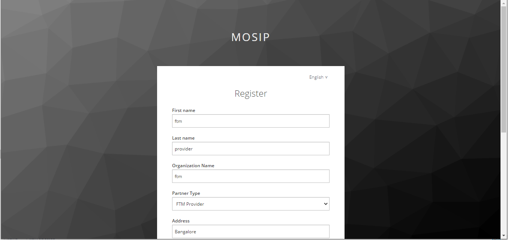
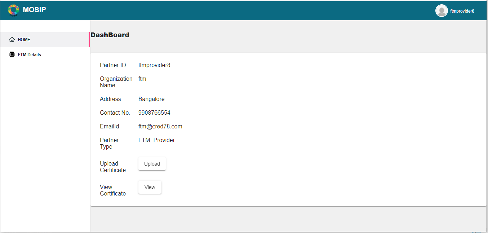
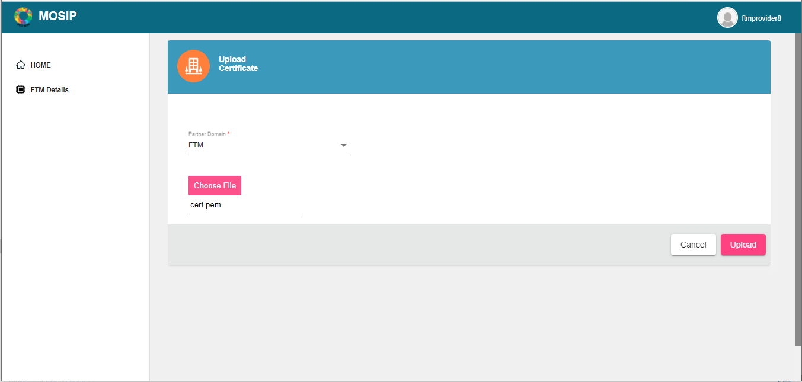
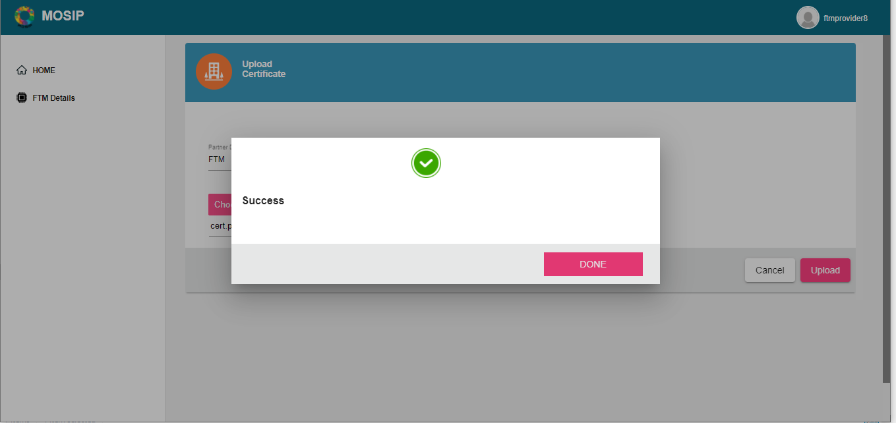
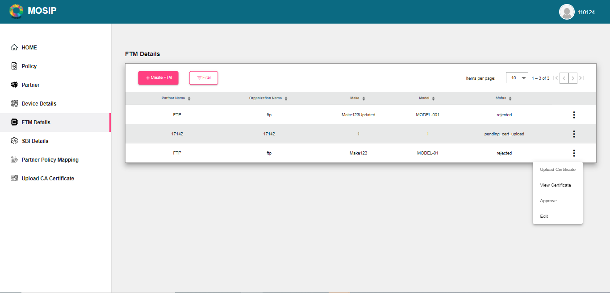
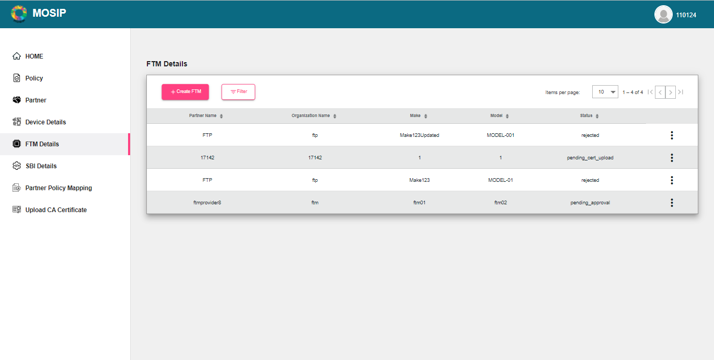
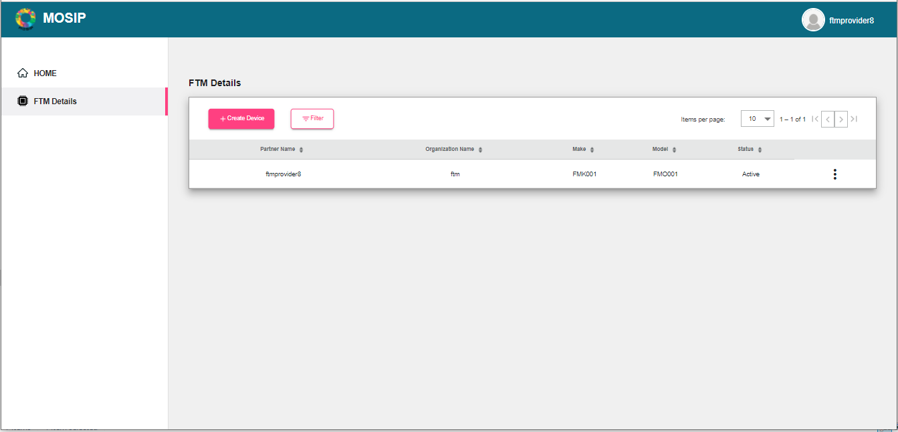

# Foundational Trust Provider

## Overview

This guide enables the Foundational Trust providers to use the PMP portal effectively. Below is the workflow:

* Partner self-register through the portal.
* Partner admin and uploads CA certificate.
* Partner admin/ Partner uploads partner certificate.
* Partner admin/ Partner creates FTM.
* Partner admin/ Partner uploads certificate from the menu before approval/ rejection.
* Partner admin approves/ rejects the FTM.

### Self-registration

* The partner can register themselves on the MOSIP PMP portal by clicking **Register** on the landing page.
* They need to fill up a form with the details below:
  * First and Last name
  * Organization Name
  * Partner type (Device Provider)
  * Address, e-mail, phone number
  * Username and password

 

To view the details entered, click **Home** to see the dashboard.

### Upload of Certificates

#### CA Certificate upload

The Partner admin needs to upload the CA certificate to enable the partner to use the portal. To do so, the Partner admin:

1. Clicks **Upload CA Certificate** option on the left navigation pane of the partner portal.
2. Selects the Partner Domain as FTM.
3. Chooses the certificate to upload (only files with extensions such as .cer or .pem).
4. Clicks **Upload**.

The uploaded certificates can be viewed by clicking on `View Certificates-> View`.

#### Partner Certificate upload

Similarly, the Partner certificates can be added by the Partner admin or partner.

The certificate can be uploaded by clicking **Home-> Upload Certificate -> Upload**.

The certificate can be viewed by clicking **Home-> View Certificate ->View**.

### FTM Details

#### Creating FTM Details

The partner can create FTM details by,

1. Clicking FTM Details -> Create FTM
2. Fill up the information like Partner Name, Make and Model.
3. Clicking Save.

#### FTM Certificate Upload

The partner can upload FTM certificates by,

1. Selecting **Upload Certificate** option from the Actions menu against the FTM created.
2. Entering the Partner Domain as FTM and choosing the certificate file.
3. Clicking Upload.

#### Approval or rejection of the certificate

The Partner Admin can choose to approve or reject the FTM certificate uploaded. Below illustrates the workflow:

Finally, you can see the FTM activated.

