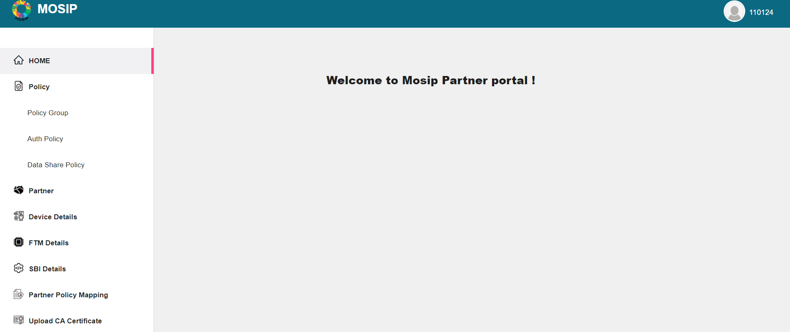
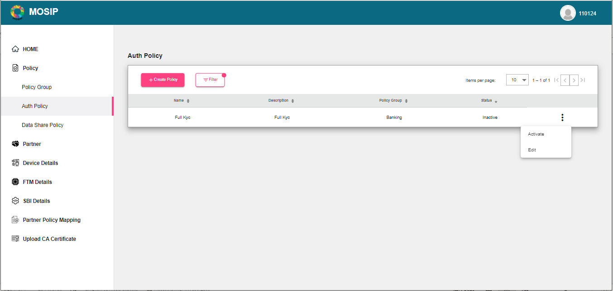

# Partner Management Portal

## Overview

Partner management portal allows the partners to register themselves in MOSIP. With LTS release, the following types of partners can register themselves:

1. Authentication Partners
2. Credential Partners(with limited features)
3. Device Providers
4. FTM Provider



## Partner roles

| Partner Type           | Associated Role     |
| ---------------------- | ------------------- |
| Partner Admin          | PARTNER\_ADMIN      |
| Policy Manager         | POLICYMANAGER       |
| Authentication Partner | AUTH\_PARTNER       |
| Credential Partner     | CREDENTIAL\_PARTNER |
| Device Provider        | DEVICE\_PROVIDER    |
| FTM Provider           | FTM\_PROVIDER       |

A Partner Admin can create Policies that are required for Authentication and Credential partners. The section below describes the types of policies that are supported by MOSIP.

## Home page

## Policies

To create policies, policy groups should be defined. Policy groups can be considered as the regulatory bodies in a country, examples could be Telecom, Insurance, Banking, etc.

### Creation of Policy group

* Login as `Partner Admin` into the PMS portal.
* After successful login, on the left navigation pane, click on **Policy -> Policy Group**.
* The existing policy groups are listed on the screen and the new ones can be created.

**To create Policy groups**

* Click Policy -> Policy Group -> +Create Policy Group
* Enter the Policy group Name and Description and click **Save**.

To search or filter any data pertaining to policy groups, use the filter menu.

You can also change the status of policy group(Deactivate/Re-activate) or edit it using the Action menu as shown below.

On successful creation of Policy groups, polices can be created under that group. MOSIP supports two types of policies, i.e., **Auth** policy and **Datashare** policy.

## Auth Policy

By default, on clicking Auth policy, the screen displays the list of existing auth [policies](../../../partners.md#partner-policies).

### Create an Auth policy

1. Click **Auth Policy -> Create Policy**.
2. Add the Name and Description.
3. From the dropdown, select the Policy group.
4. Add the Policies Data.
5. Click **Save**.

_Note_: Once the policy is created, it will be in _Inactive_ state. You have to activate it before using it for a partner.

### Activate/edit Auth policy

1. Select the policy you want to activate or edit.
2. From the Actions menu, select Activate/Edit.

### Search or filter data

1. Use the filter menu.

## Data Share Policy

Data Share policy can be created/edited in the same way as the steps mentioned in the previous section on `Auth policy` by using Data Share Policy menu options.

## Partner

### Self Registration

Partners in MOSIP are created in a self-service mode. The partner visits the MOSIP partner management portal and requests for collaborating with MOSIP by providing basic details such as organization name and email-id, purpose of registration (how they want to collaborate with MOSIP - as a device provider, authentication partner, print partner, etc), basic credentials and performing an OTP based verification. Once these details are filled by the partner and a request is sent to MOSIP, the `Partner Admin` verifies the details of the partners and allows the partner to integrate with MOSIP.

To know more about each of the partners, click:

1. [Auth partner/ Credential partner](auth-credential-partner.md)
2. [Device Provide](device-provider-partner.md)
3. [FTM Provider](../../../ftm-provider-partner.md)
