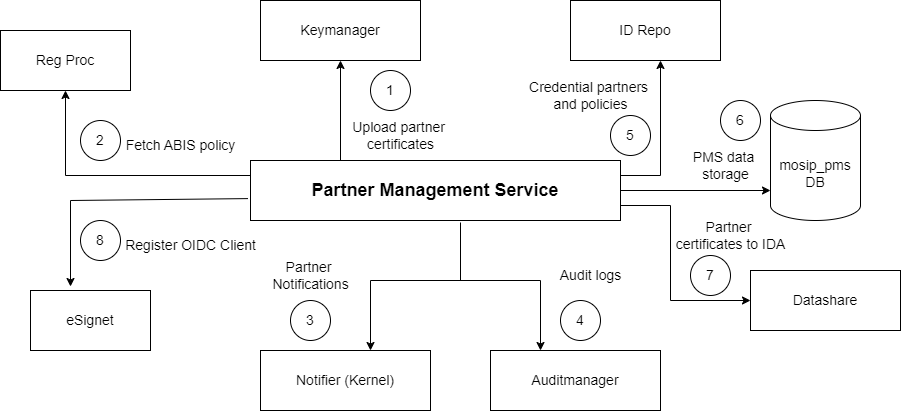

# Architecture

### **Partner Management Service**

Partner Management Service provides various partner services like onboarding partners and providing partner data to other modules.

The diagram below illustrates the relationship of this service to other MOSIP services.

<figure><figcaption></figcaption></figure>

1. Certificates of partner are uploaded to [Key Manager](https://docs.mosip.io/1.2.0/modules/keymanager) as part of onboarding.
2. Registration processor fetches ABIS datashare policy from PMS.
3. PMS sends notification messages to partners via notification service (of Kernel).
4. Audit logs are logged into Auditmanager.
5. [ID Repository](https://docs.mosip.io/1.2.0/modules/id-repository) fetches credential data share partners and their polices from PMS.
6. All PMS data is stored in mosip\_pms DB.
7. Certificates of Authentication Partners are sent to IDA module as IDA runs independently. The certificates are shared using [Datashare](https://docs.mosip.io/1.2.0/modules/datashare) (which futher uses Websub to share data with IDA).
8. PMS invokes the client management endpoint of eSignet to register OIDC client

Rest of the content can be referred to here: [https://docs.mosip.io/1.2.0/modules/partner-management-services](https://docs.mosip.io/1.2.0/modules/partner-management-services)
