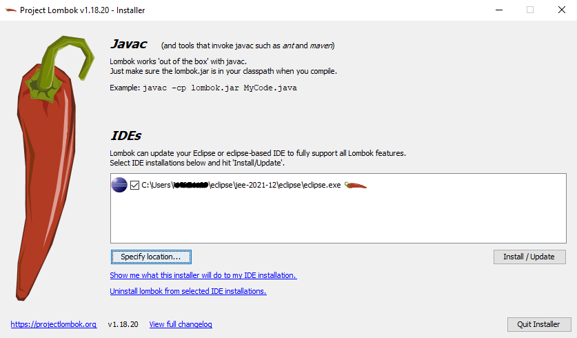
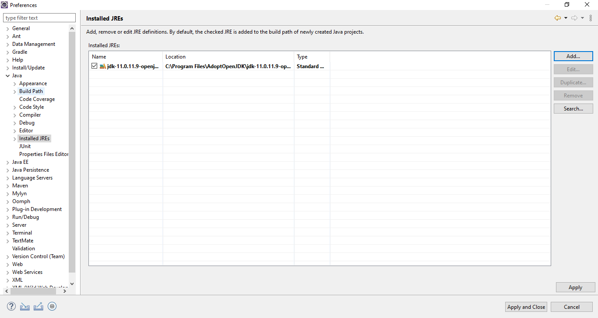
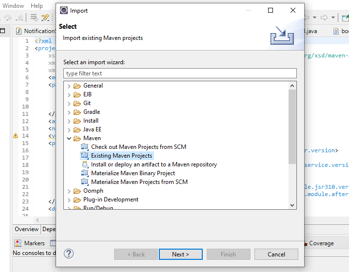
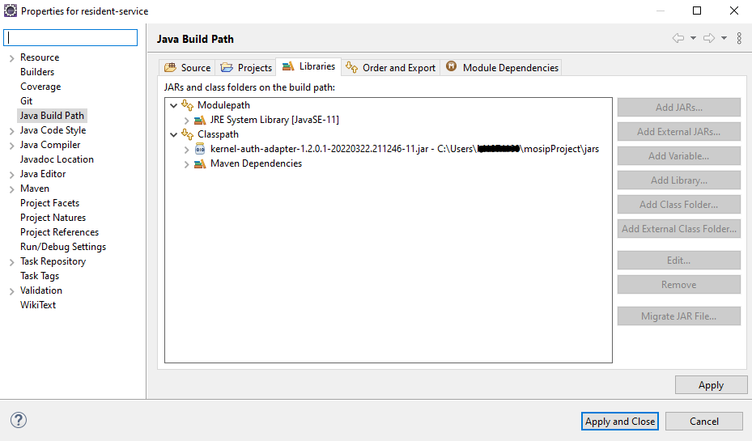

# Backend Developers Guide

### Overview

PMS Portal is used by the Partners to onboard with MOSIP and manage Devices, FTM, Create API Keys and Create OIDC clients etc.

Partner Management module has two services:

* Partner Management service
* Policy Management service

The documentation here will guide you through the prerequisites required for the developer's setup.

### Software setup

Below is a list of tools required in Partner Management Services:

1. JDK 11
2. Any IDE (like Eclipse, IntelliJ IDEA)
3. Apache Maven (zip folder)
4. pgAdmin
5. Postman
6. Git
7. Notepad++ (optional)
8. lombok.jar (file)
9. settings.xml (document)

Follow the steps below to set up Partner Management Services on your local system:

1. Download `lombok.jar`and `settings.xml` from [here](https://github.com/mosip/documentation/tree/1.2.0/docs/\_files/partner-management-services-config-files).
2. Install Apache Maven.
3. Copy the `settings.xml` to ".m2" folder `C:\Users\<username>\.m2`.
4. Install Eclipse.
5. Open the `lombok.jar` file and wait for some time until it completes the scan for Eclipse IDE and then click `Install/Update`. Specify the eclipse installation location if required by clicking the ‘Specify location…’ button. Then, click `Install/Update` the button to proceed.

<figure><figcaption></figcaption></figure>

6. Check the Eclipse installation folder `C:\Users\userName\eclipse\jee-2021-12\eclipse` to see if `lombok.jar` is added. By doing this, you will not have to add the dependency of lombok in your `pom.xml` file separately as it is auto-configured by Eclipse.
7. Configure the JDK (Standard VM) with your Eclipse by traversing through `Preferences → Java → Installed JREs`.

<figure><figcaption></figcaption></figure>

### Code setup

For the code setup, clone the repository and follow the guidelines mentioned in the [Code Contributions](https://docs.mosip.io/1.2.0/community/code-contributions).

#### Importing and building a project

1. Open the project folder `partner-management-services\partner` where `pom.xml` is present.
2. Open the command prompt from the same folder.
3. Run the command `mvn clean install -Dgpg.skip=true` to build the project and wait for the build to complete successfully.
4. After building a project, open Eclipse and select `Import Projects → Maven → Existing Maven Projects → Next → Browse to project directory → Finish`
5. This will import 5 projects into Eclipse: `partner, partner-management-service, pms-common, policy-management-service and policy-validator`

<figure><figcaption></figcaption></figure>

6. After successful importing of all the projects, update each `project by right-clicking on Project → Maven → Update Project`.

### Environment setup

* For the environment setup, you need an external JAR that is available [here](https://oss.sonatype.org/#nexus-search;gav\~\~kernel-auth-adapter\~1.2.0-SNAPSHOT\~\~) with different versions. Download the below-mentioned JARs with appropriate latest/appropriate versions. You will need to input the appropriate artifact ID and version and other inputs. `kernel-auth-adapter.jar`
* E.g.: You can download `kernel-auth-adapter.jar` and add to the `project Libraries → Classpath → Add External JARs → Select Downloaded JAR → Add → Apply` and Close).

<figure><figcaption></figcaption></figure>

* Properties Files - Update `application-dev.properties` and `bootstrap.properties` files in below folder `partner-management-services\partner\partner-management-service\src\main\resources` _to run the Partner Management Service locally_

| **Name of property**                                                     | **Value**                                                                                                                                                                                                          | **File Name**                |
| ------------------------------------------------------------------------ | ------------------------------------------------------------------------------------------------------------------------------------------------------------------------------------------------------------------ | ---------------------------- |
| `spring.profiles.active`                                                 | dev                                                                                                                                                                                                                | `bootstrap.properties`       |
| `spring.cloud.config.uri`                                                | dev                                                                                                                                                                                                                | `bootstrap.properties`       |
| `javax.persistence.jdbc.url`                                             | jdbc:postgresql://$HOST:$PORT/mosip\_pms                                                                                                                                                                           | `application-dev.properties` |
| `javax.persistence.jdbc.password`                                        | Password of DB                                                                                                                                                                                                     | `application-dev.properties` |
| Replace all URL’s `https://dev.mosip.net with ${mosip.api.internal.url}` | 
${mosip.api.internal.url} should be set to the URL to the your env where all below dependent services are running.

WebSub, MasterData, KeyManager, AuthManager, DataShare, Notifier, Esignet, IDP etc
 | `application-dev.properties` |
| `mosip.iam.base-url`                                                     | This should point to the URL of your env where KeyCloak is running. Ex: [https://iam.dev.mosip.net](https://iam.dev.mosip.net)                                                                                     | `application-dev.properties` |
| `mosip.pmp.auth.secretKey`                                               | Key Cloak Secret of mosip-pms-client                                                                                                                                                                               | `application-dev.properties` |
| `pms.cert.service.token.request.clientId`                                | mosip-pms-client                                                                                                                                                                                                   | `application-dev.properties` |
| `mosip.iam.module.clientsecret`                                          | Key Cloak Secret of mosip-pms-client                                                                                                                                                                               | `application-dev.properties` |
| `mosip.iam.adapter.clientsecret`                                         | Key Cloak Secret of mosip-pms-client                                                                                                                                                                               | `application-dev.properties` |
| `mosip.iam.module.login_flow.scope`                                      | email                                                                                                                                                                                                              | `application-dev.properties` |
| `mosip.iam.module.redirecturi`                                           | http://localhost:9109/v1/partnermanager/login-redirect/                                                                                                                                                            | `application-dev.properties` |
| `auth.allowed.urls`                                                      | http://localhost:3000/                                                                                                                                                                                             | `application-dev.properties` |
| `mosip.pms.esignet.config-url`                                           | ${mosip.api.internal.url}/v1/esignet/oidc/.well-known/openid-configuration                                                                                                                                         | `application-dev.properties` |
| `mosip.pms.esignet.claims-mapping-file-url`                              | Config Server URL pointing to identity-mapping.json                                                                                                                                                                | `application-dev.properties` |
| `mosip.pms.esignet.amr-acr-mapping-file-url`                             | Config Server URL pointing to amr-acr-mapping.json                                                                                                                                                                 | `application-dev.properties` |
| `mosip.pms.esignet.oidc-client-create-url`                               | ${mosip.api.internal.url}/v1/esignet/client-mgmt/oidc-client                                                                                                                                                       | `application-dev.properties` |
| `mosip.pms.esignet.oidc-client-update-url`                               | ${mosip.api.internal.url}/v1/esignet/client-mgmt/oidc-client                                                                                                                                                       | `application-dev.properties` |
| `mosip.pms.esignet.oauth-client-create-url`                              | ${mosip.api.internal.url}/v1/esignet/client-mgmt/oauth-client                                                                                                                                                      | `application-dev.properties` |
| `mosip.pms.esignet.oauth-client-update-url`                              | ${mosip.api.internal.url}/v1/esignet/client-mgmt/oauth-client                                                                                                                                                      | `application-dev.properties` |

* Click the "run" option, the service will start locally on port 9109.

Policy management service also can run by following the above steps.

#### Partner Management Services API

* For API documentation, refer [here](https://mosip.stoplight.io/docs/partner-management-portal-revamp/iv3x4n7c2tef1-partner-management-services-api-documentation).
* The APIs can be tested with the help of **Postman** or **Swagger-UI**.
* Swagger is an interface description language for describing restful APIs expressed using JSON. Can access Swagger-UI of partner-management-services for dev-environment from `https://dev.mosip.net/v1/partnermanager/swagger-ui/index.html?configUrl=/v1/partnermanager/v3/api-docs/swagger-config` and localhost from `http://localhost:9109/v1/partnermanager/swagger-ui/index.html?configUrl=/v1/partnermanager/v3/api-docs/swagger-config`.
* Can access Swagger-UI of policy-management-services for dev-environment from `https://dev.mosip.net/v1/policymanager/swagger-ui/index.html?configUrl=/v1/policymanager/v3/api-docs/swagger-config` and localhost from `http://localhost:9107/v1/policymanager/swagger-ui/index.html?configUrl=/v1/policymanager/v3/api-docs/swagger-config`.
* Postman is an API platform for building and using APIs. Postman simplifies each step of the API lifecycle and streamlines collaboration so you can create better APIs—faster. It is widely used tool for API testing.
* Download the [JSON collection](https://github.com/mosip/mosip-onboarding) and then import it in your postman.
