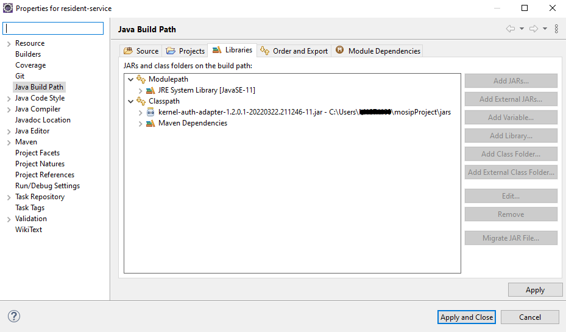

# Pre-registration Developers Guide

## Overview

The documentation here will guide you through the pre-requisites required for [Pre-registration](https://docs.mosip.io/1.2.0/modules/pre-registration) developer setup.

## Software setup

#### Below are the list of tools required in Pre-registration

1. JDK 11
2. Any IDE (Eclipse, IntelliJ IDEA)
3. Apache Maven (zip folder)
4. pgAdmin
5. Postman
6. Git
7. [lombok.jar](https://projectlombok.org/download) (file)
8. MOSIP Pre-registration specific JARs: The version will depend on which Pre Registration branch you have cloned. If it is "release-1.2.0.1" then you can download 1.2.0.1.B1 or 1.2.0.1.B2 version of below jars whichever is available.
   * [kernel-auth-adapter](https://repo1.maven.org/maven2/io/mosip/kernel/kernel-auth-adapter/)
   * [kernel-transliteration-icu4j](https://repo1.maven.org/maven2/io/mosip/kernel/kernel-transliteration-icu4j/)
   * [kernel-ref-idobjectvalidator](https://repo1.maven.org/maven2/io/mosip/kernel/kernel-ref-idobjectvalidator/)
   * [kernel-virusscanner-clamav](https://repo1.maven.org/maven2/io/mosip/kernel/kernel-virusscanner-clamav/)
9. [settings.xml](../../\_files/pre-registration-config-files/settings.xml)
10. Notepad++ (optional)

#### Follow the steps below to setup Pre-registration on your local system

1. Fork the MOSIP [Pre-registration repository](https://github.com/mosip/pre-registration) from Github MOSIP repository to your GitHub account.
2. Clone the forked repository into your local machine.
   * `git clone https://github.com/${urgithubaccname}/pre-registration.git`
   * `git remote add upstream https://github.com/mosip/pre-registration.git`
   * `git remote set-url --push upstream no_push`
   * `git remote -v`
   * `git checkout -b my-release-1.2.0.1`
   * `git fetch upstream`
   * `git rebase upstream/release-1.2.0.1`
3. Inside `settings.xml` change local repository directory to your directory name where `.m2 folder` is located. E.g.: `<localRepository>C:/Users/username/.m2/repository</localRepository>`
4. Add `settings.xml` inside `.m2 folder` (Maven Folder). E.g.: `C:\Users\username\.m2`
5. Import the project in Eclipse IDE and it starts updating Maven projects configuration, refreshing workspaces, project starts building (downloading sources, javadoc).
6. Add downloaded `lombok.jar` to project, click on downloaded JAR and install specifying Eclipse IDE(eclipse.exe) location.


7. Configure the JDK (Standard VM) with your Eclipse by traversing through `Preferences → Java → Installed JREs`.


8. Add MOSIP Pre-registration specific JARs from [Maven central](https://repo1.maven.org/maven2/io/mosip/):
   * Adding JARs to Build Path: Right click on service -> Build Path -> Configure Build Path -> click on Classpath -> Add External JARs -> Add required JARs -> Apply and close.



9. Add `auth-adapter`, `transliteration`, `ref-idobjectvalidator`, `virusscanner`, `lombok` JARs to `pre-registration-application-service`, `pre-registration-datasync-service` classpath.
10. Add `auth-adapter`, `lombok` JARs to `pre-registration-core`, `pre-registration-batchjob`, `pre-registration-captcha-service`, `pre-registration-booking-service` classpath.
11. Run `mvn clean install -Dgpg.skip=true` command to build locally and to execute test cases.
12. Update Maven dependencies: Maven syncs the Eclipse project settings with that of the pom. It downloads dependencies required for the project.
13. Build and run the Project.
14. To run the pre-registration-application-service locally _**without config server**_, update values in application.properties and bootstrap.properties:

* `spring.cloud.config.uri=https://localhost:8080`
* `spring.cloud.config.label=develop`
* `spring.cloud.config.name=pre-registration`
* `spring.application.name=pre-registration-application-service`
* `spring.profiles.active=default` _**Point below urls to a valid env which has MOSIP setup:**_
* `mosip.base.url=https://yourenvurl`
* `auth-token-generator.rest.issuerUrl:https://iam.yourenvurl/auth/realms/mosip`
* `javax.persistence.jdbc.password: XXXXXX`
* `javax.persistence.jdbc.url=jdbc:postgresql://yourenvurl:5432/mosip_prereg`
* `mosip.batch.token.authmanager.password: XXXXXX`
* `mosip.iam.adapter.appid=prereg`
* `mosip.iam.adapter.clientsecret=XXXXXX`
* `auth.server.admin.issuer.uri=https://iam.yourenvurl/auth/realms/`

## Developer setup for MOSIP Pre-registration UI

1. Fork the [Pre-registration UI repo](https://github.com/mosip/pre-registration-ui) to your GitHub account.
2. Clone the forked repository into your local machine.

* `git clone https://github.com/${urgithubaccname}/pre-registration-ui.git`
* `git remote add upstream https://github.com/mosip/pre-registration-ui.git`
* `git remote set-url --push upstream no_push`
* `git remote -v`
* `git checkout -b my-release-1.2.0.1`
* `git fetch upstream`
* `git rebase upstream/release-1.2.0.1`

3. Install all dependencies with `npm install`.
4. Install Angular JS `npm install -g @angular/cli`.
5. Start the Angular JS server `ng serve`.
6. Open `http://localhost:4200` to access the application.
7. You will face CORS issue since API Services are hosted on `https://{env}`.

#### Using the Angular CLI proxy solution to get around CORS issue

1.  Update the API services `BASE_URL` in `config.json`:

    * `config.json` is found inside assets directory.
    * E.g.: `C:\MOSIP\pre-registration-ui\pre-registration-ui\src\assets\config.json`

    ```
    {
    "BASE_URL": "https://localhost:4200/proxyapi/",
    "PRE_REG_URL": "preregistration/v1/"
    }
    ```
2.  Create a new file named `proxy.conf.json`:

    Location should be in `C:\MOSIP\pre-registration-ui\pre-registration-ui\proxy.conf.json` project folder.

    ```
    {
     "/proxyapi": {
      "target": "https://{env}/",
      "secure": true,
      "changeOrigin": true,
      "pathRewrite": {
        "^/proxyapi": ""
          }
        }
      }
    ```
3. Start the server by executing `ng serve --proxy-config proxy.conf.json --ssl true`.
4. Open the browser, load the app with `https://localhost:4200`.

## Pre-registration API

1. For API documentation, refer [here](https://mosip.github.io/documentation/1.2.0/1.2.0.html).
2. The APIs can be tested with the help of **Swagger-UI** and **Postman**.
3. Swagger is an interface description language for describing restful APIs expressed using JSON. You can access Swagger-UI of pre-registration here:
   * Pre-registration Application service : `https://{env}/preregistration/v1/application-service/swagger-ui.html`
   * Pre-registration Datasync Service : `https://{env}/preregistration/v1/sync/datasync-service/swagger-ui.html`
   * Pre-registration Captcha service : `https://{env}/preregistration/v1/captcha/swagger-ui.html`
   * Pre-registration Booking service : `https://{env}/preregistration/v1/appointment/booking-service/swagger-ui.html`
