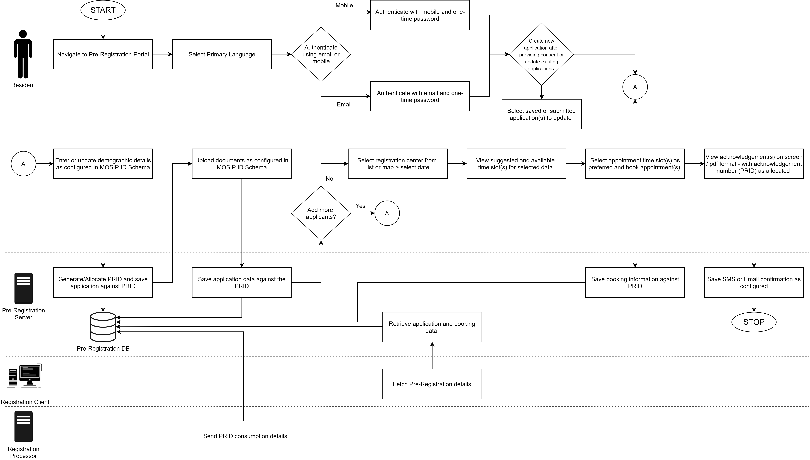
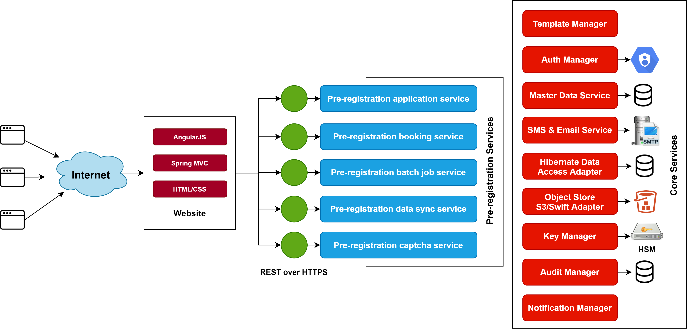

# Overview

This module enables a resident to:
* Enter demographic data & upload supporting documents
* Book an appointment for one or many users for registration by choosing a suitable registration center and time slot
* Receive appointment notifications
* Reschedule and cancel appointments

Once the residnet completes the above process, their data will be synced to their respective registration centers before their appointment, so that it can be used during the registration process.

# Detailed functionality

Below are the links to detailed features of the pre-registration module,
* [Login/create a user account](Login-or-create-a-user-account.md)
* [Creating an application](Creating-an-application.md)
* [Attaching documents to an application](Attaching-documents-to-an-application.md)
* [Booking an appointment](Booking-an-appointment.md)
* [Appointment acknowledgment](Appointment-acknowledgment.md)
* [Batch jobs](Batch-jobs.md)
* [Data sync](Data-sync.md)

# Process flow

The below process flow diagram provides a brief description on how to create or update a pre-Registration application.

The below process flow diagram provides a brief description on how to cancel and discard a pre-registration application.

# Services

For detailed description of pre-registration services refer to [pre-registration repository](https://github.com/mosip/pre-registration).

For high level and low level design refer to [pre-registration repository/design](https://github.com/mosip/pre-registration/design)

# Logical View

The below diagram depicts the logical architecture of pre-registration,

# Build and deploy
Refer to build and deploy instructions in [pre-registration repo](https://github.com/mosip/pre-registration).

# APIs
For detailed functionality of pre-registration APIs please view our page, [Pre-registration APIs](../../../api-reference/Pre-Registration-APIs.md)

# UI Reference Implementation
MOSIP provides a reference implementation of the Pre-registration UI that may be customized as per country needs. The implementation is available on [reference implementation repository](https://github.com/mosip/mosip-ref-impl).

# Configurations
Refer to the [pre-registration configuration](Pre-Registration-Configuration.md) document for details about the configurations in pre-registration.