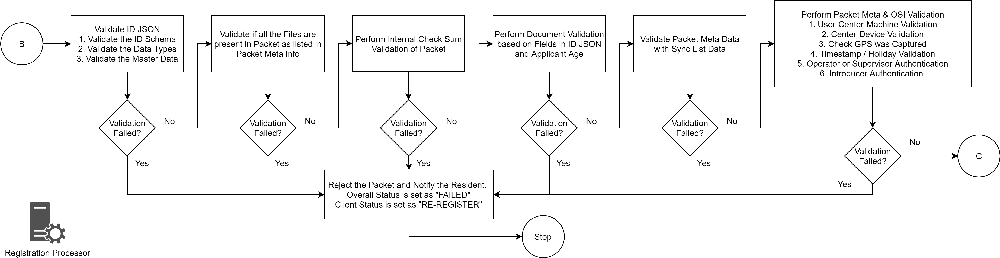
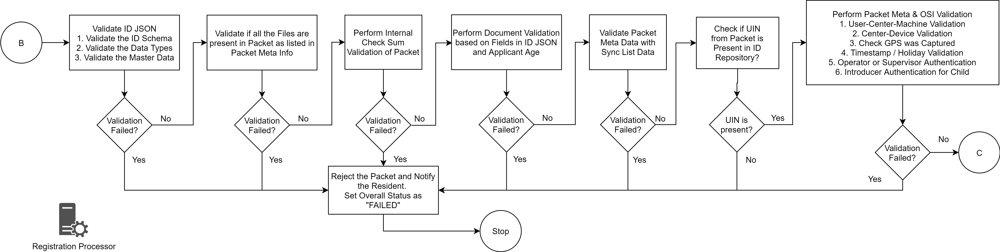
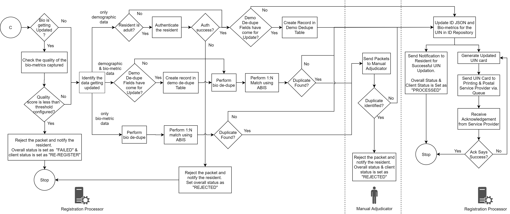

# Overview
Registration Processor processes the data (demographic and biometric) of an Individual for quality and uniqueness and then issues a Unique Identification Number (UIN). It also provides functionality to update demographic and biometric data and issue a new UIN if lost.  The source of data are primarily from
- MOSIP's Registration Client
- Existing ID system(s) of a country

Important considerations are as follows:

* Once the packet is received on the server packets should not be lost.  
* MOSIP defines and implement the basic registration packet processing flow. However, every country will have their own processing requirements like integration with its existing ID system and fetch data for validation.  Registration processor provides options to add such stages.
* Registration processor can integrate with multiple ABIS providers.
* Each processing stage is scalable independently based on the load.
* Each stage in the processor is independent of other stages such that the logic of a stage can be changed to improve efficiency without affecting the overall flow.

# Design Principles
Details related to various design principles used in registration processor are detailed [here](Design-Principles.md).

# Detailed functionality
* [Functional Flows](Functional-Flows.md)
* [Pre-Processing](Pre-Processing.md)
* [Processing](Processing.md)
* [Post-Processing](Post-Processing.md)

# MOSIP Stages
* [ABIS Handler Stage](stages/ABIS-Handler-Stage.md)
* [ABIS Middleware Stage](stages/ABIS-Middleware-Stage.md)
* [Bio Deduplication Stage](stages/Bio-Deduplication-Stage.md)
* [Demo Deduplication Stage](stages/Demo-Deduplication-Stage.md)
* [Manual Adjudication Stage](stages/Manual-Adjudication-Stage.md)
* [OSI Validator Stage](stages/OSI-Validator-Stage.md) 
* [Packet Classification Stage](stages/Packet-Classification-Stage.md)
* [Packet Receiver Stage](stages/Packet-Receiver-Stage.md)
* [Packet Uploader Stage](stages/Packet-Uploader-Stage.md)
* [Packet Validator Stage](stages/Packet-Validator-Stage.md)
* [Printing Stage](stages/Printing-Stage.md)
* [Quality Check Stage](stages/Quality-Check-Stage.md)
* [Secure Zone Notification Stage](stages/Secure-Zone-Notification-Stage.md)
* [UIN Generator Stage](stages/UIN-Generator-Stage.md)

# Process flow

## Packet Pre-Processing

## New Packet Processing

## Update Packet Processsing

## Lost UIN Packet Processing

## Activate/De-Activate Packet Processing

# Logical View

# Services
For detailed description of Registration Processor Services refer to [registration processor repo](https://github.com/mosip/registration/tree/master/registration-processor).

For high level and low level design refer to [registration processor repo](https://github.com/mosip/registration/tree/master/registration-processor)

# Build and deploy
Refer to build and deploy instructions in [registration processor repo](https://github.com/mosip/registration/tree/master/registration-processor).

# APIs

[Registration Processor APIs](Registration-Processor-APIs.md)  
