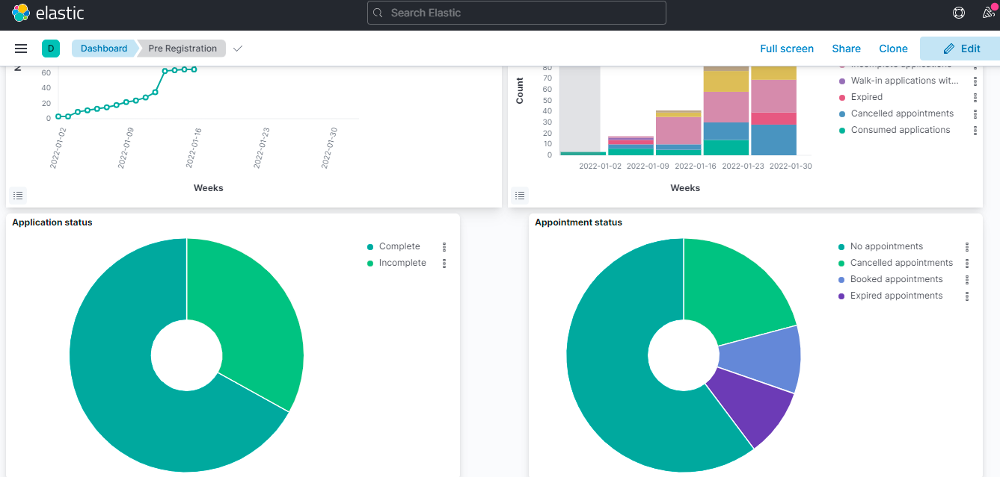
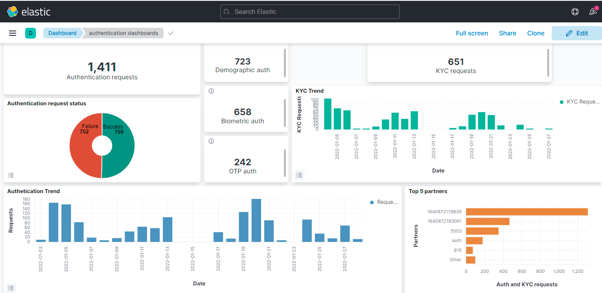
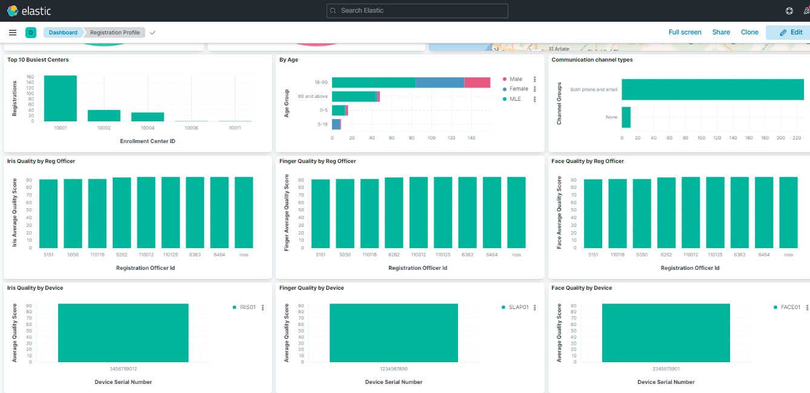
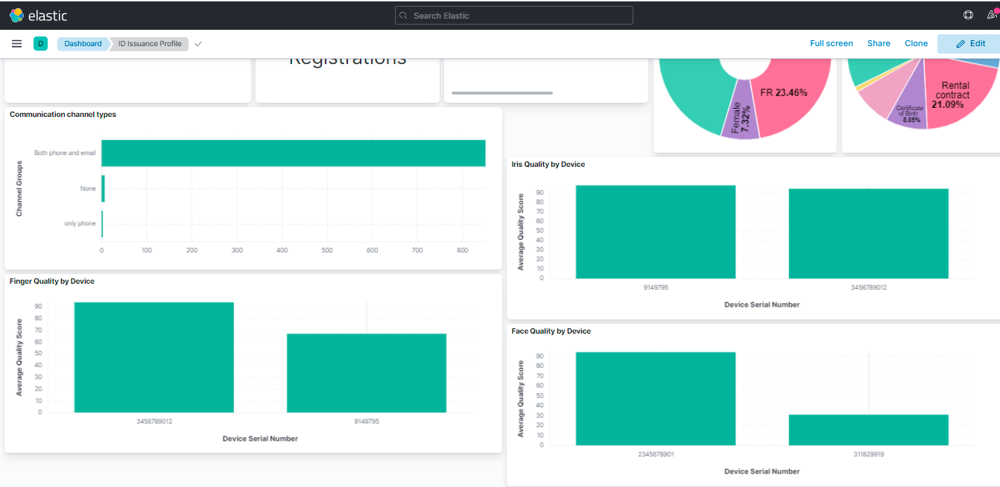

# Reporting

## Overview

MOSIP provides a reporting framework for real-time streaming of data and visualization. The dashboards give a visual display of metrics and important data to track the status of various pre and post-enrollment processes. This data helps ID issuers with improving efficiency, forecasting, and better decision-making. The framework has been used to create a set of default dashboards using Kibana.

Details of reporting framework can be found [here](https://github.com/mosip/reporting/blob/release-1.2.0/README.md).

## Dashboards

The following dashboards are configured on [Kibana](https://www.elastic.co/kibana/). The NDJSON source files are available [here](https://github.com/mosip/reporting/tree/release-1.2.0/dashboards).

### Pre-registration

 

### Pre-registration operations

 

### Registration

 

### Authentication

### Registration profile

 

### ID issuance profile

 

### Overall trend

## How to customize?

The reporting pipeline and dashboards may be customized according to an adopter's requirements.

* Setup a data pipeline for populating data from database to Elasticsearch as given [here](https://github.com/mosip/reporting/blob/release-1.2.0/docs/connectors.md).
* After data is populated in Elasticsearch, add/customize dashboards in Kibana as given [here](https://www.elastic.co/guide/en/kibana/current/dashboard.html).

## Source code

[Github repo](https://github.com/mosip/reporting/tree/release-1.2.0)
