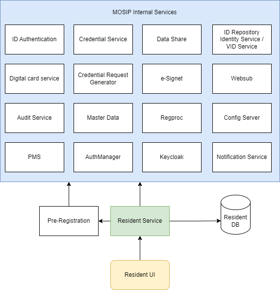
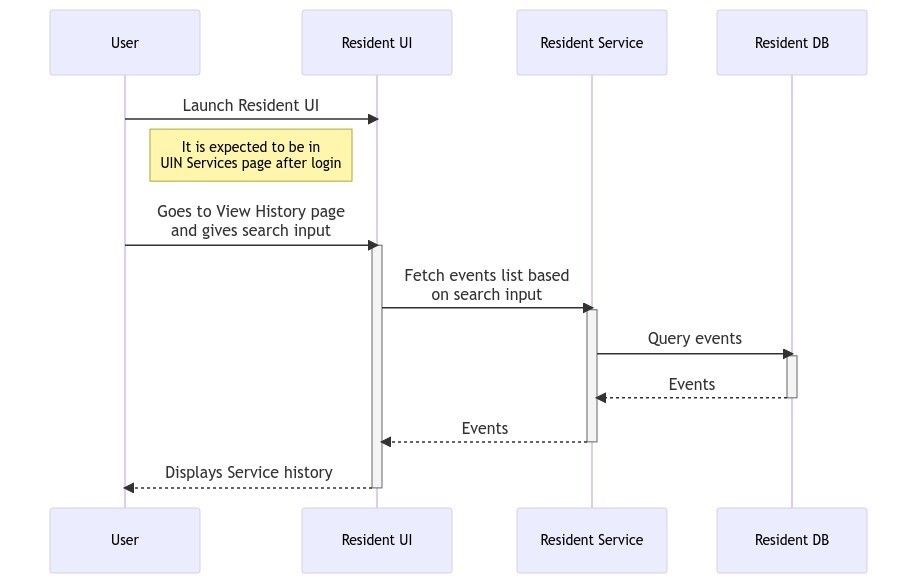
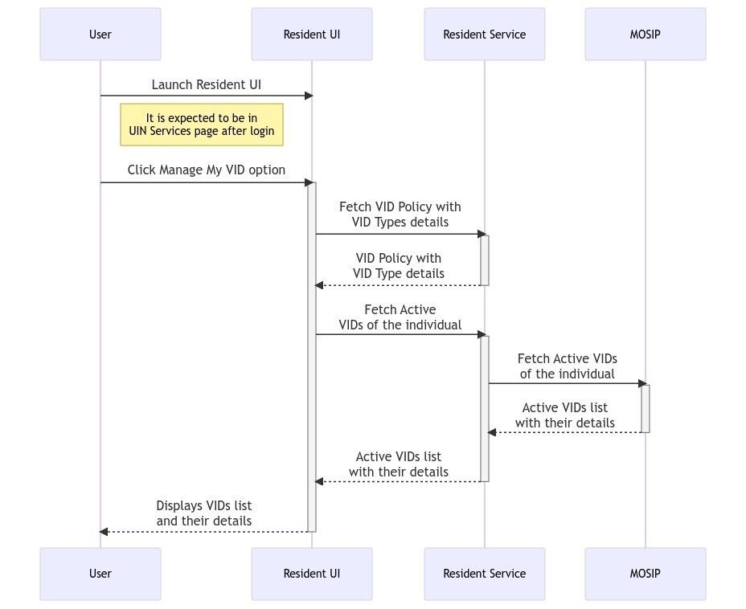
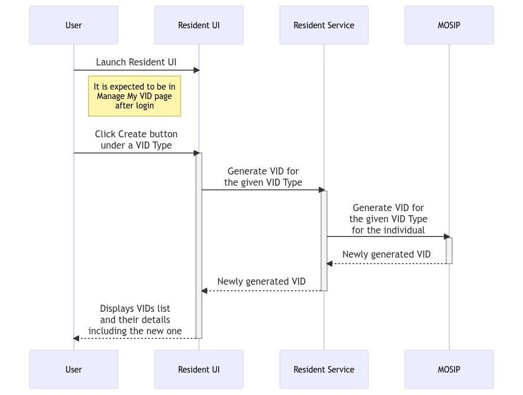
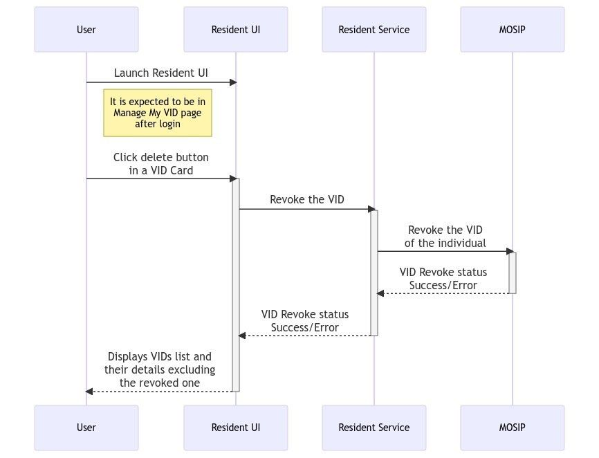
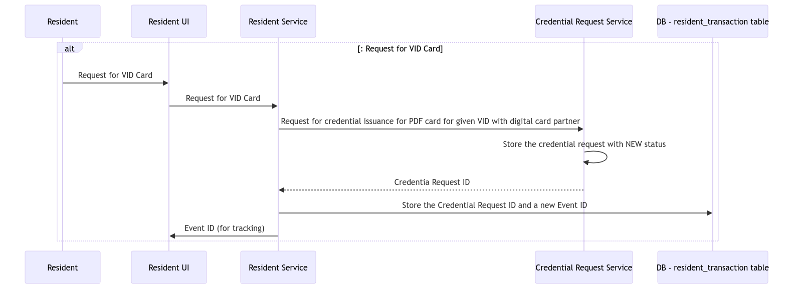
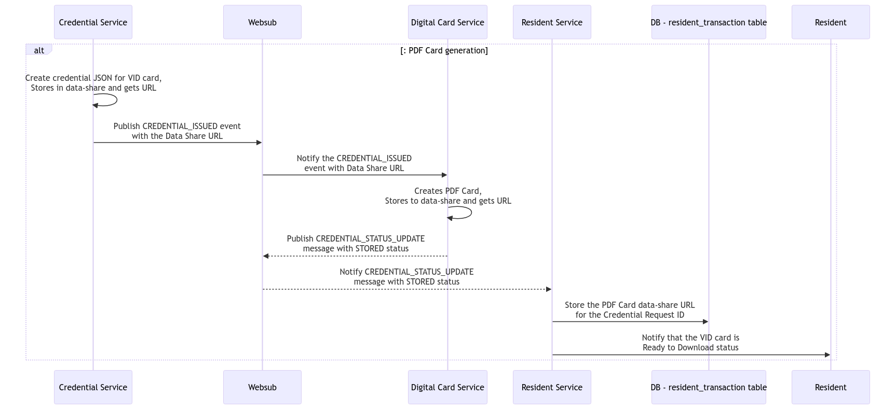
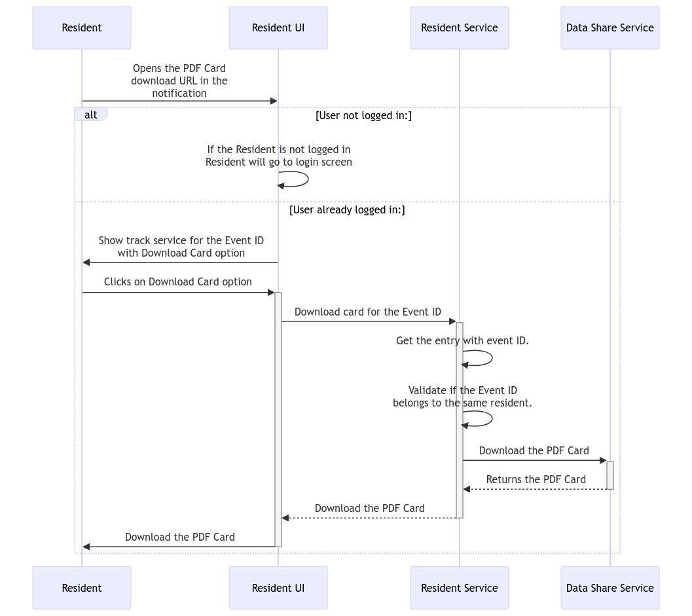

# Functional Overview

**Overview**: Resident Portal is a self-help web-b portal that can be used by the residents of a country to avail the services related to their Unique Identification Number (UIN). The key services provided are:

1. UIN services
   1. View My History
   2. Secure My ID
   3. Manage My VID
   4. Track My Request
   5. Download My Personalized Card
   6. Share My Credential
2. Get Information
   1. Supporting Document
   2. Registration Center
3. Verify Email ID/Phone number
4. Get My UIN
5. Booking an Appointment

Below is the detailed explanation of each of the features along with the list of relevant APIs.&#x20;

<figure><figcaption></figcaption></figure>

**Fig:** Modules/services that Resident services depends on

***

**View My History:**

The residents can view the history of all the transactions associated with their logged-in UIN/ AID/ VID. They can also view their details and if any unaccounted entry is found, a report can be raised against the same.

**Below is the list of APIs :**

1. **GET /service-history/{lang-code}**: This API is to get the service history of one or more service types. These entries can be fetched for a certain period (start date and end date). The result will be paginated. This is an authenticated API.
   1. [https://mosip.stoplight.io/docs/resident/0b88c7fac6a1c-get-service-history-of-the-resident](https://mosip.stoplight.io/docs/resident/0b88c7fac6a1c-get-service-history-of-the-resident)
2. **GET /download/service-history**: This API is to download the View History Tables as a PDF
   1. [https://mosip.stoplight.io/docs/resident/f3ca383640b73-download-service-history](https://mosip.stoplight.io/docs/resident/f3ca383640b73-download-service-history)

<figure><figcaption></figcaption></figure>

***

**Manage My VID:**

On clicking “Manage My VID”, the resident will be taken to a page where they can view details of the existing VIDs, generate new VID, revoke existing VID or download a VID card.

The following types of VIDs can be seen based on the VID policy:

1. Perpetual VID
2. Temporary VID
3. One-time VID

**Below is the list of APIs:**

1. **GET​/vid​/policy:** This API is to get the VID policy. This is an authenticated API.
   1. [https://mosip.stoplight.io/docs/resident/76c0bbbec07ef-vid-policy](https://mosip.stoplight.io/docs/resident/76c0bbbec07ef-vid-policy)
2. **GET /vids**: This is an authenticated API that will retrieve the list of active VIDs of the UIN/VID of the logged in session.
   1.  [https://mosip.stoplight.io/docs/resident/7c8694c3fa4ba-get-vi-ds-of-the-resident](https://mosip.stoplight.io/docs/resident/7c8694c3fa4ba-get-vi-ds-of-the-resident)

<figure><figcaption></figcaption></figure>

1.  **POST​/generate-vid:** This API generates the VID for the given VID type for the logged in user.

    1. [https://mosip.stoplight.io/docs/resident/b61a4bf8f3117-generate-vid](https://mosip.stoplight.io/docs/resident/b61a4bf8f3117-generate-vid)\

    <figure><figcaption></figcaption></figure>
2.  **PATCH​/revoke-vid​/{vid}:** VID Revoke API that is authenticated used to revoke a VID of the logged in user. It also needs to verify the individual ID in the request belongs to the same user who has logged in.

    1. [https://mosip.stoplight.io/docs/resident/e7c01df57c4d3-revoke-vid-vid](https://mosip.stoplight.io/docs/resident/e7c01df57c4d3-revoke-vid-vid)

    
3. **GET/request-card/vid/{VID}:** This API is to request the PDF card generation for a specific VID of the logged in user. This will give back a event ID for tracking purpose and to use it to download the VID card from the notifications.

<figure><figcaption></figcaption></figure>

1. **POST /callback/credentialStatusUpdate:** The websub callback API that will be used to notify the status of the credential upon the PDF card generation is done. This will notify the resident with phone/email message or Resident UI bell notification icon.

<figure><figcaption></figcaption></figure>

1. **GET /download-card/event/{event-id}**: This API is to download the UIN card using URL sent over email/SMS/track event/notification section.
   1. [https://mosip.stoplight.io/docs/resident/3672a8452d62a-download-card-event-event-id](https://mosip.stoplight.io/docs/resident/3672a8452d62a-download-card-event-event-id)
   2. [https://mosip.stoplight.io/docs/resident/683e194d61190-request-card-vid-vid](https://mosip.stoplight.io/docs/resident/683e194d61190-request-card-vid-vid)

<figure><figcaption></figcaption></figure>

***

**Secure My ID**

On clicking “Secure My ID”, the residents can view the status of all the authentication types. They can choose to lock or unlock authentication types like the following:

1. Email OTP authentication
2. Phone OTP authentication
3. Demographic authentication
4. Fingerprint authentication
5. Iris authentication
6. Face authentication

**Below is the list of APIs:**

1. **GET​/auth-lock-status:** This API returns the lock/unlock status of Auth Types for a given UIN/VID. The individual ID is obtained from the logged in session.
   1. [https://mosip.stoplight.io/docs/resident/2229d1317ece0-auth-lock-status](https://mosip.stoplight.io/docs/resident/2229d1317ece0-auth-lock-status)\

2. **POST​/auth-lock-unlock:** Resident service to store the Auth type lock/unlock status with status\_comment containing summary of what is locked /unlocked.&#x20;
   1. [https://mosip.stoplight.io/docs/resident/0c178333f2164-auth-lock-unlock](https://mosip.stoplight.io/docs/resident/0c178333f2164-auth-lock-unlock)\

3. **POST​/callback​/authTypeCallback:** This is a Websub callback for Auth Type Lock/Unlock acknowledgement from IDA. Resident Service subscribes to the websub topic AUTH\_TYPE\_STATUS\_UPDATE\_ACK and update the Auth type lock/unlock status into resident\_transaction Table for the request ID (AID) as COMPLETED/FAILED. The table will have multiple entries in for each online verification Partners and the status will be updated for the online verification specific partner id mentioned in the websub notification.
   1. [https://mosip.stoplight.io/docs/resident/bd55a60bedd28-websub-callback-for-auth-type-lock-unlock-acknowledgement](https://mosip.stoplight.io/docs/resident/bd55a60bedd28-websub-callback-for-auth-type-lock-unlock-acknowledgement)

***

**Track My Requests**

On clicking “Track My Requests”, the residents can track the status of an Event ID (EID) associated with the logged-in UIN/ VID. They can also **view and download** the detailed information about the entered EID.

**Below is the list of APIs:**

1. **GET /events/{event-id}?langCode={language-Code}**: This authenticated API is to get the details of status for a given EID and including its status.
   1. [https://mosip.stoplight.io/docs/resident/d7394b9e82775-events-event-id-lang-code-language-code](https://mosip.stoplight.io/docs/resident/d7394b9e82775-events-event-id-lang-code-language-code)
2. **GET /ack/download/pdf/event/{eventId}/language/{languageCode}:** This API is to convert the acknowledgement of any service request Event ID as a downloadable PDF. This is an authenticated endpoint.
   1. [https://mosip.stoplight.io/docs/resident/752a9090b564e-ack-download-pdf-event-event-id-language-language-code](https://mosip.stoplight.io/docs/resident/752a9090b564e-ack-download-pdf-event-event-id-language-language-code)

***

**Get Personalized Card:**

On clicking “Get Personalized Card”, the residents can select the data to be added to their credential. They can preview the chosen data and download it. Residents should select at least 3 attributes.

**Below is the list of APIs:**

1. **GET ​/identity/info/type/{schema-type}:** API to get the list of ID Attributes of the logged-in user to pre-populate in the UI.
   1. [https://mosip.stoplight.io/docs/resident/24c36650d44e0-identity-info-type-schema-type](https://mosip.stoplight.io/docs/resident/24c36650d44e0-identity-info-type-schema-type)
2. **GET​/proxy​/config​/identity-mapping:** This API is to get the identity mapping Json
   1. [https://mosip.stoplight.io/docs/resident/ea2336c94f85f-proxy-config-identity-mapping](https://mosip.stoplight.io/docs/resident/ea2336c94f85f-proxy-config-identity-mapping)
3. **GET​/proxy​/config​/ui-schema:** API to return the UI Spec (UI Schema) for the given schemaType which is one of share-credential/update-demographics/personalized-card.
   1. [https://mosip.stoplight.io/docs/resident/0f2b7295f1e29-proxy-config-ui-schema](https://mosip.stoplight.io/docs/resident/0f2b7295f1e29-proxy-config-ui-schema)
4. **POST /download/personalized-card:** This API is to download the personalized PDF card. This is a synchronous call where the personalized card is downloaded immediately. The input for this is the HTML content used in the preview card in the Resident UI. This is an authenticated API.
   1. [https://mosip.stoplight.io/docs/resident/ff21b71c08730-download-personalized-card](https://mosip.stoplight.io/docs/resident/ff21b71c08730-download-personalized-card)

***

**Share My Data**

On clicking “Share My Data”, the residents can choose the data to be shared with any of the registered partners to avail various third party services.

**Below is the list of APIs:**

1. **GET​/auth-proxy/partners:** This API is to get the list of partner types from PMS.
   1. [https://mosip.stoplight.io/docs/resident/bd8ca93768659-auth-proxy-partners](https://mosip.stoplight.io/docs/resident/bd8ca93768659-auth-proxy-partners)
2. **GET​/proxy​/config​/ui-schema:** API to return the UI Spec (UI Schema) for the given schemaType which is one of share-credential/update-demographics/personalized-card.
   1. [https://mosip.stoplight.io/docs/resident/0f2b7295f1e29-proxy-config-ui-schema](https://mosip.stoplight.io/docs/resident/0f2b7295f1e29-proxy-config-ui-schema)
3. **GET​/proxy​/config​/identity-mapping**: This API is to get the identity mapping Json.
   1. [https://mosip.stoplight.io/docs/resident/ea2336c94f85f-proxy-config-identity-mapping](https://mosip.stoplight.io/docs/resident/ea2336c94f85f-proxy-config-identity-mapping)
4. **GET​/auth-proxy​/masterdata​/templates/{langcode}/{templatetypecode}:** This API is to return terms and conditions for different use cases for different languages such as eng, fra, and ara. This will be invoked by UI for the specific language. This is a Proxy API of master data service for getting templates for template type code and language code . This should be an authenticated proxy API.
   1. [https://mosip.stoplight.io/docs/resident/94f785201e613-auth-proxy-masterdata-templates-langcode-templatetypecode](https://mosip.stoplight.io/docs/resident/94f785201e613-auth-proxy-masterdata-templates-langcode-templatetypecode)
5. **POST /share-credential:** This API is to share the user specified attributes to selected partner in the selected formats along with a purpose.
6. **POST /callback/credentialStatusUpdate:** The websub callback API that will be used to notify the status of the credential sharing done by the Auth partner. This will notify the resident with phone/email message or Resident UI bell notification icon.
   1. [https://mosip.stoplight.io/docs/resident/5f8ac1903d659-share-credential](https://mosip.stoplight.io/docs/resident/5f8ac1903d659-share-credential)

***

**Update My Data**

**Below is the list of APIs:**

1. **GET​/proxy​/config​/ui-schema:** API to return the UI Spec (UI Schema) for the given schemaType which is one of share-credential/update-demographics/personalized-card.
   1. [https://mosip.stoplight.io/docs/resident/0f2b7295f1e29-proxy-config-ui-schema](https://mosip.stoplight.io/docs/resident/0f2b7295f1e29-proxy-config-ui-schema)
2. **GET​ /documents​/{transaction-id}:** This API is to get the list of documents for a given transaction Id
   1. [https://mosip.stoplight.io/docs/resident/6b1c4354a5a45-get-documents-for-given-transaction-id](https://mosip.stoplight.io/docs/resident/6b1c4354a5a45-get-documents-for-given-transaction-id)
3. **POST ​/documents​/{transaction-id}**: This API is to upload a document for a given document type, reference Id and transaction Id.
   1. [https://mosip.stoplight.io/docs/resident/92a70cb516d20-upload-a-document-for-given-transaction-id](https://mosip.stoplight.io/docs/resident/92a70cb516d20-upload-a-document-for-given-transaction-id)
4. **GET ​/identity/info/type/{schema-type}:** API to get the list of ID Attributes of the logged-in user to pre-populate in the UI.
   1. [https://mosip.stoplight.io/docs/resident/24c36650d44e0-identity-info-type-schema-type](https://mosip.stoplight.io/docs/resident/24c36650d44e0-identity-info-type-schema-type)
5. **GET /identity/get-pending-drafts/{langcode}:** API to get any pending draft for the logged in user.&#x20;
   1. [https://mosip.stoplight.io/docs/resident/branches/main/f9lauga5jwpf2-get-pending-drafts-for-residents](https://mosip.stoplight.io/docs/resident/branches/main/f9lauga5jwpf2-get-pending-drafts-for-residents)
6. **POST /identity/discardPendingDraft/{eid}:** API to discard any pending draft to allow any further updated needed.
   1. [https://mosip.stoplight.io/docs/resident/branches/main/ndgz15ymcnzbz-discard-a-pending-draft](https://mosip.stoplight.io/docs/resident/branches/main/ndgz15ymcnzbz-discard-a-pending-draft)\
      \

7. **PATCH​ /update-uin:** This API is to update the UIN. Resident Service gets the RID (AID) from the update response and stores the status in resident\_transaction details with a summary of what got updated.
   1. [https://mosip.stoplight.io/docs/resident/162fb3ab69b5f-update-uin](https://mosip.stoplight.io/docs/resident/162fb3ab69b5f-update-uin)
8. **GET /download-card/event/{event-id}**: This API is to download the UIN card using URL sent over email/SMS/track event/notification section.
   1. [https://mosip.stoplight.io/docs/resident/3672a8452d62a-download-card-event-event-id](https://mosip.stoplight.io/docs/resident/3672a8452d62a-download-card-event-event-id)
9. **GET /document/{document-id}:** This API is to download the document based on Document Id.\
   [https://mosip.stoplight.io/docs/resident/364e564226003-get-document-for-document-id-encoded-bytes](https://mosip.stoplight.io/docs/resident/364e564226003-get-document-for-document-id-encoded-bytes)
10. **DELETE /documents/{document-id}:** This API is to delete an uploaded document based on the document ID.
    1. [https://mosip.stoplight.io/docs/resident/4a5751cd6defe-delete-file-uploaded-with-the-document-id](https://mosip.stoplight.io/docs/resident/4a5751cd6defe-delete-file-uploaded-with-the-document-id)
11. **POST /resident/v1/transliteration/transliterate:** This API is to transliterate text from one language to another.
    1. [https://mosip.stoplight.io/docs/resident/3240dbb494654-transliterate](https://mosip.stoplight.io/docs/resident/3240dbb494654-transliterate)
12. **GET​/auth-proxy​/masterdata​/templates/{langcode}/{templatetypecode}:** This API is to return terms and conditions for different use cases for different languages such as eng, fra, and ara. This will be invoked by UI for the specific language. This is a Proxy API of master data service for getting templates for template type code and language code . This should be an authenticated proxy API.
    1. [https://mosip.stoplight.io/docs/resident/94f785201e613-auth-proxy-masterdata-templates-langcode-templatetypecode](https://mosip.stoplight.io/docs/resident/94f785201e613-auth-proxy-masterdata-templates-langcode-templatetypecode)
13. **POST /contact-details/send-otp**: This API is to send OTP to new email Id/phone number.
    1. [https://mosip.stoplight.io/docs/resident/d9f57e653e648-contact-details-send-otp](https://mosip.stoplight.io/docs/resident/d9f57e653e648-contact-details-send-otp)
14. **POST /contact-details/update-data:** This API is to verify OTP and update the new email/phone number.
    1. [https://mosip.stoplight.io/docs/resident/173ec2929857b-contact-details-update-data](https://mosip.stoplight.io/docs/resident/173ec2929857b-contact-details-update-data)
15. **GET /identity/update-count:** Create Proxy API Proxy API for ID Repo's API to retrieve remaining update counts for each id attributes for a UIN/VID.
16. **GET /identity/{individualId}/update-counts**: Create API to retrieve remaining counts for each attributes for a UIN/VID.
17. **POST /callback/credentialStatusUpdate:** The websub callback API that will be used to notify the status of the credential upon the PDF card generation is done. This will notify the resident with phone/email message or Resident UI bell notification icon.
18. **POST /callback/regprocworkflow:** The websub callback URL to update the status of the regproc packet if failed which is used to update the event status and notify user.\
    [https://mosip.stoplight.io/docs/resident/branches/main/w6znqxvb4wpwl-callback-for-registration-process-workflow-completion](https://mosip.stoplight.io/docs/resident/branches/main/w6znqxvb4wpwl-callback-for-registration-process-workflow-completion)\

19. Other Master data APIs used for this feature:
    1. **GET​/proxy​/masterdata​/locationHierarchyLevels​/{langcode}**
    2. **GET​/proxy​/masterdata​/locations​/immediatechildren​/{locationcode}​/{langcode}**
    3. **GET​/proxy​/masterdata​/locations​/info​/{locationcode}​/{langcode}**
    4. **GET​/proxy​/masterdata​/validdocuments​/{langCode}**
    5. **GET​/proxy​/masterdata​/applicanttype​/{applicantId}​/languages**
    6. **GET /auth-proxy/masterdata/dynamicfields/{fieldName}/{langCode}?withValue={true/false}**
    7. **GET /auth-proxy/masterdata/locations/immediatechildren/{locationCode}?languageCodes={comma-separated-language-codes}**
    8. **GET/proxy/masterdata/dynamicfields/all/{fieldName}**
    9. **GET /proxy/masterdata/locationHierarchyLevels**

***

**Menu Bar**

The Resident Portal menu bar contains the following:

1. **Font Size**- Residents can alter the size of the font based on their preferences.
2. **Language**- Residents can select the language of preference.
3. **Bell icon Notification**- Residents can view the notifications of all the asynchronous events in chronological order.

**Below is the list of APIs:**

1. **GET /unread/notification-count:** API to return the number of unread service notification list. This is an authenticated API. This will return the count of resident\_transasction table entries with read\_status=false.
   1. [https://mosip.stoplight.io/docs/resident/36f7e14e6ece0-unread-notification-count](https://mosip.stoplight.io/docs/resident/36f7e14e6ece0-unread-notification-count)
2. **GET /notifications/{langCode}:** API to return the all service notification list along with status summary message and status update time in a paginated way. This is an authenticated API.
   1. [https://mosip.stoplight.io/studio/resident?source=jvrylvdq\&symbol=%252Fp%252Freference%252FAPI-Unread-Service-List.yaml%252Fpaths%252F%7E1unread%7E1service-list%252Fget](https://mosip.stoplight.io/studio/resident?source=jvrylvdq\&symbol=%252Fp%252Freference%252FAPI-Unread-Service-List.yaml%252Fpaths%252F%7E1unread%7E1service-list%252Fget)
3. **GET /bell/notification-click:** API to get last date-time of user click event on the bell notification.\
   This is an authenticated API. This returns the last date time of user click event on the bell notification icon.
   1. [https://mosip.stoplight.io/docs/resident/5f86168d8037a-bell-notification-click](https://mosip.stoplight.io/docs/resident/5f86168d8037a-bell-notification-click)
4. **PUT/bell/updatedttime:** API to update last date-time when user clicked on the bell notification.\
   This is an authenticated API. This will update the last date time with current UTC time.
   1. [https://mosip.stoplight.io/docs/resident/3698b2ddd36ce-bell-updatedttime](https://mosip.stoplight.io/docs/resident/3698b2ddd36ce-bell-updatedttime)

***

**Profile Icon:**

1. **Profile Icon**- Residents can view the following:
   1. Name of the logged in user
   2. Photo of the logged in user
   3. Last login details
   4. Logout option

**Below is the list of APIs:**

1. **GET /profile:** This API is to get User details for the current session
   1. [https://mosip.stoplight.io/docs/resident/41d27b4cdfff9-profile](https://mosip.stoplight.io/docs/resident/41d27b4cdfff9-profile)

***

#### **Book an appointment**

The residents can book an appointment for registration using the pre-registration portal. To do so, they can click on “Book an appointment” tile which will redirect them to the pre-registration portal. To know more about pre-registration portal, refer to this link \[[https://docs.mosip.io/1.2.0/modules/pre-registration](https://docs.mosip.io/1.2.0/modules/pre-registration) ]

APIs: [https://github.com/mosip/documentation/blob/1.1.5/docs/Pre-Registration-APIs.md#login-service-public](https://github.com/mosip/documentation/blob/1.1.5/docs/Pre-Registration-APIs.md#login-service-public)

***

#### **Verify Email ID/ Phone number**

The residents can use this feature to verify their registered email ID or phone number.

**Below is the list of APIs:**

1. **POST /validate-otp**: This API will be used to validate OTP when the resident is trying to verify his phone number or email Id.
   1. [https://mosip.stoplight.io/docs/resident/ffb06d52ba4e7-validate-otp-for-given-uin-vid-using-ida-to-verify-phone-email](https://mosip.stoplight.io/docs/resident/ffb06d52ba4e7-validate-otp-for-given-uin-vid-using-ida-to-verify-phone-email)
2. **GET/channel/verification-status/**: This API is to check if OTP is verified for a channel for an individual (UIN/VID).
   1. [https://mosip.stoplight.io/docs/resident/dae10ad85c0a9-get-channel-verified-status](https://mosip.stoplight.io/docs/resident/dae10ad85c0a9-get-channel-verified-status)

***

#### **Get My UIN**

The residents can use this feature for one of the following:

1. Download their UIN card
2. Check the status of their Application ID (AID)

**Below is the list of APIs:**

1. **POST /individualId/otp**: This API is used to send the OTP prior to get the AID status/ download the UIN card for the given AID/VID/UIN. If the UIN is card is not ready it will return the current status of the AID.
2. **POST /aid/status:** This API is used to get the status of the AID. If the UIN is processed, this will return the UIN/VID for the given AID, otherwise it will return the current status of the AID.
3. **POST /download-card**: This API is to download the default UIN card using AID/VID/UIN. If the UIN is processed, this will return the PDF card, otherwise it will return the current status of the AID.
4. **GET /aid-stage/{aid}:** This API is used to get the latest status of AID, based on its status in reg-proc.&#x20;
5. **GET /rid/{individual-id}**: This is ID-repo API is to get the RID for a given UIN/VID. This is used internally in resident service.

***

**Login With E-Signet (OpenID Connect):**

1. **GET​/login​/{redirectURI}:** API that is used to initiate the login with E-Signet using the OpenID Connect protocol.
   1. [https://mosip.stoplight.io/docs/resident/d63e06fd24774-login-redirect-uri](https://mosip.stoplight.io/docs/resident/d63e06fd24774-login-redirect-uri)
2. **GET​/login/v2​/{redirectURI}:** API that is used to initiate the login with E-Signet using the OpenID Connect protocol. This additionally supports ui\_locales query parameter to accept the language in -which the E-Signet needs to be launched with. If not specified the E-Signet will load with the default language.
3. **GET /login-redirect/redirectURI?state={state}\&session\_state={session\_state}\&code={code} :** This is the redirect-url supplied to the E-Signet. After the successful login, this retrieves the access token and ID token for the given authorization code. and validate them and then redirects to the given redirect URL with the tokens in the response cookie.
   1. [https://mosip.stoplight.io/docs/resident/a4d6068e70a17-login-redirect](https://mosip.stoplight.io/docs/resident/a4d6068e70a17-login-redirect)
4. **GET /authorize/admin/validateToken:** API used to validate the token attached to the cookie. It will also extends the cookie expiry time to the configured duration.
5. **GET /logout/user?redirecturi={redirectURI}**: API used to logout the session attached to the cookie.

***

#### **Book an appointment**

The residents can book an appointment for registration using the pre-registration portal. To do so, they can click on “Book an appointment” tile which will redirect them to the pre-registration portal. To know more about pre-registration portal, refer to this link \[[https://docs.mosip.io/1.2.0/modules/pre-registration](https://docs.mosip.io/1.2.0/modules/pre-registration) ]

APIs: [https://github.com/mosip/documentation/blob/1.1.5/docs/Pre-Registration-APIs.md#login-service-public](https://github.com/mosip/documentation/blob/1.1.5/docs/Pre-Registration-APIs.md#login-service-public)

***

#### **Verify Email ID/ Phone number**

The residents can use this feature to verify their registered email ID or phone number.

**Below is the list of APIs:**

1. **POST /validate-otp**: This API will be used to validate OTP when the resident is trying to verify his phone number or email Id.
   1. [https://mosip.stoplight.io/docs/resident/ffb06d52ba4e7-validate-otp-for-given-uin-vid-using-ida-to-verify-phone-email](https://mosip.stoplight.io/docs/resident/ffb06d52ba4e7-validate-otp-for-given-uin-vid-using-ida-to-verify-phone-email)
2. **GET/channel/verification-status/**: This API is to check if OTP is verified for a channel for an individual (UIN/VID).
   1. [https://mosip.stoplight.io/docs/resident/dae10ad85c0a9-get-channel-verified-status](https://mosip.stoplight.io/docs/resident/dae10ad85c0a9-get-channel-verified-status)

***

#### **Get Information**

&#x20;**Below is the list of APIs:**

1. **Get Supporting Documents:**&#x20;
   1. **GET /download/supporting-documents?langcode={language-code}**: This API is to convert the List of supporting documents request as a downloadable PDF\
      [https://mosip.stoplight.io/docs/resident/32c31a9b693aa-download-supporting-documents-langcode-language-code](https://mosip.stoplight.io/docs/resident/32c31a9b693aa-download-supporting-documents-langcode-language-code)\

2. **Get Registration Centers:**
   1. **GET​/proxy​/masterdata​/getcoordinatespecificregistrationcenters​/{langcode}​/{longitude}​/{latitude}​/{proximitydistance}**
   2. **GET​/proxy​/masterdata​/registrationcenters​/{langcode}​/{hierarchylevel}​/names**
   3. **GET​/proxy​/masterdata​/registrationcenters​/page​/{langcode}​/{hierarchylevel}​/{name}**\

3. **GET​/proxy​/masterdata​/locationHierarchyLevels​/{langcode}**
4. **GET​/proxy​/masterdata​/locations​/immediatechildren​/{locationcode}​/{langcode}**
5. **GET​/proxy​/masterdata​/locations​/info​/{locationcode}​/{langcode}**
6. **GET​/proxy​/masterdata​/validdocuments​/{langCode}**
7. **GET​/proxy​/masterdata​/applicanttype​/{applicantId}​/languages**

**Order a physical card:\[DESCOPED]**

**Attachements**:\
&#x20;&#x20;
