# Functional Overview

**Overview**: Resident Portal is a self-help web-b portal that can be used by the residents of a country to avail the services related to their Unique Identification Number (UIN). The key services provided are:

1. UIN services
   1. View My History
   2. Secure My ID
   3. Manage My VID
   4. Track My Request
   5. Download My Personalized Card
   6. Update My Data
   7. Share My Credential
2. Get Information
   1. Supporting Document
   2. Registration Center
3. Verify Email ID/Phone number
4. Get My UIN
5. Booking an Appointment

Below is the detailed explanation of each of the features along with the list of relevant APIs.&#x20;

<figure><figcaption>
Modules/services that Resident services depends on
</figcaption></figure>

## **UIN Services**

### **View My History**

The residents can view the history of all the transactions associated with their logged-in UIN/ AID/ VID. They can also view their details and if any unaccounted entry is found, a report can be raised against the same.

<figure><figcaption></figcaption></figure>

### **Secure My ID**

On clicking “Secure My ID”, the residents can view the status of all the authentication types. They can choose to lock or unlock authentication types like the following:

1. Email OTP authentication
2. Phone OTP authentication
3. Demographic authentication
4. Fingerprint authentication
5. Iris authentication
6. Face authentication

*   **Fetch Authentication Types - Lock status of the individual**

    <figure>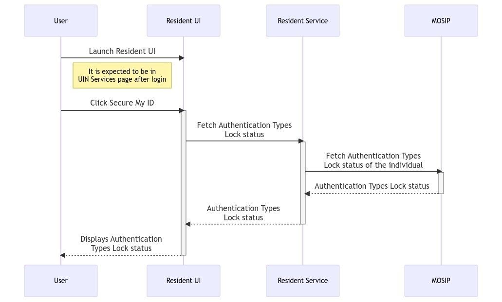<figcaption></figcaption></figure>

*   Applies the Authentication Types Lock/Unlock request in IDA

    \

    <figure>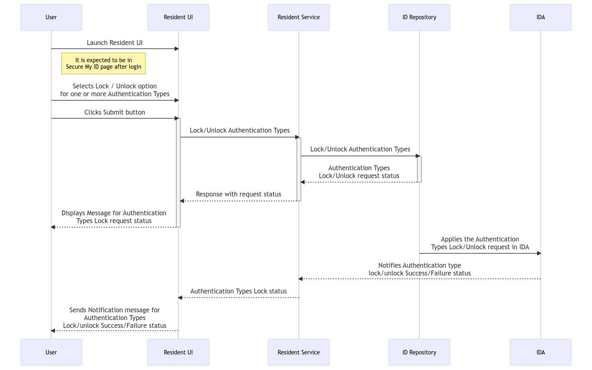<figcaption></figcaption></figure>

### **Manage My VID**

On clicking “Manage My VID”, the resident will be taken to a page where they can view details of the existing VIDs, generate new VID, revoke existing VID or download a VID card.

The following types of VIDs can be seen based on the VID policy:

1. Perpetual VID
2. Temporary VID
3. One-time VID

* Fetch Active VIDs of the Individual

<figure><figcaption></figcaption></figure>

* **Revoke the VID of the Individual**

<figure><figcaption></figcaption></figure>

* **GET/request-card/vid/{VID}:** This API is to request the PDF card generation for a specific VID of the logged in user. This will give back a event ID for tracking purpose and to use it to download the VID card from the notifications.

<figure><figcaption></figcaption></figure>

* **POST /callback/credentialStatusUpdate:** The websub callback API that will be used to notify the status of the credential upon the PDF card generation is done. This will notify the resident with phone/email message or Resident UI bell notification icon.

<figure><figcaption></figcaption></figure>

* Download PDF Card

<figure><figcaption></figcaption></figure>

### **Track My Requests**

On clicking “Track My Requests”, the residents can track the status of an Event ID (EID) associated with the logged-in UIN/ VID. They can also **view and download** the detailed information about the entered EID.

### **Download My Personalized Card**

On clicking “Get Personalized Card”, the residents can select the data to be added to their credential. They can preview the chosen data and download it. Residents should select at least 3 attributes.

* Creates the personalized card and signs it

<figure>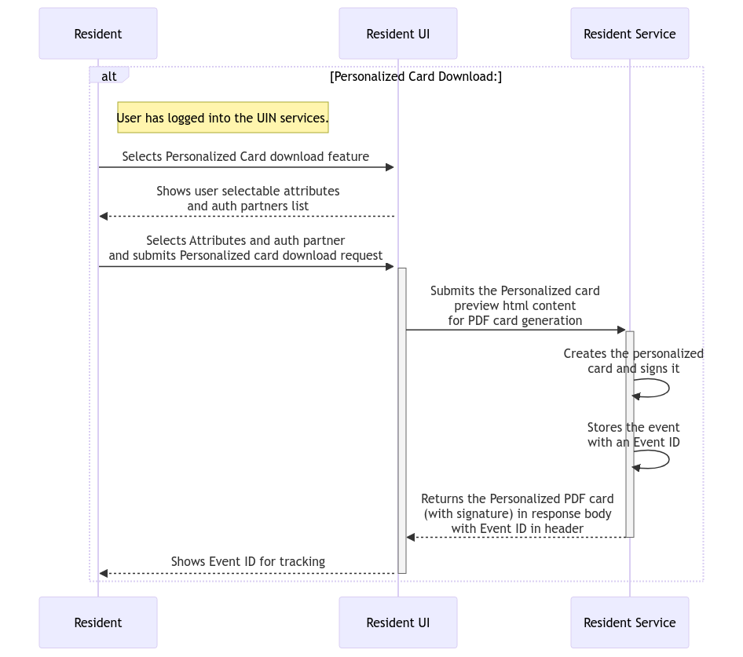<figcaption></figcaption></figure>

### **Share My Data**

On clicking “Share My Data”, the residents can choose the data to be shared with any of the registered partners to avail various third party services.

* **Submits the share credential request**

<figure>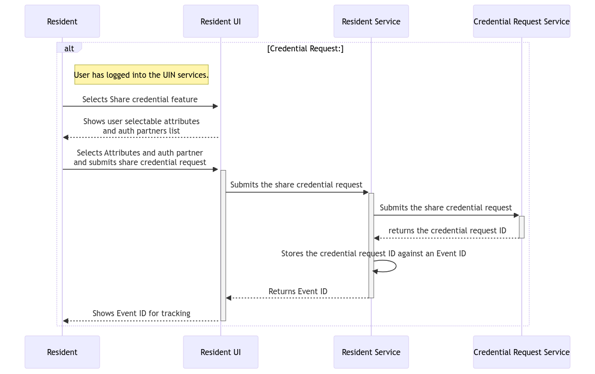<figcaption></figcaption></figure>

* Notifies resident about the credential shared status for the event ID

<figure>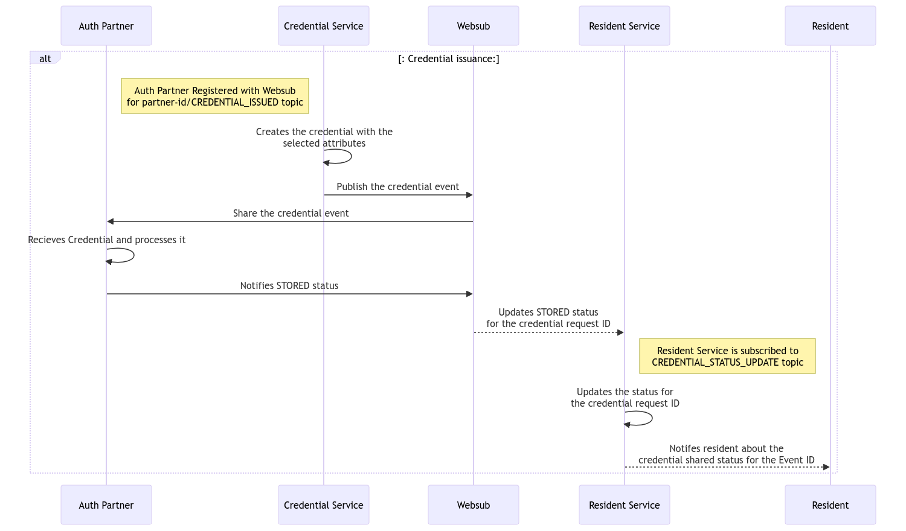<figcaption></figcaption></figure>

### **Update My Data** 

* Fetch existing AID in progress

<figure>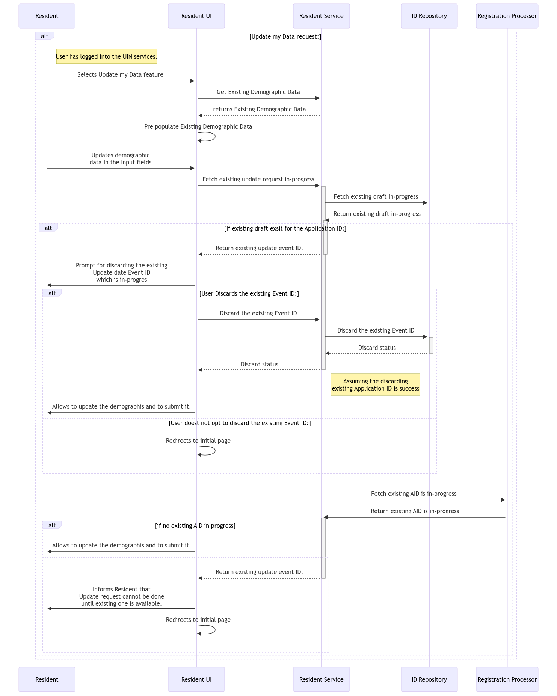<figcaption></figcaption></figure>

* Submits the update request

<figure>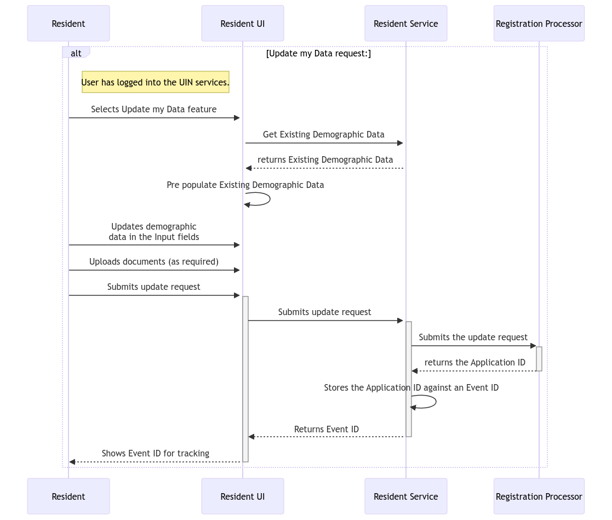<figcaption></figcaption></figure>

* **GNotifies that the UIN card is ready to Download status**

<figure>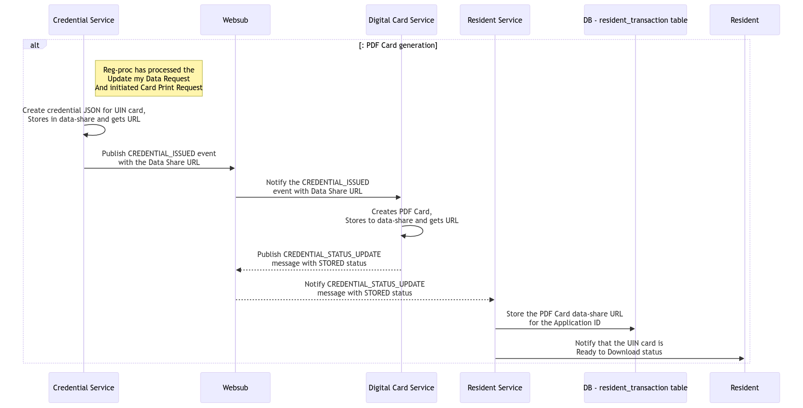<figcaption></figcaption></figure>

* Notify for IDENTITY\_UPDATED for the Event Id

<figure>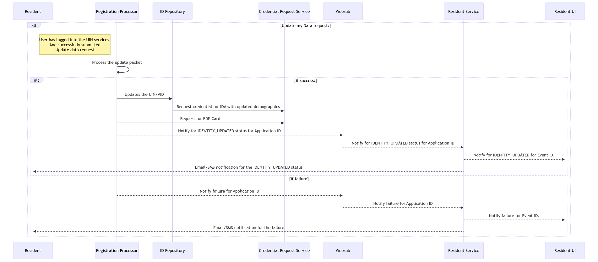<figcaption></figcaption></figure>

1. Get the Status for the AID

<figure>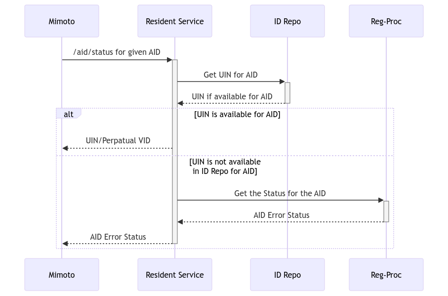<figcaption></figcaption></figure>

### **Menu Bar**

The Resident Portal menu bar contains the following:

1. **Font Size**- Residents can alter the size of the font based on their preferences.
2. **Language**- Residents can select the language of preference.
3. **Bell icon Notification**- Residents can view the notifications of all the asynchronous events in chronological order.

#### **Profile Icon:**

1. **Profile Icon**- Residents can view the following:
   1. Name of the logged in user
   2. Photo of the logged in user
   3. Last login details
   4. Logout option

## **Login With E-Signet (OpenID Connect)**

* Validate the Access token and ID token

<figure>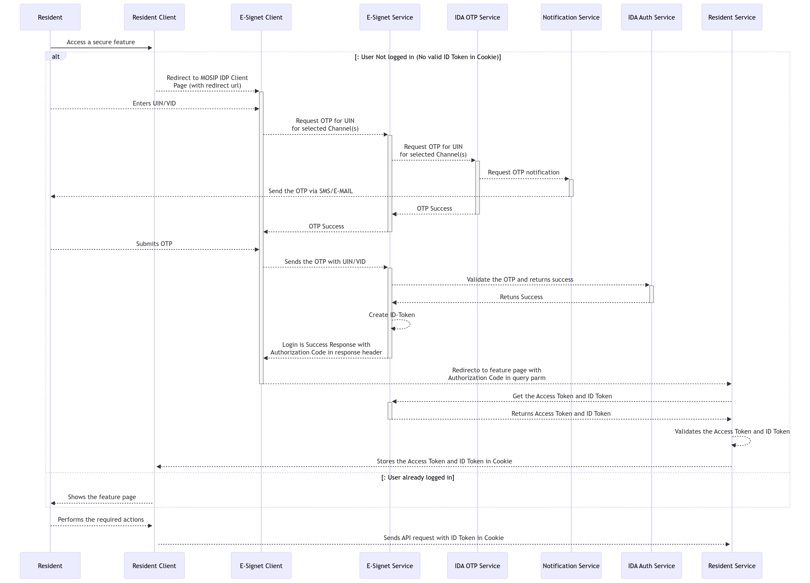<figcaption></figcaption></figure>

## **Get Information**

* Fetch Supporting Documents PDF\

<figure>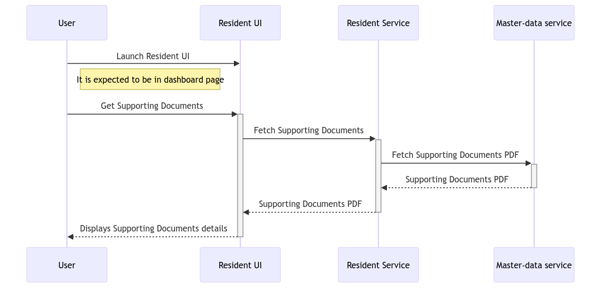<figcaption></figcaption></figure>

*   **Fetch registration centers**

    \

    <figure>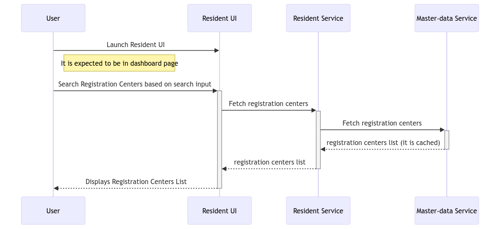<figcaption></figcaption></figure>

## &#x20;**Verify Email ID/ Phone number**

The residents can use this feature to verify their registered email ID or phone number.

## **Get My UIN**

The residents can use this feature for one of the following:

1. Download their UIN card
2. Check the status of their Application ID (AID)

* Get PDF card for AID if ready

<figure>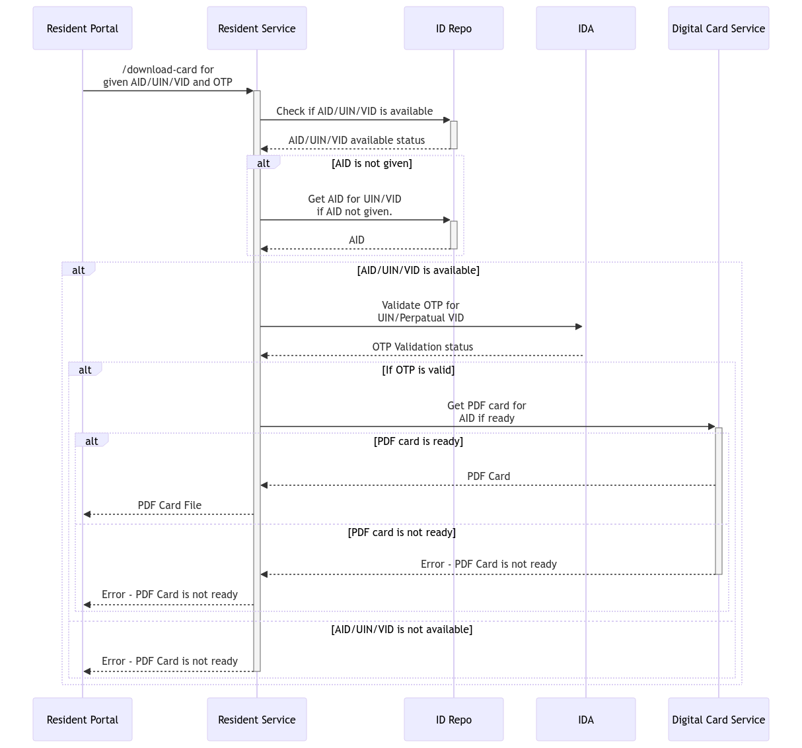<figcaption></figcaption></figure>

* **Check if PDF card URL is notified by Digital card service**.

<figure>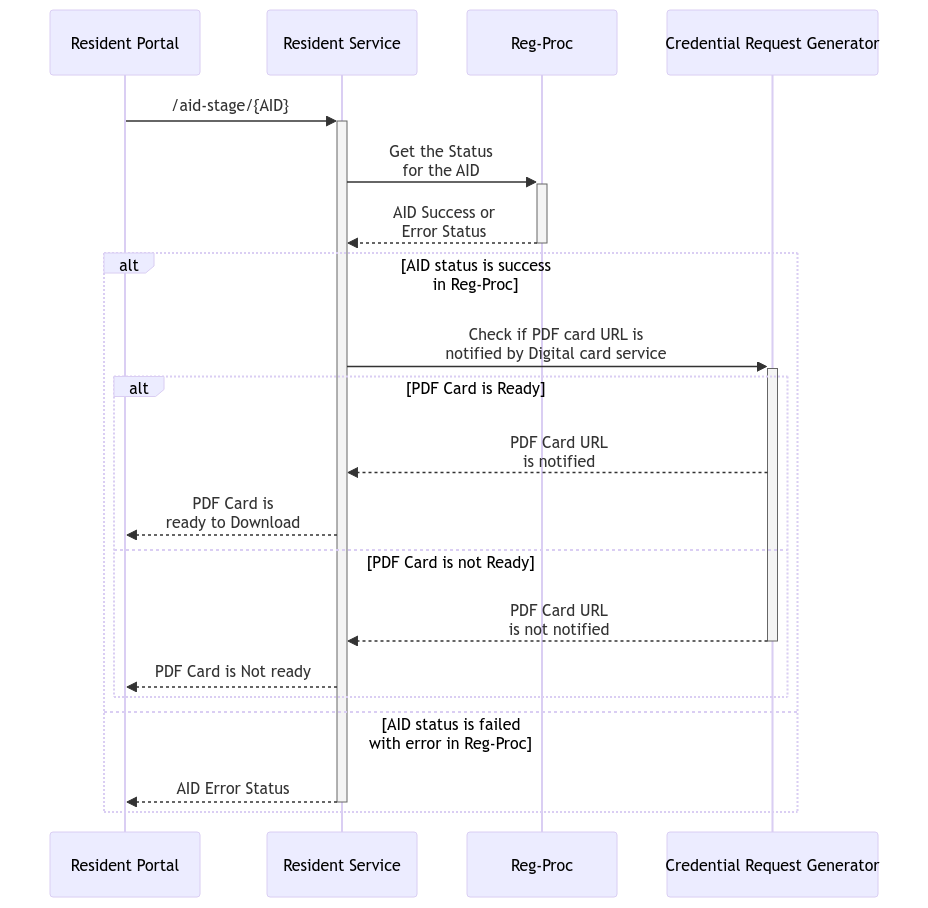<figcaption></figcaption></figure>

* **Validates the Action token and ID token**.&#x20;

<figure><figcaption></figcaption></figure>

## **Book an appointment**

The residents can book an appointment for registration using the pre-registration portal. To do so, they can click on “Book an appointment” tile which will redirect them to the pre-registration portal. To know more about pre-registration portal, refer to this link \[[https://docs.mosip.io/1.2.0/modules/pre-registration](https://docs.mosip.io/1.2.0/modules/pre-registration) ]

