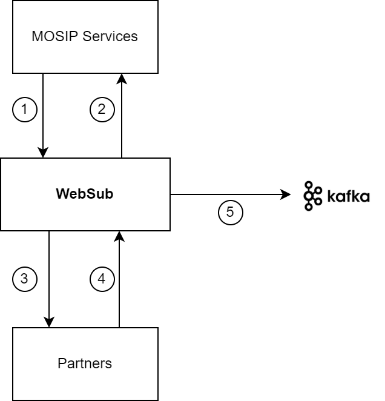

# WebSub

## Overview

WebSub provides a common mechanism for communication between publishers of any kind of Web content and their subscribers, based on HTTP web hooks. Subscription requests are relayed through hubs, which validate and verify the request. Hubs then distribute new and updated content to subscribers when it becomes available. WebSub was previously known as PubSubHubbub. For more information, read [W3C WebSub](https://www.w3.org/TR/websub/).

## WebSub in MOSIP

In MOSIP, WebSub is used to share data with services and partners. [Kafka](https://kafka.apache.org/) message broker has been used to implement the WebSub APIs. Message brokers are a natural fit for the implementation of WebSub hubs as they serve a similar purpose.

The relationship of WebSub with other services is explained here. _NOTE: The numbers do not signify sequence of operations or control flow._

1. Topic is registered and published or subscribed by MOSIP Services.
2. Content delivery and Intent Verification is done by WebSub to Mosip Services.
3. Content delivery and Intent Verification is done by WebSub to Partners.
4. Topic is registered and published or subscribed by the Partners.
5. Data and metadata needed for delivery, delivery reports and other functionalities are stored in Kafka.

Refer [WebSub repo](https://github.com/mosip/websub/tree/release-1.2.0) for further details.

## Developer Guide

To know more about the developer setup, read [WebSub Developers Guide](https://docs.mosip.io/1.2.0/modules/websub/websub-developer-guide).
