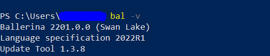

# WebSub Developers Guide

## Overview

[WebSub](https://docs.mosip.io/1.2.0/modules/websub) module provides a common mechanism for communication between publishers of any kind of Web content and their subscribers, based on HTTP webhooks.

Below is a list of tools required in WebSub:

1. Ballerina (Swan-Lake)
2. Any IDE (like Vs Code)
3. Kafka
4. Postman (any HTTP Client)
5. Git

### Software setup

1. Download [Ballerina](https://ballerina.io/downloads/) and install it as per instructions. (Use `bal -v` to ensure installation and version). 
2. Download [Kafka](https://kafka.apache.org/downloads) and install it.

### Source code setup

For the code setup, clone the repository and follow the guidelines mentioned in the [Code Contributions](https://docs.mosip.io/1.2.0/community/code-contributions).

### Importing and building

1. Open the hub and consolidator folders where `Ballerina.toml` is present.
2. Open the command prompt from the same folder.
3. Run the command `bal build` to build the hub and consolidator.
4. Open the project in VS Code either by `open with vs code` or from `File -> Open Folder`.

## Environment setup

1. Copy `websub-service.toml` and `websub-consolidator.toml` file from [mosip-config repository](https://github.com/mosip/mosip-config) to hub and consolidator folder respectively and rename both of them as `Config.toml`(case-sensitive). 
2. Run Configure and run Kafka, update `KAFKA_BOOTSTRAP_NODE` in `Config.toml` to point to your Kafka.

## Initialization and utilization of module

1. WebSub consists of consolidator and hub.
2. Consolidator should be started first, `Got to consolidator -> java -jar target/bin/<Jarname>`. (Config.toml should be in the same place where you are running this command).
3. Start WebSub with the same approach.
4. The APIs can be tried with the help of [kernel-websub-api](https://github.com/mosip/commons/tree/release-1.2.0/kernel/kernel-websubclient-api).
