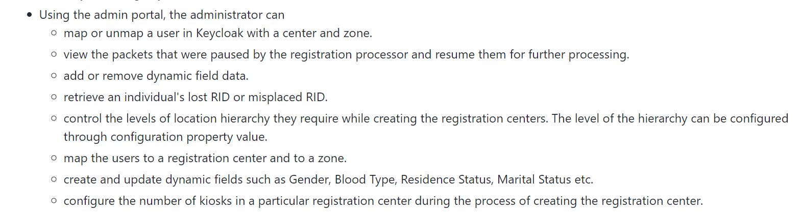

# ❗ MOSIP Documentation Style Guide

## Overview

This style guide includes the guidelines for writing clear and consistent MOSIP-related documentation. This document can be used as a reference if you are new to writing in MOSIP!

It is recommended to follow the guidelines mentioned below.

## File naming conventions

1. Every directory/folder can have a `README.md` file to convey what is present in it or can have any information that will benefit the user.
2. Filenames to start with lowercase. For longer and meaningful names, start with lowercase and then add hyphens (-) instead of underscores (\_). The are a few exceptions like `README`, `LICENSE`.
3. Use dots only for extensions in filenames and not for joining words.
4. File names should be as descriptive and meaningful as possible. It is better to avoid using any special characters (& # \* !) in the names.
5. In general, ensure that the filenames match the main heading on the page. Example, name of this file is `mosip-documentation-sytle-guid.md`.

## How to write in a markdown file?

Markdown files are text files with `.md` extension.

### Headers

* A file will have a heading followed by an Overview/Introduction/About section.
* There can be multiple other topics that can follow.
* For the main heading, use single # and it can have capitalization as required (use title case).
* For the "Overview" section, use double ## (use sentence case).
* For the other topics, use double hash or triple hashes, based on the importance of a topic or sub-topic.

### Bold

To make content/words bold, use double asterisks.

Example: I **will** complete these lessons!

### Italics

To make words italic, use underscore (\_).

Example: _Note_

### Lists

For bulleted lists, give \* with space before each entry. For numbered lists, write the numbers followed by dots and a space.

Bulleted list

* Apple
* Banana
* Water melon

Numbered list

1. Apple
2. Banana
3. Water melon

### Links

To link the content or provide references, write the content to be displayed on the screen in square bracket and the link in the parentheses (). It is also possible to provide references to specific topics.

To provide links to other pages, you may use:

1. Learn more.
2. See [title of other document](link/).
3. Refer [title of other document](link/) for ….

Example: For more information on Packet Manager, see [Packet Manager](packet-manager.md).

### Images

Images may be inserted in documents as required but they need to be uploaded in the repository before referring to them.

Syntax:

``

Example: ``

Below is an example of an diagram created using [draw.io](https://app.diagrams.net/) which is a free diagramming browser app.

Recommended settings to generate a PNG file on draw.io:

1. Go to File -> Export as -> PNG -> Advanced
2. Set DPI: 200 dpi (from drop-down)
3. Uncheck _**Transparent**_ option.
4. Click **Export**.

Another way to adjust the height and width of the image is by using the HTML tag:

``

### Indentation and sub-bullets (list in list)

Indentation must be done using 4 space characters instead of tabs as editors interpret tabs differently.

Example: _Bulleted List_

* Item 1
* Item 2
* Item 3
  * Item 3a
  * Item 3b
  * Item 3c

_Numbered List_

1. Item 1
2. Item 2
3. Item 3
   1. Item 3a
   2. Item 3b
   3. Item 3c

See [Markdown Guide](https://www.markdownguide.org/basic-syntax/).

### Code

There are two ways to format code in Markdown. You can either use inline code, by putting backticks (`) around parts of a line, or you can use a code block putting backticks (`) around parts of a line.

E.g.: `mosip_idrepo` DB

For code blocks, you can use three backticks ( \`\`\` ) or three tildes ( \~\~\~ ) on the lines before and after the code block.

To know more, refer [here](registration-client-ui-specifications.md).

## Writing style

1.  **Language and Grammar**: In general, use second person in documents rather than first person — _you_ instead of _we_. Also, avoid using _our_ in documentation. Also, use active voice as much to make clear who's performing the action.

    | Not recommended                                  | Recommended                                                     |
    | ------------------------------------------------ | --------------------------------------------------------------- |
    | If we are deleting multiple entries at a time... | If you are deleting multiple entries at a time...               |
    | For details, read our documentation.             | For details, see [Operator Onboarding](operator-onboarding.md). |
2. **Clarity**: Content needs to be concise and we need to write sentences that are short and crisp. Unordered bullet points can be used to simply content. If paragraphs are present, remember to make it short with close to 5-6 sentences (about 100-200 words).
3. **Consistency**: Maintain consistency in words and usage. For example, use "ID Repository" instead of "id repo", "WebSub" instead of "websub", "Registration Client" instead of reg client, "Pre-registration" as the concept and Pre-Registration if we are referring to the module.
4.  **Punctuations**: The right use of commas and period/full stop is extremely important. Sentences should end with a period and connecting phrases to have commas.

    Example: For more information on punctuations, refer [here](https://www.grammarly.com/blog/punctuation).
5. **Symbols**: Don’t use symbols and shortcuts like ampersand “&” in headings, text, navigation, or tables of contents. Instead, we can use **and** unless it is necessary in the code.
6. **Capitalization**: Adhere to the standards for capitalization of words in the product name or abbreviations used. Examples:
   * While referring to out platform, use MOSIP instead of mosip.
   * While referring to IDs, use user ID instead of user id.
   * Write ABIS instead of abis.
7.  **Tables**: Use tables to organize data that is too detailed or complicated to be described adequately in the text allowing the reader to quickly see the results.

    Example: [Pre-registration UI specifications](https://docs.mosip.io/1.2.0/modules/pre-registration/pre-registration-ui-specifications).
8. **Spell check**: Run a spell check using any online software or using MS-Word before saving changes. This is also called as proof-reading the document. Note: This is crucial as running a spell checker ensures that the number of typos in your document decreases significantly.
9. **Hyperlinks**: On completion, check if all the hyperlinks on the page are working fine. Any broken link can be distasteful to the reader.
10. Avoid **repetition** of words or content.

    Example:

    **Initial draft**

    

    **Final draft**

    
11. **Spacing**: Avoid leaving unnecessary empty spaces between words or sentences. You may leave one line space between each paragraph or as needed incase of multiple paragraphs.
12. Avoid using the terms like **blacklist, black list, black-list, whitelist**.

    Instead, it is recommended to use:

    * For the noun blacklist, consider using a replacement such as denylist, excludelist, or blocklist.
    * For the noun whitelist, consider using a replacement such as allowlist, trustlist, or safelist.
    * For the noun graylist (greylist), consider using a replacement such as provisional list.

## Templates

Templates for some standard pages are available as below:

* [README template](../templates/readme-template.md): For READMEs in repositories. Make sure this file is called `README.md`.
* [Module template](../templates/module-service-template.md): Template for landing page of a MOSIP module or service.
