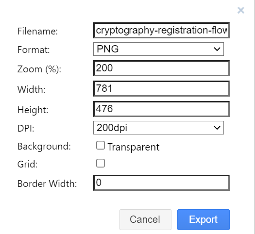

# MOSIP Documentation Style Guide

## Overview
This style guide provides guidelines for writing clear and consistent MOSIP-related documentation. This document can be used as a reference if you are new to writing in MOSIP!
It is recommended to follow the guidelines mentioned below.

## File naming conventions
1. Every directory/folder can have a README.md file to convey what is present in it or can have any information that will benefit the user.
2. Filenames to start with lowercase. For longer and meaningful names, start with lowercase and then add hyphens (-) instead of underscores (_).
3. Use dots only for extensions in filenames and not for joining words.
4. File names should be as descriptive and meaningful as possible. It is better to avoid using any special characters (& # * !) in the names.

### Examples

1. Valid filenames as per our set convention.

2. Filenames containing dots.

The above example highlights the following:

    a. `Readme` and `License` files are the only exceptional files that can have complete capitalization.

    b. Files like `deploy.sh`, `testng-report-failed.tar.gz` etc. have dots only for extensions.

    c. The filename `directoryAngularFiles` is incorrect as per our guidelines. It can be renamed to `directory-angular-files`. Unnecessary capitalization is not required in filenames.

### How to write in a markdown file?
Firstly, create a new file and save it with .md as the extension. To make changes, click **Edit**.

**Markdown basics with examples**

#### 1. Headers
* A file will have a heading followed by an Overview/Introduction/About section. 
* There can be multiple other topics that can follow.
* For the main heading, use single # and it can have capitalization as required.
* For the Overview section, use double ##.
* For the other topics, use double hash or triple, its importance as a topic or sub-topic.

**_Headers_**
# Header one
## Header two
### Header three
#### Header four
##### Header five
###### Header six

#### 2. Bold
To make content/words bold, use double asterisks. 
Example: I **will** complete these lessons!

#### 3. Italics
To make words italic, use underscore (_)
Example: _Note_

#### 4. Lists 
For unordered lists, give * with space before each entry. 
For ordered lists, write the numbers followed by dots and space.

Unordered list
* Apple
* Banana
* Water melon

Ordered list 
1. Apple
2. Banana
3. Water melon

#### 5. Links
To link the content or provide references, write the content to be displayed on the screen in square bracket and the link in the parentheses ().
It is also possible to provide references to specific topics. 

Example: For more information on Packet Manager, see [Packet Manager](https://github.com/mosip/documentation/blob/1.2.0/docs/packet-manager.md).

Note: Please ensure to put the full stop outside the link.
          
#### 6. Images
Images can be inserted in documents as required but they need to be uploaded in the repository before referring to them.

Images can be added to any markdown page using the following markdown syntax: ****

Example:

**To create images** 

You may use **draw.io** which is a free diagramming application that allows users to create and share diagrams within a web browser. 

_To generate a png (recommended settings)_
1. Go to File > Export as -> PNG > Advanced
2. Set DPI: 200 dpi (from drop-down)
3. Uncheck **Transparent** option
4. Click **Export**.

#### 7. Indentation and sub-bullets 
It is recommended to use *spaces* instead of tabs while editing content because different editors can interpret tab spacing differently. In markdown format, for indentation and sub-bullets, it is recommended to use 4 spaces instead.

For more information on Markdown, visit [Markdownguide](https://www.markdownguide.org/basic-syntax/).

### Points to remember

1. Content needs to be concise and we need to write crisp short sentences. Unordered bullet points can be used to simply content. If paragraphs are present, remember to make it short with close to 5-6 sentences (about 100-200 words).

2. Maintain consistency in words and usage. Refer to our [existing documentation](https://docs.mosip.io/1.2.0).

Examples:
* Use ID Repository (instead of id repo)
* WebSub (instead of websub)

3. Punctuations are very important. The use of commas and period/full stop(.) Sentences to end with periods and connecting phrases to have commas.

E.g.: For more information on punctuations, refer [here](https://www.grammarly.com/blog/punctuation).

4. Don’t use symbols and shortcuts like ampersand “&” in headings, text, navigation, or tables of contents.
Instead, we can use and unless it is necessary in the code.

5. Standardization and capitalization of words in the product name or abbreviations used.
Examples:
* While referring to out platform, use MOSIP instead of mosip.
* While referring to IDs, use user ID instead of user id.
* Write ABIS instead of abis.

6. Use Tables to organize data that is too detailed or complicated to be described adequately in the text, allowing the reader to quickly see the results. 
https://docs.mosip.io/1.2.0/modules/pre-registration/pre-registration-ui-specifications 

7. Run a spell checker using any online software or using MS word before saving changes. This is also called as proof-reading.
    Note: This is crucial as running a spell checker ensures that the number of typos in your document decreases significantly.
    
8. On completion, check if all the hyperlinks on the page are working fine. Any broken link can be distateful to the reader.

9. Repetition of words to be avoided as much.

Example: 

*Initial draft* 

*Final draft*

    

