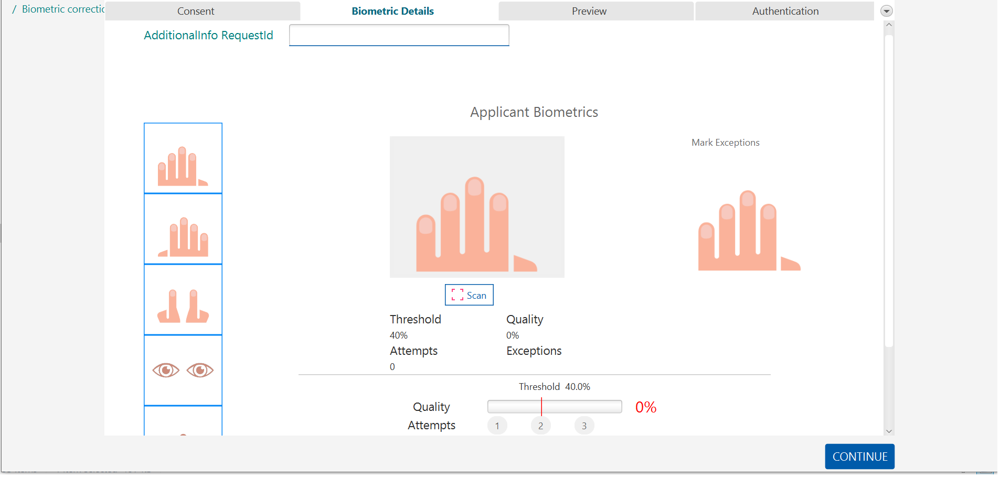

# Operator onboarding 
This guide contains all the details you may want to know about the operator onboarding.

## Creating the first operator in MOSIP
To generate the first operator in MOSIP eco-system, refer to the steps below.

The Admin needs to:
1. Create the role **Default** in KeyCloak with all the other roles.
1. Create the operator' user account in KeyCloak.
1. Assign the operator user account with the **Default** role.
1. Perform Zone and Center mapping for the operator using the Admin Portal.
1. Onboard the operator machine using the Admin Portal. Machine' details can be extracted using the [TPM utility](https://github.com/mosip/mosip-infra/blob/develop/deployment/sandbox-v2/utils/tpm/key_extractor/README.md)

The operator will need to:
1. Download the latest registration client and login with the credentials set in KeyCloak.
   The operator will automatically skip Operator/Supervisor onboarding and reaches the home page of the registration client.
2. Register themselves in MOSIP and get a RID and UIN.

Once the operator is registered:
* The Admin changes the role of the operator to either **REGISTRATION_OFFICER** or **REGISTRATION_SUPERVISOR**. 
* Deletes the role **Default** from KeyCloak so that no other user has the role Default.   
* This operator can now register and onboard other Supervisors and Officers.

## On-boarding an operator

* Admin needs to map the operator' UIN in KeyCloak under Attributes with attribute name as `individualId`.
* Admin needs to remove the "Default" role mapping for the operator' user account if it exists.
* The operator needs to login (password based) to the registration client using Keycloak credentials.
* The operator needs to ensure that the registration client machine is online.
* The operator will land into the below page and needs to click on **Get Onboarded**

  

* The operator needs to provide their biometrics and click **Save**.
* All the biometric modalities displayed in the Operator biometrics page must be captured before clicking on Save.
* Captured biometrics quality must be greater than or equal to the threshold displayed in the UI.

  *Note*- The threshold values are configurable and can be set as per the ID issuer.

   

* After successful onboarding, the operator is automatically re-directed to the [registration client home page](registration-client-home-page.md).

*Note*:
- After successful onboarding of the operator, the templates are extracted from the captured biometrics using configured Bio-SDK.
The extracted templates are stored in Derby DB. This can be used later for operator' biometric-authentication and also for local de-duplication checks during registration.
- After the first login and successful on-boarding, the registration client would mandate the operator to login with the configured authentication mode decided by the administrator.
- Any number of operators can login to a registration client machine but they need to be mapped to the same center where the machine is onboarded.
- Login operator' user ID is case-insensitive.

Summarizing, on-boarding of an operator is successful only if,
* The operator is active and not block listed.
* The operator and the machine belongs to the same center.
* The operator's User ID is mapped to their UIN. 
* The operator's biometric authentication is successful during on-boarding.
* The system is online during on-boarding.

### Modes of login
* MOSIP supports single factor and multi factor login including password, iris, fingerprint, and face authentication for registration client. An administrative configuration setting determines the mode of authentication login.
* The registration client can authenticate an operator in offline mode using the locally stored biometrics templates (face/finger/iris) and password hash.

### Temporarily lock the operator
The registration client temporarily locks the operator’s account in case they provides an invalid password/fingerprint/iris/face for X times continuously to login (X is configurable). The temporary account lock lasts for X minutes (X is again configurable).

### Logout
An Operator can logout of the registration client by:
* Clicking on the *Logout* button, 
* Closing the registration client, 
* Being in-active on the registration client for configured amount of time after which they are automatically logged out.
* Upon logout, any unsaved data will be lost. 
* Data will not be automatically saved in the database and will not be retained in memory though transaction details which is used for auditing will be captured and stored (except for PII data).

*Note*- Registration client provides an alerts to the operator ‘X’ minutes before reaching the auto logout time limit. Registration client displays a countdown timer in the alert. The operator can choose to dismiss the alert and continue working. This will also reset the timer to zero.

