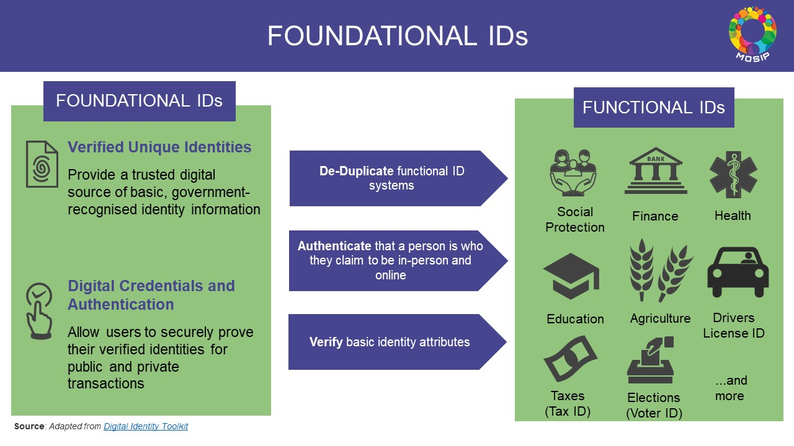
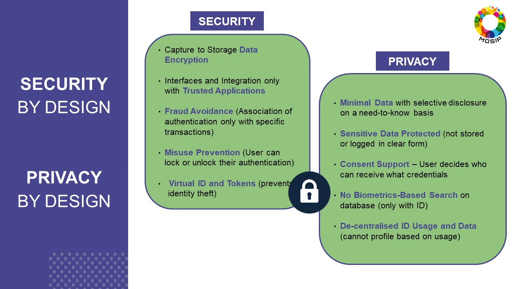
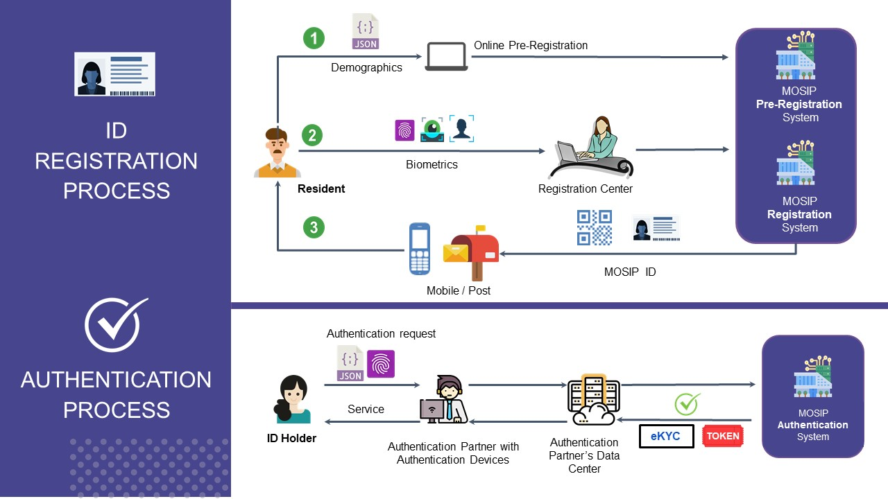

## Overview

## What is a Foundational ID system?
Governments are exploring the development of multipurpose foundational ID systems, in which the individuals receive a unique identifier from the government that they can use for identity assertion and verification. It can then be used to access a wide variety of government and private services.  

Functional IDs are the IDs that are used in specific use cases. By design, they are created having an end usage in mind. The Functional ID systems can leverage the Foundational ID system.

## What is MOSIP?
MOSIP is a robust, secure, open source platform for building foundational identity systems.
MOSIP is **configurable** and flexible to adapt to a country’ national ID requirements.

## Privacy and Security 

## MOSIP Modules

## MOSIP ECOSYSTEM

MOSIP needs to work along with other ecosystem players to create a solution for a particular country.

## MOSIP Offerings
Key MOSIP offerings are:
* ID Lifecycle Management
* ID Authentication

## Building a National ID System using MOSIP
National ID systems can leverage MOSIP as the base platform and configure, customize, extend it to build their systems just the way the need it. T
The image below depicts how MOSIP can be visualized as a national ID platform.

