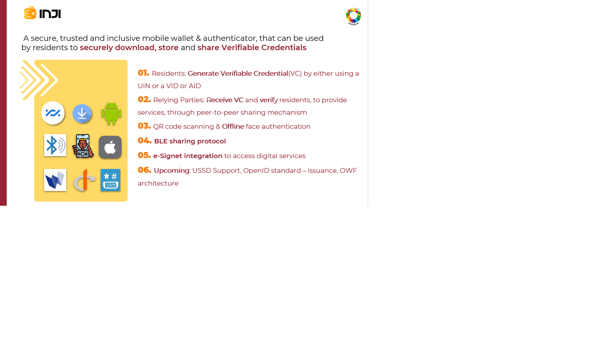

# Overview

In the Alpha version, we built an Android app with the ability to download credentials from an issuer and implemented the sharing feature using the Google Nearby protocol.

For the Beta version, we extended Inji to work on `iOS` devices. In this version, we have developed the **offline sharing feature** using the `BLE protocol` which is an extension of the OpenID for VP (Verifiable Presentation) standard. We have also added an offline selfie authentication feature. There are many ways in which this feature can be used:

User can verify their presence while sharing their digital credential by clicking a selfie and performing a face authentication. 

This can also be used by the Verifier (relying parties) to perform a selfie authentication while receiving a digital credential. 

How does that happen?

* Users can install Inji on their smartphones and download their digital credentials on it.

* Users can also use Inji to share their digital credentials with a relying party by scanning a machine-readable code like a QR code.

