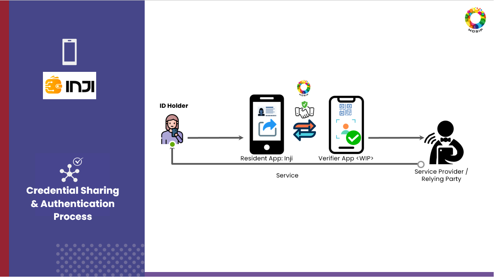
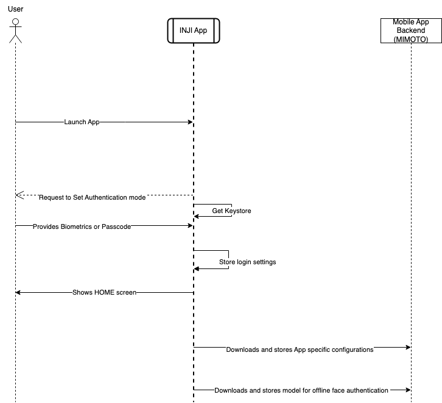
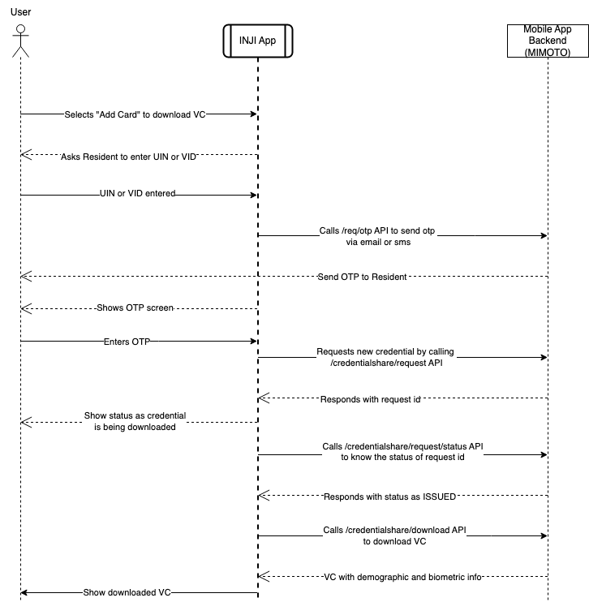
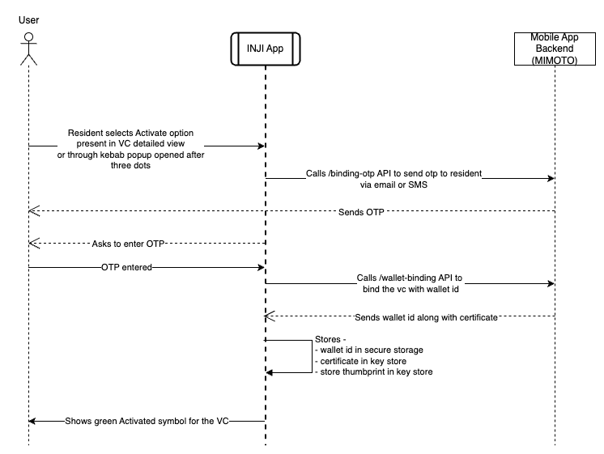
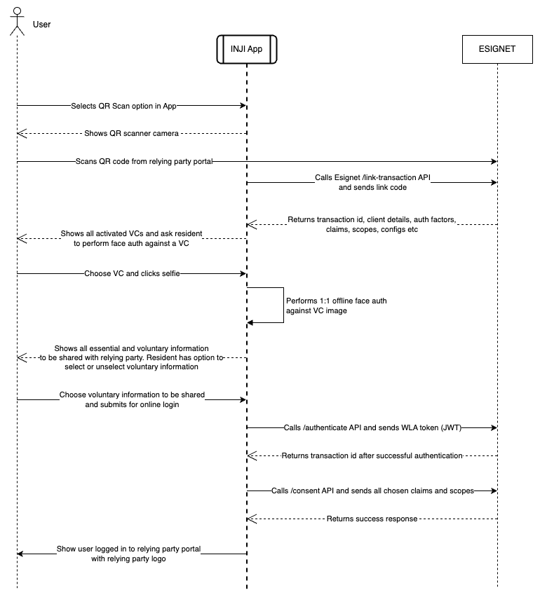

# Overview

Inji is a secure, trusted and reliable mobile wallet and authenticator that can be used by the residents to:
- securely download and store digital credentials into  the wallet.
- perform offline face authentication against their own digital credentials to verify user presence.
- share digital credentials with the relying parties to avail various services.
- perform online login to a relying party portal by scanning a QR code to avail their services.

Additionally, it can also be used as a base to create a Verifier App by service providers to authenticate the resident's identity in order to provide them services.

The app is built using [react native framework](https://reactnative.dev/) which supports both Android and iOS mobile operating systems. It uses [xstate state machines](https://xstate.js.org/docs/) to manage the application state. The digital credentials generated by the mobile application follow the Verifiable Credentials(**VC**) data model. To learn more, read [Verifiable Credentials Data Model](https://www.w3.org/TR/vc-data-model/).

**How does Inji Work?**

* After installing Inji, residents can enter their unique ID (issued by country, e.g. the UIN or VID) on the app to generate the VC. 
* Resident will now be prompted to enter the OTP sent on the registered mobile number or email address. 
* After successful validation, the VC will be downloaded and stored on the app.
* Residents can also use the Application ID if their UIN or VID is not available. They can share the downloaded VC with the relying party via bluetooth to avail the services. The app uses [BLE protocol]() to share VC.

Inji also supports integration with [e-Signet](https://docs.esignet.io/) wherein the resident can login to the relying party portal by scanning a QR code. They can can also choose what information needs to be shared with the relying party (user consent). However, the residents have to activate the VC before performing online login.

Inji will have upcoming support of USSD code for feature phone users as well as Open ID standard issuance and [OWF architecture](https://github.com/openwallet-foundation).

Below diagram shows how credentials are shared and the authentication process that takes place between the resident and the service provider.

#### Backend 
- The app uses [Mimoto APIs](https://mosip.stoplight.io/docs/mimoto) for generating VCs, downloading and activation.
- It uses [e-Signet APIs](https://mosip.stoplight.io/docs/identity-provider) for online login.

## Installing the application
After installing the application, the user will need to set an app lock code for it. App supports biometric or PIN based lock. For more details, refer the [User Guide](https://docs.mosip.io/1.2.0/modules/mobile-application/inji-mobile-app-beta).

## Generating and storing of credentials
A resident can generate a Verifiable Credential(VC) for them or their family or friends on the same phone.
Detailed steps on generating and sharing credentials are given in the [User guide](https://docs.mosip.io/1.2.0/modules/mobile-application/inji-mobile-app-beta).
The process of generating a credential is shown below

## Sharing of credentials
The credentials are shared in peer-to-peer model with the verifier application. The data exchange between devices is done using the BLE Protocol. Refer to [Tuvali documentation]() for more info.

## Online login process
* Resident can use INJI app to login to any service provider app (integrated with e-Signet) just by scanning a QR code from their portal. 
* The app performs offline face auth after scanning the QR code to verify the user presence. 
* Once the presence is verified, resident is given an option to choose the optional information to be shared with the service provider portal.
* After consent is provided, the app sends a WLA (Wallet local auth) token which is a JWT token to the relying party. 
* The resident is given access to the portal after the token verification.

#### Step 1: VC activation process

#### Step 2: Online QR login

