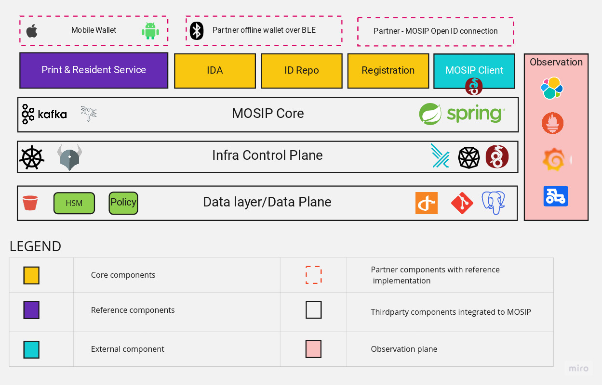
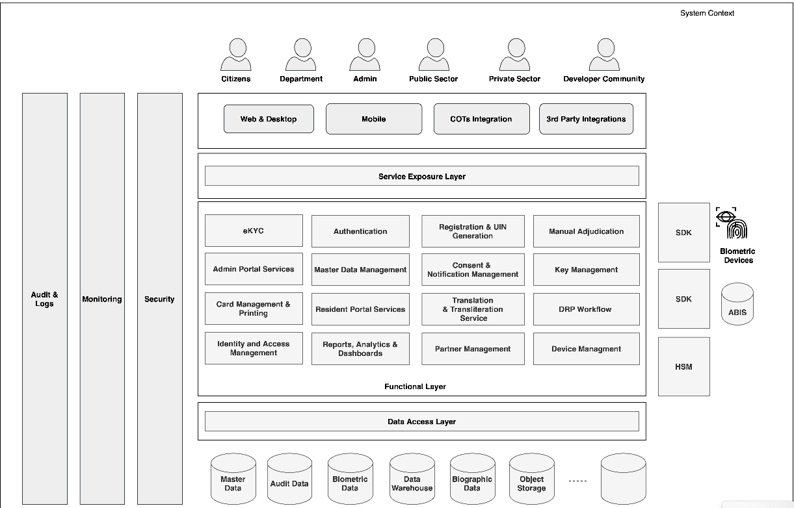

# Architecture

MOSIP as it stands is a modular microservice based architecture. It's modularity helps in adoption of MOSIP at complex situations. Most of the MOSIP modules are designed to be a strong foundation infrastructure modules and can be adopted in several projects.

MOSIP is designed with the following architecture principles. These architecture principles are core to the development of the system's feature and has a great influence on how and why specific software design patterns are used within.

* Data Privacy
* No Vendor Lock-in
* Open Standards
* Async/ Offline First
* Commodity Computing
* Fault tolerant
* Manageable
* Secure By Default

### Overview

<figure><figcaption>
Architecture Overview
</figcaption></figure>

To know how MOSIP can be deployed, refer [Getting Started](https://docs.mosip.io/1.2.0/deploymentnew/getting-started). The different installation models are detailed out in the [Deployment](https://docs.mosip.io/1.2.0/deploymentnew) section.

### High-Level Reference Functional Architecture

The High-Level Reference Functional Architecture serves as a blueprint outlining the system's high-level functioning and interactions, providing a structured framework.

<figure><figcaption></figcaption></figure>
