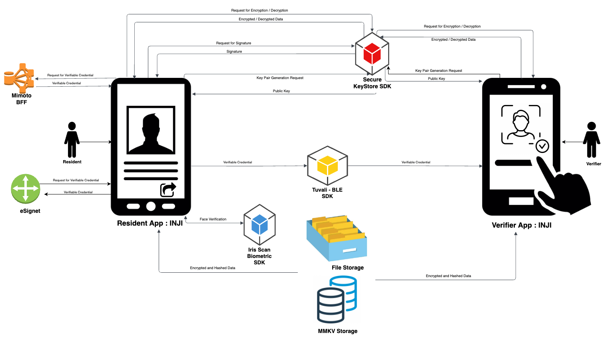

# Architecture

Inji is a mobile application designed to enhance user convenience by allowing them to securely download and manage their Verifiable Credentials (VC) offline. The diagram below illustrates the extensive features of Inji, highlighting the essential modules involved in issuing Verifiable Credentials.

Furthermore, this overview outlines various user flows, detailing the seamless processes users can follow. These processes include downloading VC through OTP, utilizing eSignet for authentication, securely activating VC, logging in to eSignet, and effortlessly sharing VCs.

<figure><figcaption>
Inji Architecture
</figcaption></figure>

Let’s go through a brief overview these components. 

* **eSignet**: A server which is being used to generate verifiable credentials from user's data securely.

* **Mimoto**:  BFF for routing API calls to services.

* **Tuvali**: SDK that transfers data securely over BLE.

* **Iris Scan**: SDK used for face verification.

* **Secure Key Store**:  SDK used for key generation, signing and encryption/ decryption.

