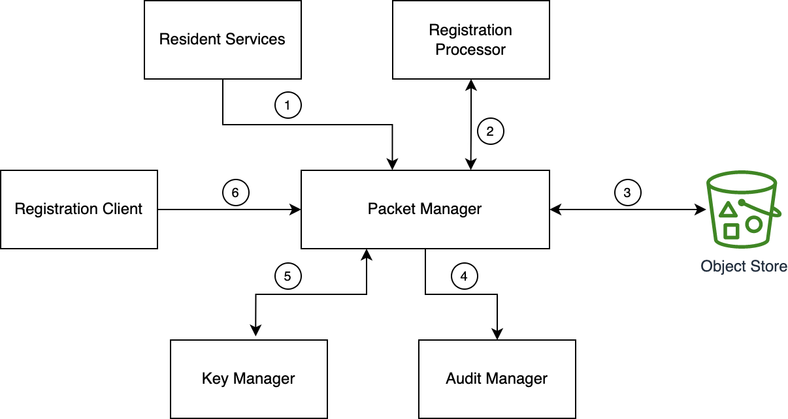

# Packet Manager

## Overview
Packet Manager performs the following functions:

1. Reads/writes registration packets from/to [Object Store](storage.md#object-store).
1. Performs in-memory encryption and decryption of packets. 
1. Performs security checks, checksum, file validations, ID object validations etc. on the registration packet.
1. Provides packet information to other services via APIs. In case of multiple packets associated with an ID, pulls information from packets based on configured priority. (See [`packetmanager.default.priority`](https://github.com/mosip/mosip-config/blob/develop3-v3/application-default.properties)).

Packet Manager runs as a service and is also available as a library. 

The relationship of Packet Manager with other services is explained here. _NOTE: The numbers do not signify sequence of operations or control flow. Arrows indicate data flow_.

1. [Resident Services](resident-services.md) uses Packet Manager library to create packet.
2. [Registration Processor](registration-processor.md) reads packet data using Packet Manager service.
3. Packets are stored and retrieve from [Object Store](storage.md#object-store).
4. Audit logs.
5. Encryption and decryption of packet. 
6. [Registration Client](registration-client.md) uses Packet Manager libray to create packet.

## Packet structure
A registration packet is an [encrypted](data-protection.md#registration-data-flow), zipped file containing ID information and meta data of an individual. Example zipped file:

`10001100771006920220128223618-10001_10077-20220128223618.zip`

Naming convention: `appid-refid_timestamp.zip` 
* [appid](identifiers.md#rid-appid)
* refid: `centerid_machineid`

## API
Refer [API Documentation](https://mosip.github.io/documentation/1.2.0-rc2/1.2.0-rc2.html).

## Source code 
[Github repo](https://github.com/mosip/packet-manager/tree/1.2.0-rc2).

