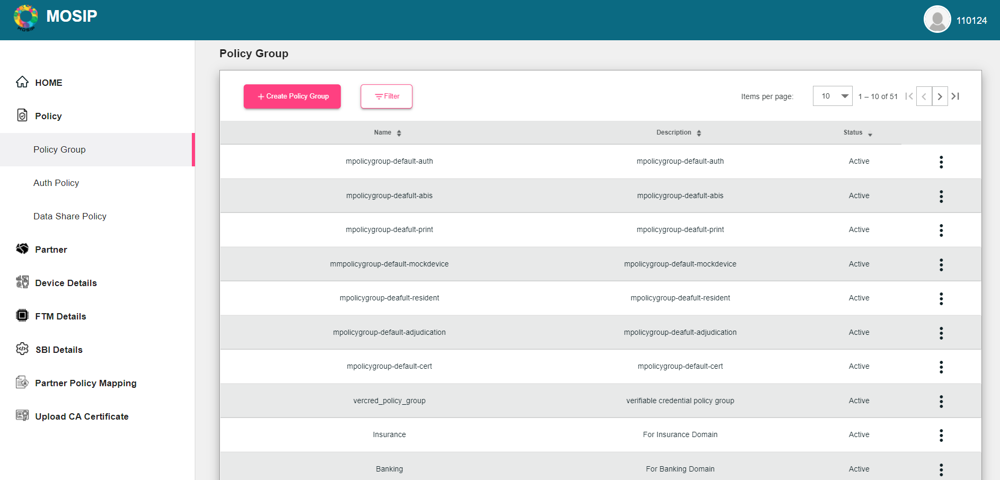
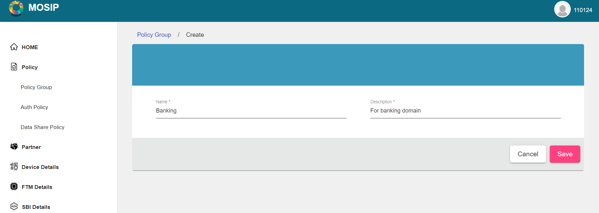
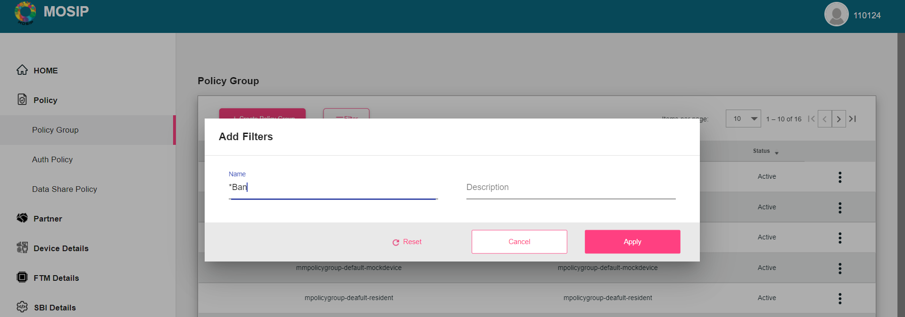
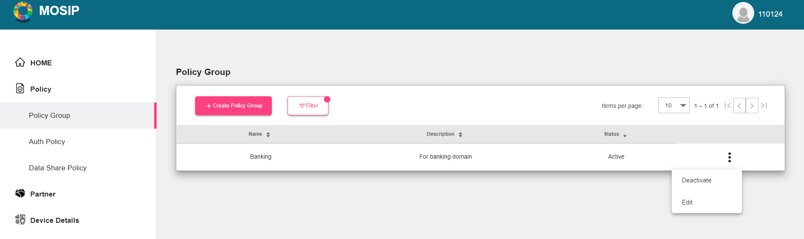
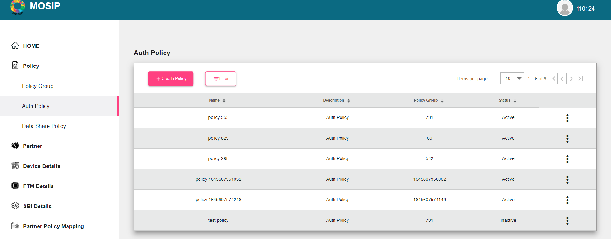
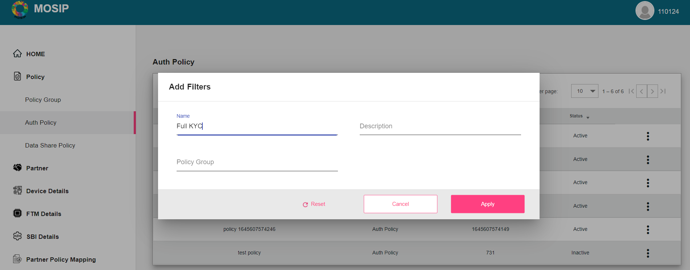
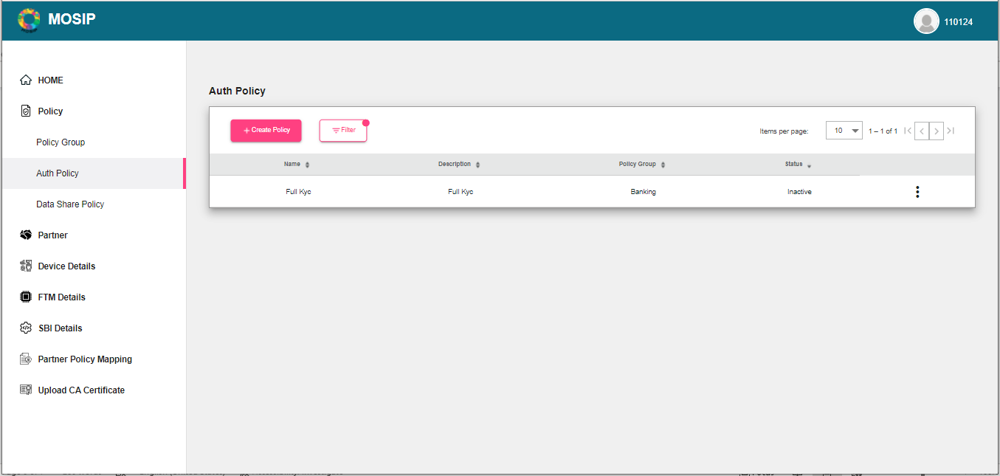
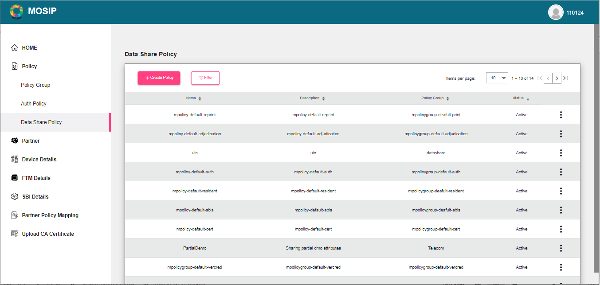

# Partner Management Portal 

_THIS DOCUMENT IS BEING UPDATED_.

## Overview
Partner management portal allows the partners to register themselves in MOSIP. With LTS release, the following types of partners can register themselves:
1.	Authentication Partners
2.	Credential Partners(with limited features)
3.	Device Providers
4.	FTM Provider

## Partner roles

|Partner Type|Associated Role|
|------|-----|
|Partner Admin|PARTNER_ADMIN|
|Policy Manager|POLICYMANAGER|
|Authentication Partner|AUTH_PARTNER|
|Credential Partner|CREDENTIAL_PARTNER|
|Device Provider|DEVICE_PROVIDER|
|FTM Provider|FTM_PROVIDER|

A Partner Admin can create Policies that are required for Authentication and Credential partners. The section below describes the types of policies that are supported by MOSIP.

## Home page

## Policies

Learn more about Policy types, refer [here](partner-policies.md).

To create policies, policy groups should be defined. Policy groups can be considered as the regulatory bodies in a country, examples could be Telecom, Insurance, Banking, etc.

### Creation of Policy group
* Login as `Partner Admin` into the PMS portal.
* After successful login, on the left navigation pane, click on **Policy -> Policy Group**.
* The existing policy groups are listed on the screen and the new ones can be created. 

**To create Policy groups**
* Click Policy -> Policy Group -> +Create Policy Group
* Enter the Policy group Name and Description and click **Save**.

To search or filter any data pertaining to policy groups, filter menu can be used. 

You can also change the status of policy group(Deactivate/Re-activate) or edit it using the Action menu as shown below.

On successful creation of Policy groups, polices can be created under that group. MOSIP supports two types of policies, i.e., **Auth** policy and **Datashare** policy.

## Auth Policy

 By default, on clicking Auth policy, the screen displays the list of existing auth policies.

### To create an Auth policy 

  1. Click **Auth Policy -> Create Policy**. 
  2. Add the Name and Description.
  3. From the dropdown, select the Policy Group.
  4. Add the Policies Data.
  5. Click **Save**.

_Note_: Once the policy is created, it will be in _Inactive_ state. You have to activate it before using it for a partner.

### To activate or edit the Auth policy
 
 1. Select the policy you want to activate or edit. 
 2. From the Actions menu, select Activate/Edit.

### To search or filter required data.

  1. Use the filter menu**.

## Data Share Policy

* Data Share policy can be created/edited in the same way as the steps mentioned in Auth policy by using Data Share Policy menu options.

## Partner

### Self Registration
Partners in MOSIP are created in a self-service mode. The partner visits the MOSIP partner management portal and requests for collaborating with MOSIP by providing basic details such as organization name and email-id, purpose of registration (how they want to collaborate with MOSIP - as a device provider, authentication partner, print partner, etc), basic credentials and performing an OTP based verification.
Once these details are filled by the partner and a request is sent to MOSIP, the `Partner Admin` verifies the details of the partners and allows the partner to integrate with MOSIP.

To know more about each of the partners, click:
1. [Auth [partner](auth-partner.md)
2. [Device Provide](device-provider.md)
3. [FTM Provider](ftm-provider.md)

