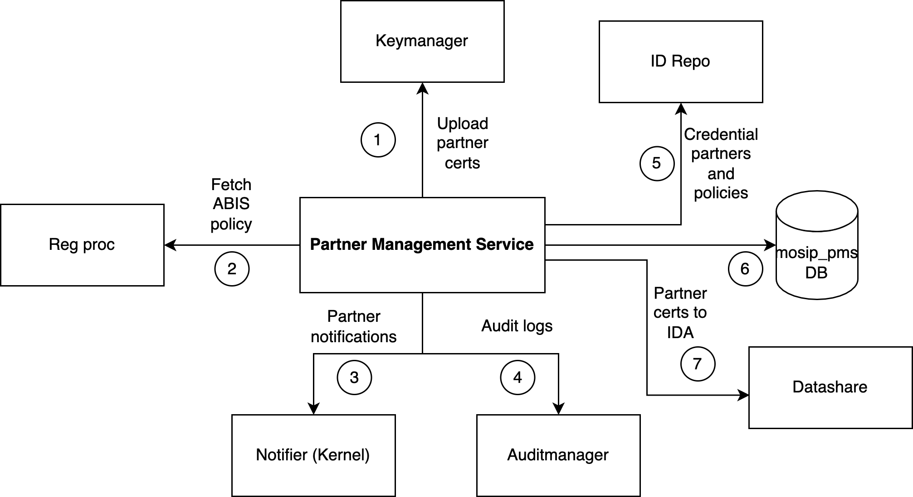
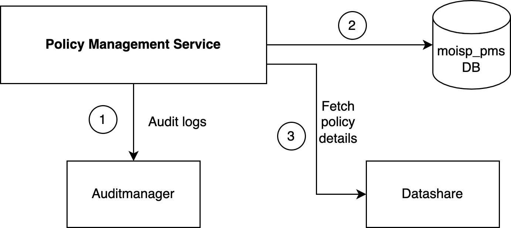

# Partner Management Services

## Overview
Partner Management Services (PMS) module provides the following services:
1. Partner Management Service 
1. Policy Management Service

For an overview of role of partners in MOSIP refer [here](partners.md).

## Partner Management Service 
Provides various partner services like onboarding partners and providing partner data to other modules. The diagram below illustrates the relationship of this service to other MOSIP services.

1. Certificates of partner are uploaded to [Keymanager]() as part of onboarding.
2. Registration processor fetches ABIS datashare policy from PMS.
3. PMS sends notification messages to partners via notification service (of Kernel). 
4. Audit logs are logged into Auditmanager.
5. ID Repository fetches credential data share partners and their polices from PMS.
6. All PMS data is stored in `mosip_pms` DB.
7. Certificates of Authentication Partners are send to IDA module as IDA runs independently.  The certs are shared using [Datashare](datashare.md) (which futher uses Websub to share data with IDA).

## Policy Management Service
This service manages partner policies. The diagram below illustrates the relationship of this service to other MOSIP services.

1. Audit logs are logged into Auditmanager.
2. All policies are stored stored in `mosip_pms` DB.
3. Datashare service fetches partner policies and shares data with partners accordingly.

## Partner portal

## Repository

## Build and deploy

## Configurations

## API

