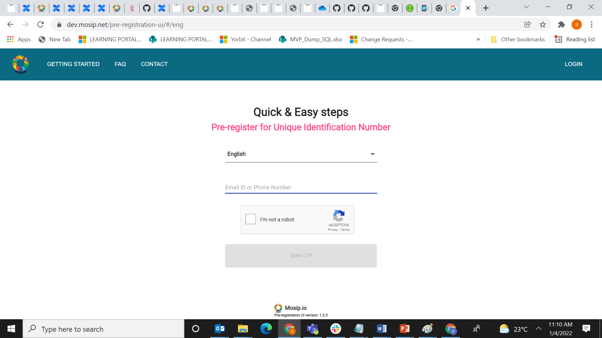
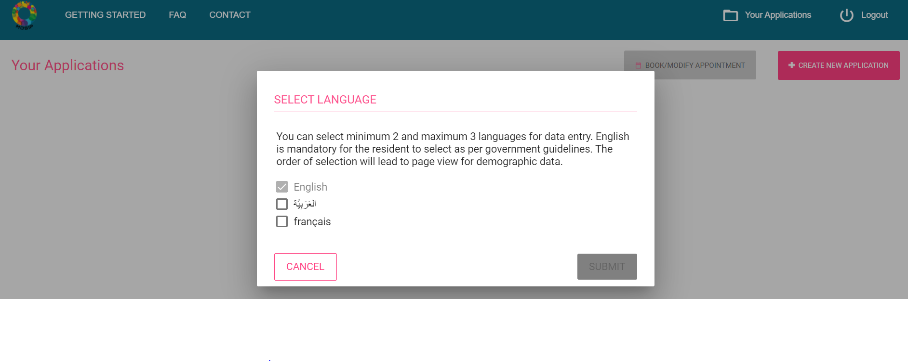
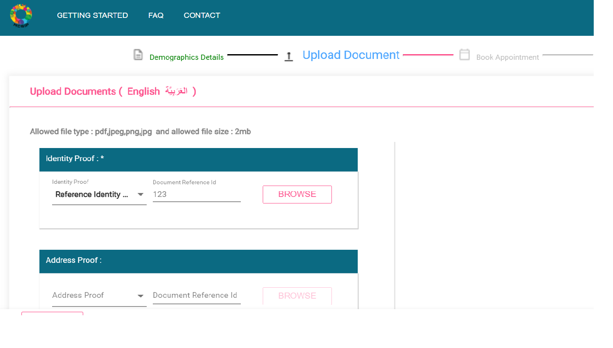
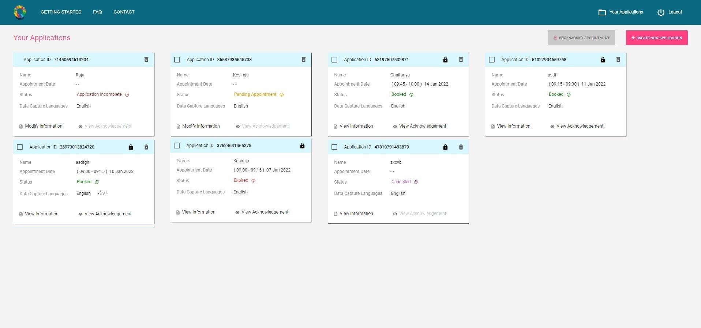
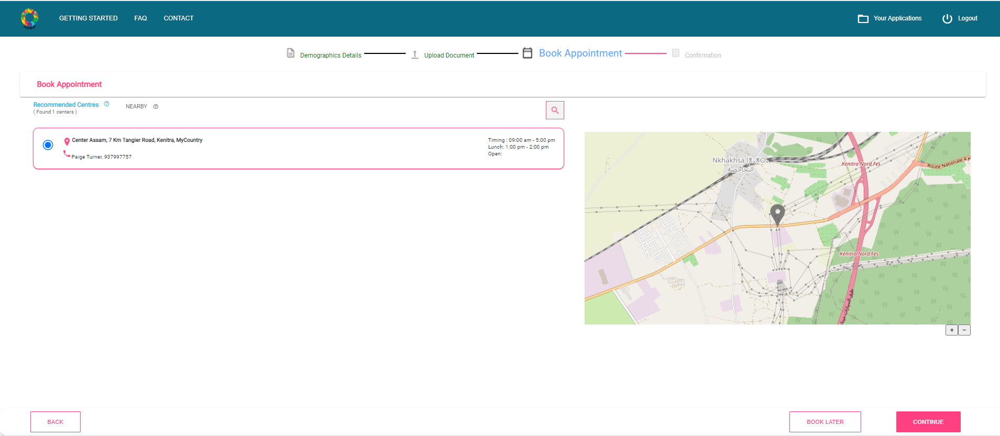
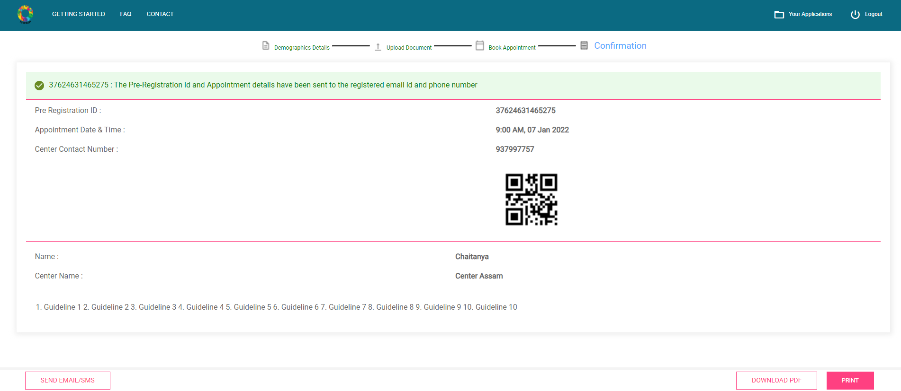

# Overview
This guide helps in understanding the pre-registration sample UI implementation. The pre-registration portal can be used in **self-service** as well as in **assisted** mode.

**Self-service mode**- In this mode, a resident can select a language that is familiar to them for logging into the application. The same language might also be selected by them as one of the languages for data capture.

**Assisted mode**- When used in an assisted mode, the operator could be handling the portal and helping other residents in filling up their details. The languages that the operator and the resident understands, may or may not be the same. If we consider a country with linguistic diversity, the possibilities increase. In such cases, the operator might log in with a language that they are familiar with, and also select a data capture language that the resident understands. 

## Pre-registration process
The key steps in this process are:
* Login/create a user account
* Create an Application
* Book an Appointment
* Receive a Confirmation

To create an application, the resident or the operator can follow the steps below:

## Login/create a user account

1. Open the browser and visit the pre-registration portal.
2. On the login page, click the language dropdown to see the list of languages. 
3. Select the **language** of your preference.
4. Enter your valid email address or phone number in the text box provided.
5. Select the Captcha field.
6. Click **Send OTP** to receive an One Time Password (OTP) on your provided email address or mobile number.
7. Enter the OTP and click **Verify**.
Once the OTP is verified, you will see a pop up for selecting the languages for data entry.

**Note**: In case you have not received OTP, click **Resend** to receive an OTP again. Enter the newly received OTP.
When your OTP is verified, you can create, view, or modify your pre-registration application.

## Create an Application

#### Step 1: Select the data capture language

* A user logging in for the first time and having no applications will be prompted with a data capture language pop-up. The same set of languages will be used for the next set of applications created in the same session.
* The language selected by the user in the login screen will be pre-selected in the data capture language pop-up.
* Select the languages and click **Submit**.
* The user can change this by clicking on the **CHANGE DATA CAPTURE LANGUAGES** button.

**Note**: This choice will be available only if the ID issuer has configured the usage of optional languages.

#### Step 2: Provide consent

* On the Demographic Details page, read the **Terms and Conditions** and select the check box to agree. 
* This agreement is to provide consent for the storage and processing of your personal information.
* Click **Accept** and proceed.
**Note**: User consent is mandatory for creating/updating applications. The contents on this page will be displayed in all data capture languages selected.

#### Step 3: Enter Demographic details

* Enter all your demographic details, which includes Name, Age/DOB, Gender, Residential Status, Address, Mobile Number, Email Id, etc.
* You can also change or verify your demographic details in the other selected language.
* After you have filled and verified your demographic details, click **Continue**.
  Note: The mandatory fields/labels have a `*` mark.
  Field and button labels, error and information messages will be displayed in the user preferred language selected in the login screen.
  
#### Step 4: Upload documents

* On the Upload Documents page, select the document (e.g. Passport, Reference Identity Number, etc.) from the document drop-down list.
* Click **Browse** to locate the scanned document on your machine.
* Select the file that you want to upload.
* When the file is uploaded successfully, the document will appear on the right side. Verify that you have uploaded the correct document.
* Repeat the steps above to upload document(s) for each applicable document category.
* When adding an applicant, if a newly added applicant’s Proof of Address (POA) document is same as that of the the existing user’s POA, which is an already uploaded POA document, then click **Same As** option and select the name of the applicant.
* Click **Continue** to preview your application.

#### Step 5: Preview the data

* To change your demographic details (Name, Age, etc.), click **Modify** at the top-right corner adjacent to the Demographic Details section.
* To modify your uploaded documents, click **Modify** at the bottom-right corner adjacent to the Documents section and make changes.
* To add a new applicant, click **Add Applicant**.
**Note**: On clicking the **Add Applicant** option, you will be navigated to the Demographic Details page to provide Consent and proceed with providing the required demographic data/documents.
* Click **Book Now** to book your appointment.

**Add new Applicant**
In Your Applications page, click **Create New Application** to generate a new application for the new applicant.

### Viewing My Applications

Once the application is created, there could be multiple statuses depending on the data filled by the user/resident or the actions performed by them. The user can view all the pre-registration applications created by them in the Dashboard. The different statuses with a brief explanation are mentioned below:

|**Status**|**Description**|**User Action**|
|------|-----|-----|
|Incomplete|Filled only demographic details|Upload documents and book an appointment|
|Pending appointment|Filled demographic details and uploaded documents |Book an appointment|
|Booked|  Filled demographic details, uploaded documents, and booked appointment|Visit the registration center on the appointment date and time|
|Expired| Appointment date has passed|Re-book an appointment
|Cancelled| Appointment has been cancelled|Re-book an appointment

The applications are sorted and displayed by the order of creation of application. The first application created appears first, latest created/modified application appears at the end. If the user visits the registration center and consumes the appointment, then the application will be removed from the list. If the appointment date has passed, the status changes to "Expired" and is retained on the dashboard for further rebooking/modification as required.

## Book an Appointment

#### Step 1: Choose a Registration center

* The recommended registration centers are automatically displayed based on your demographic details (Postal Code)
* On the Book Appointment page, you can find a registration center through the three options as follows:
    * Click **Nearby Centers** to view the registration centers based on your geographical location.
    * Use the search box to find the registration center based on your search criteria.
    * Click **Recommended Centers** to view registration centers based on your demographic details. (Postal Code)

#### Step 2: Select a time slot
* Select your preferred date from the list of available calendar days and the number of available bookings. 
* The list of available time slots for your selected date is categorized between Morning and Afternoon. Select your preferred option.
* Select your preferred time slot from the list.
* Select the particular applicant name to book an appointment.
Note: On clicking the **Add Applicant** option, you will be navigated to the Demographic Details page to provide Consent and proceed with providing the required demographic data/documents.
* Verify the time slot(s) as selected against the applicant name(s).
* Click **Submit** to view an acknowledgment of your application.

 

## Receive a Confirmation

 

* After successful completion of the Pre-registration application, you will receive an acknowledgmenon on the registered phone number(SMS) or email address as per details provided in the demographic form.
* The acknowledgement contains the following information: name, pre-registration ID, age/DOB, mobile number, email id and registration center details, appointment date, appointment time)
* A QR code containing the pre-registration ID is generated. This QR code can be scanned at the registration center to fetch the details to be used during the registration process.
* You can print, download, email or SMS your acknowledgment.
    * To print your acknowledgement, click **Print**.
    * To download your acknowledgement, click **Download PDF**.
* To add the additional recipient(s) to receive the acknowledgment of your application, follow these steps:
    * Click **Send Email/SMS**.
    * Enter the mobile number and/or enter the email ID.
    * Click **Send** to receive the acknowledgement on your provided e-mail address or mobile number.

### Modify application data
The user can modify the pre-registration data by opting to select the **modify** option for a specific application. The system provides the demographic form with pre-filled demo details and allows the user to edit the details as required. The system associates the modified demo details with the pre-registration id for which Modify information is initiated.

### Discard application
* On Your Applications page, click on the **delete** icon against pre-registration application of an applicant, a pop-up window appears on the screen.
* Select the **Discard entire application** option in the pop-up window.
* Click **SUBMIT** to discard your application.

### Cancel appointment
* On Your Applications page, click on the **delete** icon against pre-registration application of an applicant, a pop-up window appears on the screen.
* Select **Cancel** appointment and save the details option in the pop-up window.
* Click **SUBMIT** to cancel an appointment.
* Following a successful appointment cancellation, the system unlocks the time slot of the registration center to ensure that someone else can book it.

### Re-book appointment
* On **Your Applications** page, select the check box for the applicable applicant.
* Click **Book/Modify Appointment** to re-book an appointment.
* The user can select any appointment date available and the appointment slot available
* An user cannot Re-book the appointment if the appointment booking is less than 48 hours (configurable) from time of booking

