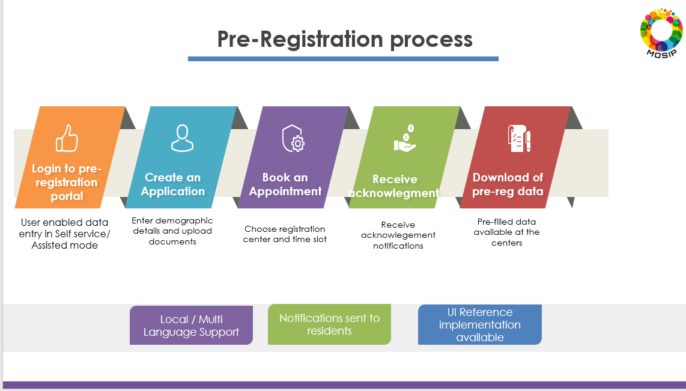
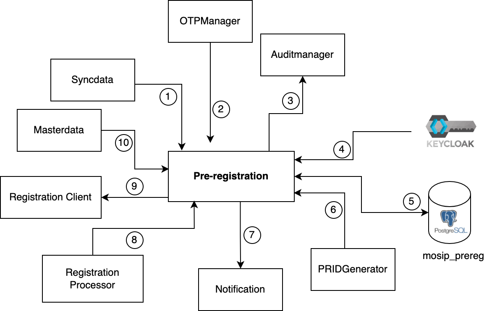

# Overview

Pre-registration module enables a resident to 
* enter demographic data and upload supporting documents,
* book an appointment for one or many users for registration by choosing a suitable registration center and a convinient time slot,
* receive appointment notifications,
* reschedule and cancel appointments.

Once the resident completes the above process, their data will be downloaded at the respective registration centers prior to their appointment. This data will further be used during the registration process. MOSIP pre-registration module supports multiple languages. 

MOSIP provides backend APIs for this module along with a reference implementation of [pre-registration portal](#pre-registration-portal).

## Pre-registration process

## Create an application
* User provides consent
* User provides demographic information
* User uploads supporting documents (Proof of Address, Birth certificate, etc.)
* A pre-registration request ID (PRID) is generated and provided to the user.

## Book an appointment
* User selects a registration center based on postal code, geo-location, etc.
* The available slots are displayed
* An option to cancel and re-book the appointment is made available

## Receiving acknowledgement notifications
* An acknowledgement is sent via email/SMS 
* The user can print the acknowledgement containing PRID and QR code. 
* This QR code can be scanned at the in-person registration centers.

## Download of pre-registration data at registration centers
* User provides the PRID/QR code at the registration center.
* The registration form gets pre-filled with the pre-registration data.

## Pre-registration module

The relationship of pre-registration module  with other services is explained here.  _NOTE: The numbers do not signify sequence of operations or control flow_

1. Fetch [ID Schema](id-schema) details.
2. Fetch a new OTP for the user in login page.
3. Pre-Registration service uses kernel-auditmanager-service to log all events to be audited.
4. Pre-Registration interacts with Keycloak via `kernel-auth-adapater`.
5. Database used by pre-reg.
6. Generate a new [PRID]() for the application.
7. Send OTP in the email/sms to the user.
8. Registration Processor uses reverse sync to mark the pre-reg application as consumed.
9. Registration clients uses [Datasync service](https://github.com/mosip/pre-registration/tree/1.2.0-rc2/pre-registration/pre-registration-datasync-service) to get the pre-reg application details for a given registration center, booking date and PRID.
10. Fetch data for dropdowns, locations, consent form etc.

## Services

Pre-registration module consists of the following services:
* Application 
* Booking
* Batchjob
* Captcha
* Datasync

For more details, refer to [pre-registration repo](https://github.com/pjoshi751/pre-registration/tree/develop)

# Pre-registration portal
MOSIP provides a **reference** implementation of the pre-registration portal that may be customized as per country needs. The sample implementation is available at [reference implementation repository](https://github.com/mosip/mosip-ref-impl).
For getting started with the pre-registration, refer to the [Pre-registration user guide](pre-registration-user-guide.md) 

# Build and deploy
To access the build and read through the deployment instructions, refer to [pre-registration repo](https://github.com/pjoshi751/pre-registration/tree/develop).

# APIs
For detailed functionality of pre-registration APIs, refer to [pre-registration APIs](../../../api-reference/Pre-Registration-APIs.md).

# Configurations
For details related to pre-registration configurations, refer to [pre-registration configuration](https://github.com/pjoshi751/pre-registration/blob/develop/docs/configuration.md).
