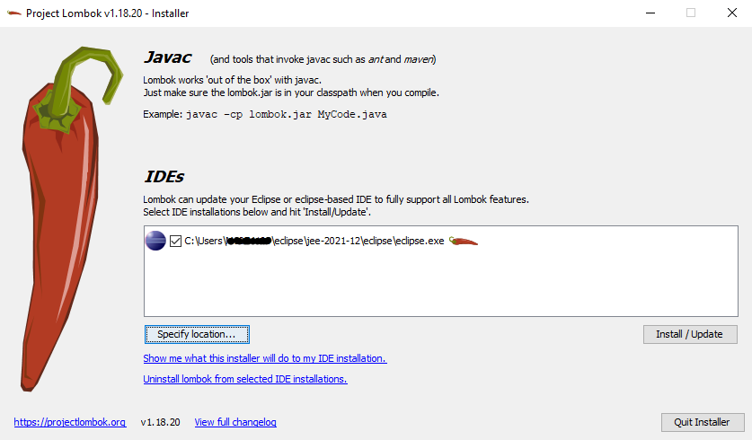
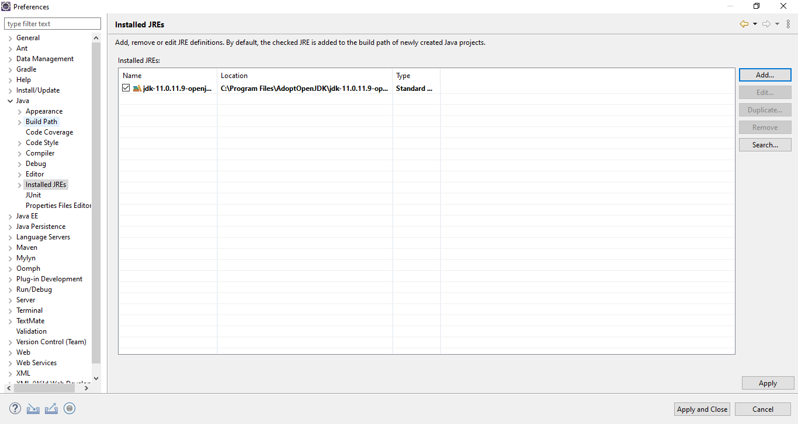

# Registration Client Developers' Guide

## Overview

[Registration Client](https://docs.mosip.io/1.2.0/modules/registration-client) is a thick Java-based client where the resident's demographic and biometric details are captured along with the supporting documents in online or offline mode. 

The documentation here will guide you through the prerequisites required for the developer' setup.

## Software setup

Below are a list of tools required in Resident Services:

1. JDK 11
2. Any IDE (like Eclipse, IntelliJ IDEA)
3. Apache Maven (zip folder)
4. pgAdmin
5. Git
6. Notepad++ (optional)
7. Postman (optional)
8. lombok.jar (file)
9. settings.xml (document)

Follow the steps below to set up Registration Client on your local system:

1. Download `lombok.jar` and `settings.xml` from [here](https://github.com/mosip/documentation/tree/1.2.0/docs/_files/registration-client-config-files).

2. Unzip Apache Maven and move the unzipped folder in `C:\Program Files` and `settings.xml` to `conf` folder `C:\Program Files\apache-maven-3.8.4\conf`.

3. Install Eclipse, open the `lombok.jar` file and wait for some time until it completes the scan for Eclipse IDE and then click `Install/Update`.

4. Check the Eclipse installation folder `C:\Users\userName\eclipse\jee-2021-12\eclipse` to see if the `lombok.jar` is added. By doing this, you don't have to add the dependency of `lombok` in your `pom.xml` file separately as it is auto-configured by Eclipse.

5. Configure the JDK (Standard VM) with your Eclipse by traversing through `Preferences → Java → Installed JREs`.

 
## Code setup

For the code setup, clone the [Registration Client](https://github.com/mosip/registration-client) repository and follow the guidelines mentioned in the [Code Contributions](https://docs.mosip.io/1.2.0/community/code-contributions).

### Importing and building of a project

1. Open the project folder where `pom.xml` is present.
1. Open command prompt from the same folder.
1. Run the command `mvn clean install -Dgpg.skip=true -DskipTests=true` to build the project and wait for the build to complete successfully.
1. After building of a project, open Eclipse and select `Import Projects → Maven → Existing Maven Projects → Next → Browse to project directory → Finish`.
1. After successful importing of project, update the project by right-click on `Project → Maven → Update Project`.

## Environment setup

1. For the environment setup, you need an external dependency that is available [here](https://oss.sonatype.org/#nexus-search;gav~~mock-sdk~1.2.0-SNAPSHOT~~) with different versions. (E.g.: You can download `mock-sdk.jar` and add to registration-services project `Libraries → Classpath → Add External JARs → Select Downloaded JAR → Add → Apply and Close`).

2. Registration Client UI is developed using JavaFX and the UI pages are fxml files which can be opened using a tool called `Scene Builder`. The JavaFX integration with the Eclipse IDE is provided with the e(fx)clipse tool. Go to `Help → Install New Software → Work with → Add`. Give Name and Location as mentioned in below image.

Once the software is installed, you will be prompted to restart your IDE.

3. Download `openjfx-11.0.2_windows-x64_bin-sdk.zip` from [here](https://github.com/mosip/documentation/tree/1.2.0/docs/_files/registration-client-config-files), unzip and place it in your local file system. This folder contains list of javafx related jars that are necessary for running Registration Client UI.

4. We can change the application environment in the file `registration-services\src\main\resources\props\mosip-application.properties` by modifying the property `mosip.hostname`

Below are the configurations to be done in Eclipse:

1. Open Eclipse and run the project for one time as `Java application`, so that it creates a Java application which you can see in debug configurations.

2. Open the arguments and pass this `--module-path C:\Users\<USER_NAME>\Downloads\openjfx-11.0.2_windows-x64_bin-sdk\javafx-sdk-11.0.2\lib --add-modules=javafx.controls,javafx.fxml,javafx.base,javafx.web,javafx.swing,javafx.graphics --add-exports javafx.graphics/com.sun.javafx.application=ALL-UNNAMED` in VM arguments.

3. Click Apply and then debug it (starts running). You can see a popup which shows informative messages of what is happening in background while Registration Client UI is loading and the application will be launched.

