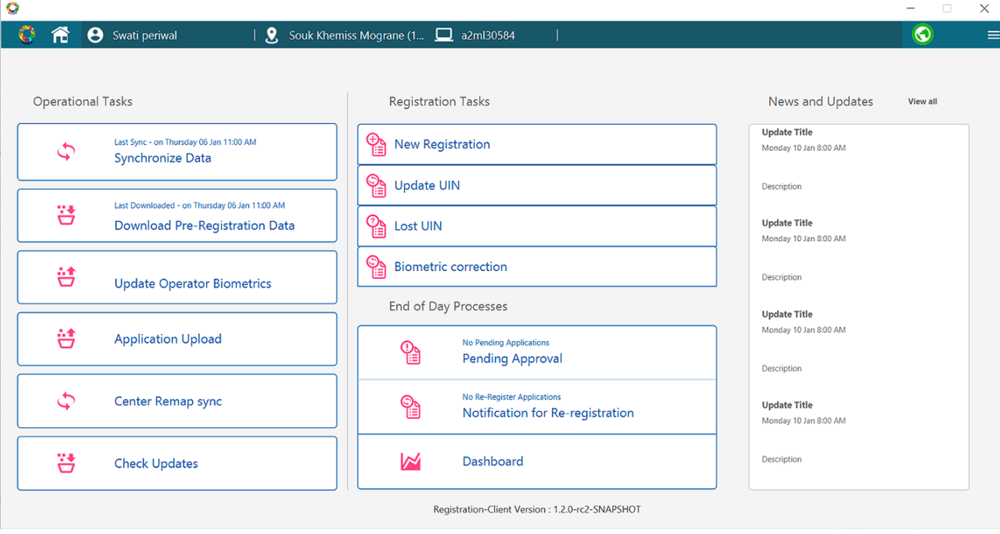

# Overview
This guide describes the various funtions provided in the Home page of the reference UI implementation of the registration client.

## Registration client reference UI implementation
Below is the image of the reference UI implementation of the registration client.

Menu bar
_ Mosip logo i s
      
### Operational Tasks
      
* **Synchronize Data**: Synchronize data is the data required to make the registration client functional. Full sync is performed initially during the launch of the registration client for the first time. Post this, the registration client syncs only the changes from sever and this is called as the delta sync. Synchronize data is automated and can be triggered manually. 
This happens automatically while launching the registration client and is also manually initiated by the operator.
 
   1. **Configuration sync**: Sync of properties which drives in deciding the registration client UI functionality. For example: Invalid login attempts, idle timeout, thresholds, etc
   1. **Masterdata sync** : As a part of this sync, supporting information like Dynamic fields data, templates, locations, screen authorization, block listed words, etc are pulled in.
   1. **UserDetails sync**: userID, user roles along witrh their status is synced. Only the user details belonging to machine mapped center will be synced. 
   1. **Certificate sync**: Certificates used to validate the server signatures, device CA certificates, public key used to encrypt the registartion packet will be synced.
   1. **Packet sync**: 
         * All the approved/rejected Registration IDs(RIDs) will be synced to the server.
         * All the synced RID packets will be uploaded to the server.
         * All the uploaded packet status will be synced from server.
          
* **Download Pre-Registration Data**: An operator can download the pre-registration data of a machine mapped center while being online and store it locally in the registration machine for offline use. Now when the system is offline and the pre-registration data is already downloaded, the operator can enter the pre-registration ID to auto-populate the registration form. Provided the machine is online, any pre-registration application can be downloaded irrespective of the center booked by the resident.
     
  **Note**- Date Range of pre-registration data to be downloaded and storage location of pre-registration data in the registration machine is configurable. this is synced as a part of configuration sync.       
       
* **Update Operator Biometrics**:  Using this option, the operator can onboard themselves anytime.  
Refer <<operator onboarding link>> for more details.

  

 * **Application Upload**: Application upload refers to upload of supervisor reviewed registration packets(approved and rejected). From this page, the operator can export the packets to any location on their machine. 
      - Upload of registration packet from this page internally performs two operations in sequence:
          * Sync registration metadata to server
          * On successful sync of metadata, actual registration packets are uploaded to the server.
      
 **Client Status** : This column displays status of a registration packet based on the abpve mentioned operation.
      
       * Synced
 
 **Server Status**: 
      
      * Pushed
      * Duplicate  
 
  **Registration Type**:
      
* **Center Remap Sync**:
      
* **Check Updates**:

## Settings

### Registration Tasks

## New registration
An operator can initiate the process of registering a new applicant in the MOSIP ecosystem by filling the new registration form with the resident.
Below are few of the processes that needs to be completed for a new registration.

1. **Capture consent**- For every registration, the registration client provides an option for the operator to mark an individual's consent from the resident for data storage and utilization. The operator marks consent in the checkbox provided after confirming the same with the resident. Whether the consent is marked as Yes or No, it will not have any impact on issuance of UIN for that resident and the registration processor will not execute any validations in this regard during packet processing.

2. **Enter demographic data and upload documents**
If the resident has a pre-registration ID, the operator can auto-populate the demographic data and the documents by entering the pre-registration ID.
If the resident does not have a pre-registration ID, the operator can enter the resident’s demographic details (such as Name, Gender, DOB, Residential Address, etc.) and upload the documents (such as Proof of Address, Proof of Identity, Proof of Birth) based on the [ID Object defined](MOSIP-ID-Object-Definition.md) by the country.

After the demographic details are entered the registration client validates the entered demographic data as per the Id validation rules defined in the ID Object UI Specification and appropriate error messages are shown in case the validation fails.

### Capture biometrics of a resident
The capture of biometrics is governed by the country, i.e. capture of each modality (fingerprint, iris or face) can be controlled by the country using the global configuration to turning on or off, capture of a particular biometrics.

When the operator clicks on the capture button and tries to capture the biometrics of the resident, the device needs to make the capture when the quality of the biometrics is more than the threshold configured by the country. The device will try to capture the biometrics until the quality threshold has crossed or the device capture timeout has crossed which is also configurable. 

Post the timeout has occurred and the captured quality of biometrics is less than the threshold, registration client provide an option to the operator to retry capture of biometrics but for a particular number of times which is also configurable.

If the resident has a biometric exception (resident is missing a finger/iris or quality of finger/iris is very poor) the resident can mark that particular biometrics as exception but the resident has provide an exception photo after providing the biometrics.

### Device validation
The biometric devices connected to the registration machine to perform registration needs to registered devices and hence device validation is a very important process. The devices are validated using the master data that is received from the server during sync. Once the validation is successful and the device is connected to the registration machine a three way mapping of the center, machine & device is created and synced back to the server.

### New registration for an infant
The registration flow for an infant is slightly different from that of registering an adult. The categorization of normal resident and infant is determined based on the age calculated by when the resident provides the date of birth. The age of infant is a configurable parameter (in the current configuration age of infant is set to 5 years).

For an infant registration client doesn't collect the biometrics (except for photo) but it collects the parent/guardian UIN or RID and biometrics for authentication in the server side. Apart from parent/guardian details the resident need to provide a Proof of Relationship document defined by the country.

## Update resident's details
When a resident visits the registration center to update his/her demographic or biometrics details, the operator captures the updated data as provided by the resident in the registration client.

Process Flow using which data gets captured by registration client for updating a resident's data:


*The UIN update feature is configurable by a country. The Admin can turn ON or OFF, the UIN update feature using the configuration.*


## Find a lost UIN
There might be a situation when a resident might have lost his UIN and visits the registration center for retrieving the same, the operator then captures the biometrics and demographic details of the individual and processes a request to retrieve the lost UIN. The system sends a notification to the individual upon successful creation of the UIN retrieval request.

## Acknowledgement and Notifications

### Printing the registration receipt
Once the registration process (new registration, UIN update or lost UIN) is completed, the registration client generates an unique request id and a registration receipt which contains labels & data in configured language. This data also contains a QR code of the RID, photograph of the resident and ranking of each finger from 1 to 10 (1 being the finger with the best quality). This receipt is print friendly and can be used for printing using any printer.

### Sending email and SMS notifications
Once a registration process is completed, a notification is sent to the resident using the email ID and mobile number that was provided as part of demographic data. This notification sent is driven by a template created as part of master data and the language selected (primary, secondary or both) & notification mode (SMS, Email or none) is driven by configurations.

Registration Client also provides an option to send SMS and email notifications to additional recipient\s (other than the individual’s primary email ID and mobile number).

* New Registration:
* Update UIN:
* Lost UIN:
* Correction:

For <refer to ID lifecycle management page>

### End of day processes

* Pending Approval:
* Re-registrations:
  
  
### Dashboard:
      
### News and Updates: 
