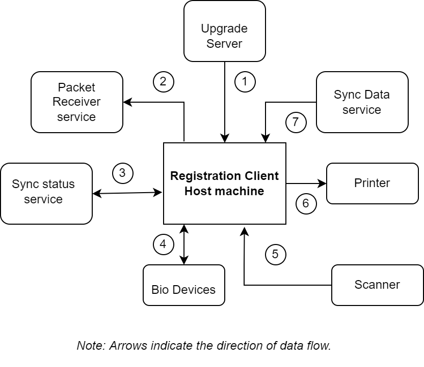

# Registration Client

## Overview
The Registration Client (RC) is a thick Java-based client where the resident's demographic and biometric details are captured along with the supporting documents in online or offline mode. Data is captured in the form of registration packets and is cryptographically secured to ensure that there is no tampering. The captured information is packaged and sent to the server for further processing.

MOSIP provides a reference implementation of RC that supports multiple languages. 

RC is operated by either a **Supervisor** or an **Officer**. They can login to the client application and perform various activities. The Supervisor and the Officer can perform tasks like Onboarding, Synchronize Data, Upgrade software, Export packet, Upload packets, View Re-registration packets, Correction process, Exception authentication, etc. In addition to this, the Supervisor has exclusive authority to Approve/reject registrations.

To know more about the onboarding process of an operator, refer to [Operator onboarding](operator-onboarding.md).

The relationship of RC with other services is illustrated below. _Note: the numbers do not signify sequence of operations or the control flow._

1. RC connects to the Upgrade Server to check on upgrades and patch downloads.
2. All the synced packets are uploaded to packet receiver service one by one.
3. Packets ready to be uploaded meta-info are synced to sync status service and also the status of already uploaded packets are synced back to RC.
4. RC always connects to external biometric devices through [SBI](secure-biometric-interface.md).
5. RC scans the document proofs from any document scanner.
6. Acknowledgement receipt print request is raised to any connected printers.
7. All the masterdata and configurations are downloaded from syncdata-service.

## RC in host machine
The image below illustrates the internal view of a RC in host machine.

1. RC comprises of JavaFX UI, registration-services libraries and any third party biometric SDK.
2. SBI is allowed to run on loopback IP and should listen on any port within 4501-4600 range. More than one SBI can run on the host machine. RC scans the allowed port range to identify the available SBI.
3. RC connects to local Derby database (used to store all the data synced)
4. TPM- is the hardware security module used to get machine identifier, to secure DB password, prove the client authenticity on auth requests and packets created in the host machine.
5. All the completed registration packets are stored under packetstore directory.
6. `.mosipkeys` directory is used to store sensitive files. `db.conf` under this directory stores encrypted DB password. This is created on the start of RC for the first time.
7. Bio SDKs– Third party vendors [Biometric SDKs](biometric-sdk.md) are used to extract biometric templates, check biometrics quality and match biometrics for auth and local deduplications. 

## Know your machine TPM keys
A Trusted Platform Module (TPM) is a specialized chip on a local machine that stores RSA encryption keys specific to the host system for hardware authentication. The pair is maintained inside the chip and cannot be accessed by a software. By leveraging this security feature, every individual machine would be uniquely registered and identified by the MOSIP server component with it's TPM public key.
  
To know more about setting up the reference RC, refer to [RC user guide](registration-client-user-guide.md).

To know more about the functions present in the Home page of the RC, refer to [RC home page](registration-client-home-page.md).

## Data protection
* Local Derby db - DB is configured for strict access controls and encrypted with boot password. The boot password encrypted with TPM key and stored in `db.conf` file under `.mosipkeys` folder.
* Registration packets - Packets created during registration process is a zip, signed by TPM key and encrypted with policy key stored in local configured folder.
* Pre-registation packets - Downloaded pre-registration packets are encrypted with TPM key.
* All the other JSON and MVEL scripts synced in the registration-client are tamper proof. Everytime registration-client tries to open these files, file hash check must pass, else client will fail to load the hash check failed files.

## Configurations
Based on the [ID Schema][id-schema.md], the RC can be customized as per a country' requirements. For details related to RC configurations, refer to [RC configuration](registration-client-configuration.md).

## UI Specifications for registration tasks 
Default UI Specifications loaded with sandbox installation is available [here](https://github.com/mosip/mosip-infra/blob/1.2.0-rc2/deployment/v3/mosip/kernel/masterdata/xlsx/ui_spec.xlsx).

## Source code 
[Github repo](https://github.com/mosip/registration-client/tree/release-1.2.0).

