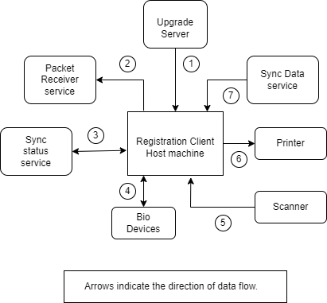

# Overview

The Registration Client is a thick Java-based client where the resident's demographic and biometric details are captured along with the supporting documents in online or offline mode. Data is captured in the form of registration packets and is cryptographically secured to ensure that there is no tampering. The captured information is packaged and sent to the server for further processing.

MOSIP provides a reference implementation of a Java-based Registration Client. The code, build files for the Registration Client are available in the [Registration Client repo](https://github.com/mosip/registration-client).

## Multiple language support

* Registration Client is featured to allow an operator to choose the operation language. Option to select their preferred language is provided on the login screen.
* Data collection during registration client supports more than one language at a time.
* Before starting any registration process, the operator can choose the languages amongst the configured ones.
 
  
To know more about setting up the reference registration client, refer to [Registration client user guide](registration-client-user-guide.md).

To know more about the functions present in the Home page of the registration client, refer to [Registration client home page](registration-client-home-page.md).

## Who operates the Registration Client?

The Registration Client can be operated by an operator who can be either a **Supervisor** or an **Officer**. They can login to the client application and perform various activities. The Supervisor and the Officer can perform tasks like Onboarding, Synchronize Data, Upgrade software, Export packet, Upload packets, View Re-registration packets, Correction process, Exception authentication, etc. In addition to this, the Supervisor has exclusive authority to Approve/reject registrations.

To know more about the onboarding process of an operator, refer to [Operator onboarding](operator-onboarding.md).

## Registration client entity diagram
    

The relationship of Registration Client with other services is explained here. _NOTE_: The numbers do not signify sequence of operations or control flow.

1. Registration Client connects to the Upgrade Server to check on upgrades and patch downloads.
2. All the masterdata and configurations are downloaded from SyncData-service.
3. Registration Client always connects to external biometric devices through SBI.
4. Registration Client scans the document proofs from any document scanner.
5. Aknowledgement receipt print request is raised to any connected printers.
6. Packets ready to be uploaded meta-info are synced to Sync Status service. Also, the status of already uploaded packets are synced back to Registration Client.
7. All the synced packets are uploaded to Packet Receiver service one by one.

The image below shows the setup of Registration Client Host machine.

1. Registration Client comprises of JavaFX UI, Registration-services libaries and any third party biometric-SDK.
2. SBI is allowed to run on loopback IP and should listen on any port within 4501-4600 range.
More than one SBI can run on the host machine. Registration Client scans the allowed port range to identify the available SBI.
3. Registration Client connects to local Derby database. This is used to store all the data synced. 
4. All the completed registration packets are stored under packetstore directory.
5. `.mosipkeys` directory is used to store sensitive files. `db.conf` under this directory stores encrypted DB password. This is created on the start of registration client for the first time.
6. TPM - is the hardware security module used to get machine identifier, to secure DB password, prove the client authenticity on auth requests and packets created in the host machine.

## Data protection

* The registration packets and synced data are stored in the client machine.
* Most of the synced data are stored in the Derby DB. Derby DB is encrypted with the bootpassword.
* Derby DB boot password is encrypted with machine TPM key and stored under `.mosipkeys/db.conf`.
* Synced UI-SPEC/script files are saved in plain text under registration client working directory. During sync, SPEC/script file hash is stored in derby and then the files are saved in the current working directory. Everytime the file is accessed by the client performs the hash check.
* Synced pre-registration packets are encrypted with TPM key and stored under configured directory.
* Directory to store the registration packets and related registration acknowledgments is configurable. 
* Registration packet is an signed and encrypted ZIP.
* Registration acknowledgment is also signed and encrypted with TPM key.
 
## Configurations

Registration Client can be customized as per a country' requirements.  For details related to Registration Client configurations, refer to [Registration Client configuration](https://docs.mosip.io/1.2.0/modules/registration-client/registration-client-configuration).

## UI Specifications for Registration Tasks 

* Blueprint of registration forms to be displayed in registration client are created as json called as UI-SPEC.
* Every process ( NEW / LOST / UPDATE UIN / CORRECTION ) has its own UI-SPEC json.
* Kernel-masterdata-service exposes API's to create and publish UI-SPEC.
* Published UI-SPEC json are versioned.
* Only published UI-SPEC are synced into registration-client.
* UI-SPEC json files are tamper proof, client checks the stored file hash everytime it tries to load registration UI.
* UI-SPEC json will fail to load if tampered.

Default UI Specifications loaded with Sandbox installation is available [here](https://github.com/mosip/mosip-infra/blob/1.2.0-rc2/deployment/v3/mosip/kernel/masterdata/xlsx/ui_spec.xlsx)

## Developer Guide
To know more about the developer setup, read [Registration Client Developers Guide](https://docs.mosip.io/1.2.0/modules/registration-client/registration-client-developers-guide).

