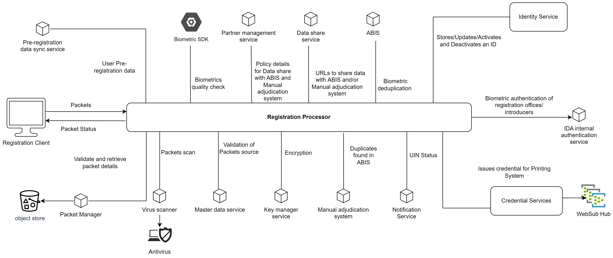

# Registration Processor

## Overview

Registration Processor (Regproc) is a backend processing engine to enable the ID Lifecycle management. The diagram below shows the Registration Processor along with the other modules that contribute in issuing a Unique Identification Number(UIN) for an individual. Internally, Regproc follows the [SEDA](https://en.wikipedia.org/wiki/Staged_event-driven_architecture) architecture where data flows via multiple stages till the UIN is issued.

The relationship of Regproc with other services is explained here. _NOTE: The numbers do not signify sequence of operations or control flow_

1. Registration packets are uploaded by [Registration Client](registration-client.md) to [Packet Receiver](https://github.com/mosip/registration/tree/release-1.2.0/registration-processor/init/registration-processor-packet-receiver-stage).
2. After packet validation is done Regproc notifies pre-registration application using datasync service.
3. Quality of biometrics is checked using an external biometric SDK. This is done in Regproc's [Quality Classifier stage](https://github.com/mosip/registration/blob/release-1.2.0/registration-processor/pre-processor/registration-processor-quality-classifier-stage/README.md).
4. Regproc shares biometric data with [ABIS](abis.md), Manual adjudication System and Verification System. The policy for sharing this data is fetched from [PMS](partner-management-services.md).
5. The above data is shared by providing a URL that partners use to fetch data.  This URL is obtained from [Datashare](datashare.md) service.
6. Regproc's [ABIS Middleware stage](https://github.com/mosip/registration/tree/release-1.2.0/registration-processor/core-processor/registration-processor-abis-middleware-stage) communicates with [ABIS](abis.md) via [Activemq](https://activemq.apache.org/). The ABIS performs deduplication and sends back result to the Queue.
7. Regproc stores and updates applicant demographic and biometric information in [ID Repository](https://docs.mosip.io/1.2.0/modules/id-repository). Also Activates or deactivates applicant UIN.
8. Regproc calls IDA Internal Authentication Service to authenticate Applicant(for update flow), introducer, operator and supervisor(when bio auth mode is used to create packet).
9. After the UIN is processed the [Printing Stage](https://github.com/mosip/registration/tree/release-1.2.0/registration-processor/post-processor/registration-processor-printing-stage)  calls [Credential Service](https://github.com/mosip/id-repository/tree/release-1.2.0/id-repository/credential-service) to create credential for print. This credential will be pushed to websub and the Printing systems will consume same.
10. The [Notification Service](https://github.com/mosip/registration/tree/release-1.2.0/registration-processor/registration-processor-notification-service) is used to send email/sms notification to the  applicant after the request processing is completed in server.
11. Regproc connects to external "Manual Adjudication System" via queue. Regproc sends applicant information required for adjudication in queue and external adjudication system consumes it. The data is shared from mosip to external adjudication system based on policy.
12. Regproc calls [Key Manager](https://docs.mosip.io/1.2.0/modules/keymanager) for decrypting packet and for encrypting information.
13. Regproc uses [Masterdata Service](https://docs.mosip.io/1.2.0/deployment/masterdata-guide) to validate center, machine, user etc.
14. Regproc connects to Virus Scanner for scanning packets in [Packet Receiver Stage](https://github.com/mosip/registration/tree/release-1.2.0/registration-processor/init/registration-processor-packet-receiver-stage) and [Packet Uploader Stage](https://github.com/mosip/registration/tree/release-1.2.0/registration-processor/pre-processor/registration-processor-packet-uploader-stage)
15. Each Stage in regproc calls [Packet Manager](https://docs.mosip.io/1.2.0/modules/packet-manager) to read information from packet.



## Stages and services

The Registration Processor contains several [stages and services](https://github.com/mosip/registration/tree/release-1.2.0#registration-stages-and-pipeline). 

The registration packet flows through the various stages depending on the type of flow. See [Registration Flows and Stage Sequence](https://github.com/mosip/registration/blob/release-1.2.0/docs/flows.md).

**Note**: The Print Stage has been renamed as the Credential Requestor Stage. For further information, please click [here]().

## Build and deploy

Refer to [repo](https://github.com/mosip/registration/tree/release-1.2.0).

## Configurations

Refer to [Configuration Guide](https://github.com/mosip/registration/blob/release-1.2.0/docs/configuration.md).

## Developer Guide

To know more about the developer setup, read [Registration Processor Developers Guide](https://docs.mosip.io/1.2.0/modules/registration-processor/registration-processor-developers-guide).

## API

Refer [API Documentation](https://mosip.github.io/documentation/release-1.2.0/release-1.2.0.html).

## Source code 

[Github repo](https://github.com/mosip/registration/tree/release-1.2.0).
