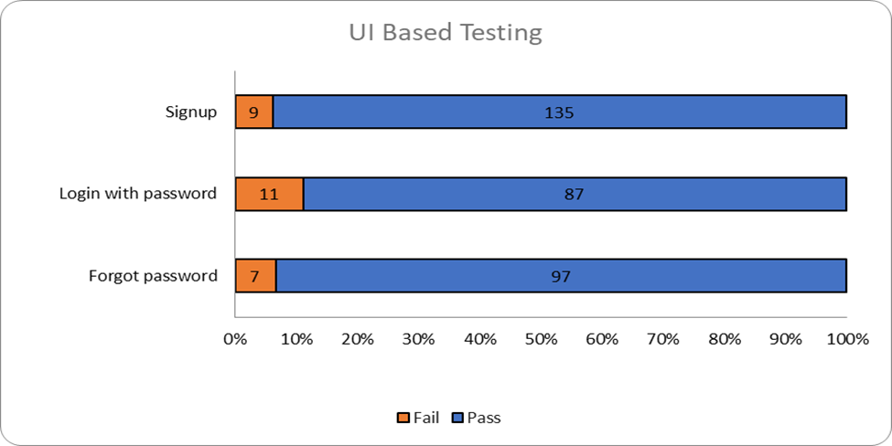

# Test Report

## Scope

The scope of testing is to verify fitment to the specification from the perspective of:

* Functionality
* Deployability
* Configurability
* Customizability

Verification is performed not only from the end-user perspective but also from the System Integrator (SI) point of view. Hence, the configurability and extensibility of the software are also assessed. This ensures the readiness of software for use in multiple countries. Since MOSIP is an “API First” product platform, the verification scope required comprehensive automation testing for all the MOSIP APIs. An automated Test Rig is created for the same.

## Test Approach

Persona based approach has been adopted to perform the IV\&V(Independent Verification and Validation) by simulating the test scenarios that resemble a real-time implementation.

A Persona is a fictional character / user profile created to represent a user type that might use a product/ or a service in a similar way. Persona-based testing is a software testing technique that puts software testers in the customer's shoes, assesses their needs from the software and thereby determines use cases/ scenarios that the customers will execute. The persona's needs may be addressed through any of the following:

* Functionality
* Deployability
* Configurability
* Customizability

The verification methods may differ based on how the need was addressed.

For regression check, "MOSIP Test Rig", an automation testing suite is indigenously designed and developed for supporting persona-based testing. MOSIP Test Rig covers end-to-end test execution and reporting. The end-to-end functional test scenarios are written starting from pre-registration, to the creation of the packet in the registration centre, processing the packet through the registration processor, generating UIN and authenticating identity using IDA through various permutations and combinations of cases being covered. MOSIP Test Rig will be an open-source artifact which can also be enhanced and used by countries to validate the SI deliveries before going live. Persona classes include both negative and positive personas. Negative persona classes include users like Bribed Registration Office, Malicious Insider etc. The needs of positive persona classes must be met, whereas the needs of negative persona classes must be effectively restricted by the software.

## Verified Configuration

Verification is performed on various configurations as mentioned below:

* Default configuration - with 3 Languages (English / Arabic / French)

## Main Features Tested

* ID Authentication - On Demand Template Extraction

## Test execution statistics

### IDA Automation test results

Below are the test metrics by performing functional testing using mock MDS, mock Authentication and mock ABIS. The process followed was black box testing which based its test cases on the specifications of the software component under test. Functional test was performed in combination of individual module testing as well as integration testing. Test data were prepared inline with the user stories. Expected results were monitored by examining the user interface. The coverage includes System testing, End-To-End flows across multiple languages and configurations. The testing cycle included simulation of multiple identity schema and respective UI schema configurations.

Here is the detailed breakdown:

|                                                  | Total | Passed | Failed | Skipped |
| ------------------------------------------------ | ----- | ------ | ------ | ------- |
| On Demand Template Extraction - UI Based testing | 58    | 58     | 0      | 0       |
| API Based Testing                                | 517   | 424    | 9 0    | 3       |

**Note**: In API Based testing, 3 test cases are marked as skipped as they were not automated

### DSL - End to end scenarios results

|                      | Total | Passed | Failed | Skipped |
| -------------------- | ----- | ------ | ------ | ------- |
| End to end scenarios | 163   | 113    | 48     | 2       |

## Sonar report

<figure><figcaption></figcaption></figure>
