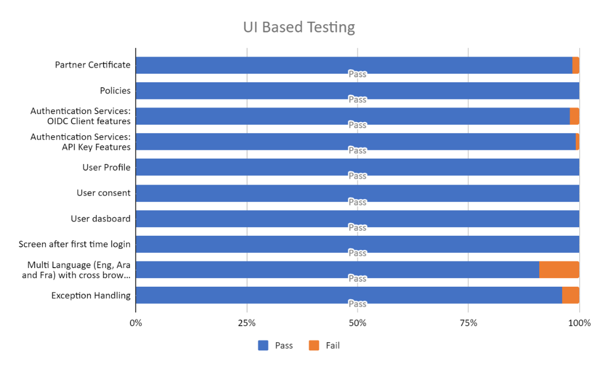
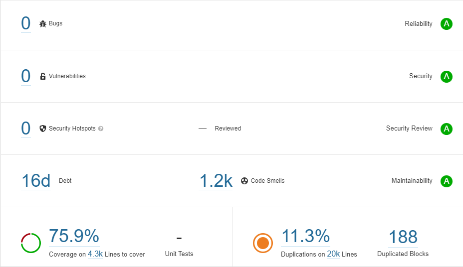
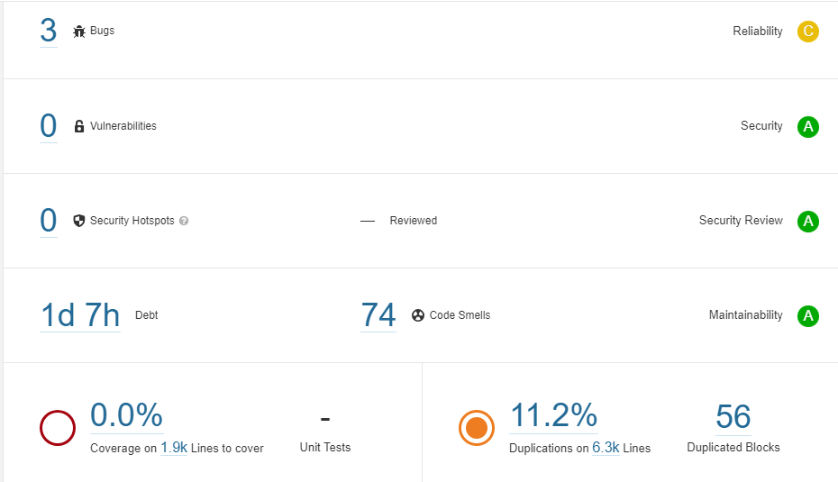

# Test Report

## Testing Scope

The scope of testing is to verify fitment to the specification from the perspective of

* Functionality
* Deployability
* Configurability
* Customizability

Verification is performed not only from the end user perspective but also from the System Integrator (SI) point of view. Hence Configurability and Extensibility of the software is also assessed. This ensures readiness of software for use in multiple countries. Since MOSIP is an “API First” product platform, Verification scope required comprehensive automation testing for all the MOSIP APIs. An automation Test Rig is created for the same.

The Partner Management System Revamp testing scope revolves around the following flows:

* Features: Partner Certificate, Policies, Authentication Services (OIDC Client & API key), User Profile, User Dashboard, Accept Terms & Conditions/ Consent.
* Multilingual (English/Arabic/French)
* Multi-browser testing: using Edge, Firefox, and Chrome browsers (Windows/ Mac)
* Partner Management System Revamp End to End testing
* Regression Testing

## Test Approach

Persona based approach has been adopted to perform the IV\&V, by simulating test scenarios that resemble a real-time implementation.

A Persona is a fictional character/user profile created to represent a user type that might use a product/or a service in a similar way. Persona based testing is a software testing technique that puts software testers in the customer's shoes, assesses their needs from the software and thereby determines use cases/scenarios that the customers will execute. The persona needs may be addressed through any of the following.

* Functionality
* Deployability
* Configurability
* Customizability

The verification methods may differ based on how the need was addressed.

For regression check, “MOSIP Test Rig” - an automation testing suite - which is indigenously designed and developed for supporting persona based testing. MOSIP Test Rig covers the end to end test execution and reporting. The end to end functional test scenarios are written starting from creation of packet in registration center, processing the packet through the registration processor, generating UIN and authenticating identity using IDA through various permutation and combinations of cases being covered. MOSIP Test Rig will be an open source artifact which can also be enhanced and used by countries to validate the SI deliveries before going live. Persona classes include positive personas.

## Verified configuration

Verification is performed on various configurations as mentioned below

* Default configuration - with 3 Lang (English/Arabic/French)

## Feature Health

<figure><figcaption></figcaption></figure>

## Test execution statistics

### **Functional test results by modules**

Below are the test metrics by performing functional testing. The process followed was black box testing which based its test cases on the specifications of the software component under test. Functional test was performed in combination of individual module testing as well as integration testing. Test data were prepared in line with the user stories. Expected results were monitored by examining the user interface. The coverage includes GUI testing, System testing, End-To-End flows across multiple languages and configurations. The testing cycle included simulation of multiple identity schema and respective UI schema configurations.

MANUAL VERIFICATION (UI):

|                                    |            |            |                   |
| ---------------------------------- | ---------- | ---------- | ----------------- |
| **Total**                          | **Passed** | **Failed** | **Skipped (N/A)** |
| 842                                | 825        | 16         | 1                 |
| Test Rate: 99% with Pass Rate: 98% |            |            |                   |

Note: NA - 1 Test Cases which are descoped scenarios/not developed feature

API Test Rig:

|                                      |            |            |                   |
| ------------------------------------ | ---------- | ---------- | ----------------- |
| **Total**                            | **Passed** | **Failed** | **Skipped (N/A)** |
| 23                                   | 23         | 0          | 0                 |
| Test Rate: 100% with Pass Rate: 100% |            |            |                   |

**Note-** API flow is testing by automation only (positive flow). No manual testing done for APIs

### Detailed Test metrics

Below are the detailed test metrics by performing Manual/automation testing. The project metrics are derived from Defect density, Test coverage, Test execution coverage, test tracking and efficiency.

The various metrics that assist in test tracking and efficiency are as follows:

* Passed Test Cases Coverage: It measures the percentage of passed test cases. (Number of passed tests / Total number of tests executed) x 100
* Failed Test Case Coverage: It measures the percentage of all the failed test cases. (Number of failed tests / Total number of test cases executed) x 100

### **Tested with components:**

| **Module/Repro**            | **Compatible Version**                                                                                                                                                                                                                                                                                                                                                                                                                                                                                                                                                                                                                                                                                                                                                                                                                                                                                                | **Comments**                     |
| --------------------------- | --------------------------------------------------------------------------------------------------------------------------------------------------------------------------------------------------------------------------------------------------------------------------------------------------------------------------------------------------------------------------------------------------------------------------------------------------------------------------------------------------------------------------------------------------------------------------------------------------------------------------------------------------------------------------------------------------------------------------------------------------------------------------------------------------------------------------------------------------------------------------------------------------------------------- | -------------------------------- |
| PMS Revamp                  | mosipqa/pmp-reactjs-ui:1.3.x                                                                                                                                                                                                                                                                                                                                                                                                                                                                                                                                                                                                                                                                                                                                                                                                                                                                                          |                                  |
| Partner Management Services | mosipqa/partner-management-service:1.3.x                                                                                                                                                                                                                                                                                                                                                                                                                                                                                                                                                                                                                                                                                                                                                                                                                                                                              |                                  |
| Policy Management service   | mosipqa/policy-management-service:1.3.x                                                                                                                                                                                                                                                                                                                                                                                                                                                                                                                                                                                                                                                                                                                                                                                                                                                                               |                                  |
| PMS UI                      | mosipqa/pmp-ui:release-1.2.0.1                                                                                                                                                                                                                                                                                                                                                                                                                                                                                                                                                                                                                                                                                                                                                                                                                                                                                        | PMP-UI used for admin activities |
| Key-manager                 | mosipqa/kernel-keymanager-service:1.2.1.x                                                                                                                                                                                                                                                                                                                                                                                                                                                                                                                                                                                                                                                                                                                                                                                                                                                                             |                                  |
| IDA Auth                    | mosipqa/authentication-service:release-1.2.0.1                                                                                                                                                                                                                                                                                                                                                                                                                                                                                                                                                                                                                                                                                                                                                                                                                                                                        |                                  |
| Artifactory                 | mosipqa/artifactory-server:1.2.0.x                                                                                                                                                                                                                                                                                                                                                                                                                                                                                                                                                                                                                                                                                                                                                                                                                                                                                    |                                  |
| eSignet                     | mosipqa/esignet:1.2.0                                                                                                                                                                                                                                                                                                                                                                                                                                                                                                                                                                                                                                                                                                                                                                                                                                                                                                 |                                  |
| Reg Proc                    | 
mosipid/registration-processor-stage-group-1:1.2.0.1

mosipid/registration-processor-stage-group-2:1.2.0.1

mosipid/registration-processor-stage-group-3:1.2.0.1

mosipid/registration-processor-stage-group-4:1.2.0.1

mosipid/registration-processor-stage-group-5:1.2.0.1

mosipid/registration-processor-stage-group-6:1.2.0.1

mosipid/registration-processor-stage-group-7:1.2.0.1

mosipid/registration-processor-common-camel-bridge:1.2.0.1

mosipid/registration-processor-notification-service:1.2.0.1

mosipid/registration-processor-dmz-packet-server:1.2.0.1

mosipid/registration-processor-reprocessor:1.2.0.1

mosipid/registration-processor-registration-status-service:1.2.0.1

mosipid/registration-processor-registration-transaction-service:1.2.0.1

mosipid/registration-processor-workflow-manager-service:1.2.0.1
 | 
   
              |
| Notifier (Kernel)           | mosipid/kernel-notification-service:1.2.0.1-B1                                                                                                                                                                                                                                                                                                                                                                                                                                                                                                                                                                                                                                                                                                                                                                                                                                                                        |                                  |
| Audit manager               | mosipid/kernel-auditmanager-service:1.2.0.1-B1                                                                                                                                                                                                                                                                                                                                                                                                                                                                                                                                                                                                                                                                                                                                                                                                                                                                        |                                  |
| ID Repro                    | mosipqa/id-repository-identity-service:develop                                                                                                                                                                                                                                                                                                                                                                                                                                                                                                                                                                                                                                                                                                                                                                                                                                                                        |                                  |
| datashare                   | mosipqa/data-share-service:develop                                                                                                                                                                                                                                                                                                                                                                                                                                                                                                                                                                                                                                                                                                                                                                                                                                                                                    |                                  |
| mosip-pms table             | bitnami/postgresql:15.4.0-debian-11-r10                                                                                                                                                                                                                                                                                                                                                                                                                                                                                                                                                                                                                                                                                                                                                                                                                                                                               |                                  |
| Keycloak                    | mosipqa/mosip-artemis-keycloak:develop                                                                                                                                                                                                                                                                                                                                                                                                                                                                                                                                                                                                                                                                                                                                                                                                                                                                                |                                  |
| minio                       | bitnami/minio:2022.2.7-debian-10-r0                                                                                                                                                                                                                                                                                                                                                                                                                                                                                                                                                                                                                                                                                                                                                                                                                                                                                   |                                  |
| config-server               | mosipid/config-server:1.1.2                                                                                                                                                                                                                                                                                                                                                                                                                                                                                                                                                                                                                                                                                                                                                                                                                                                                                           |                                  |
| artifactory                 | mosipqa/artifactory-server:1.2.0.x                                                                                                                                                                                                                                                                                                                                                                                                                                                                                                                                                                                                                                                                                                                                                                                                                                                                                    |                                  |
| Websub                      | mosipid/websub-service:1.2.0.1-B1                                                                                                                                                                                                                                                                                                                                                                                                                                                                                                                                                                                                                                                                                                                                                                                                                                                                                     |                                  |
| postgres                    | bitnami/postgresql:15.4.0-debian-11-r10                                                                                                                                                                                                                                                                                                                                                                                                                                                                                                                                                                                                                                                                                                                                                                                                                                                                               |                                  |

### Sonar Report

* **Partner-Management-Service:**

<figure><figcaption></figcaption></figure>

* **Partner-Management-Portal:**

<figure><figcaption></figcaption></figure>
