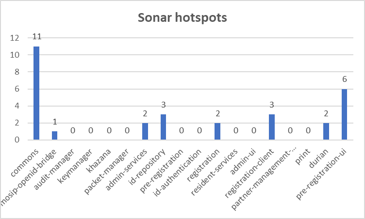

# Sonar Report

* Repository-wise sonar report that covers the following:
  * Code coverage report
  * Critical Open Bugs
  * Security vulnerabilities
  * Security Hotspots

| Repository                  | Sonar Coverage | Sonar Vulnerabilities | Sonar Bugs | Sonar Hotspots |
| --------------------------- | -------------- | --------------------- | ---------- | -------------- |
| commons                     | 83.4           | 0                     | 0          | 11             |
| mosip-openid-bridge         | 81.7           | 8                     | 4          | 1              |
| audit-manager               | 100            | 0                     | 0          | 0              |
| keymanager                  | 22.9           | 0                     | 2          | 0              |
| khazana                     | 2.1            | 0                     | 6          | 0              |
| packet-manager              | 0              | 0                     | 7          | 0              |
| admin-services              | 81             | 5                     | 0          | 2              |
| id-repository               | 81.8           | 0                     | 11         | 3              |
| pre-registration            | 81             | 0                     | 49         | 0              |
| id-authentication           | 82.8           | 0                     | 0          | 0              |
| registration                | 82.5           | 2                     | 15         | 2              |
| resident-services           | 73.3           | 0                     | 23         | 3              |
| admin-ui                    | 0              | 0                     | 61         | 0              |
| registration-client         | 73.5           | 0                     | 23         | 3              |
| partner-management-services | 81             | 0                     | 0          | 0              |
| print                       | 2.4            | 0                     | 8          | 0              |
| durian                      | 84.8           | 0                     | 5          | 2              |
| pre-registration-ui         | 0              | 0                     | 102        | 6              |

