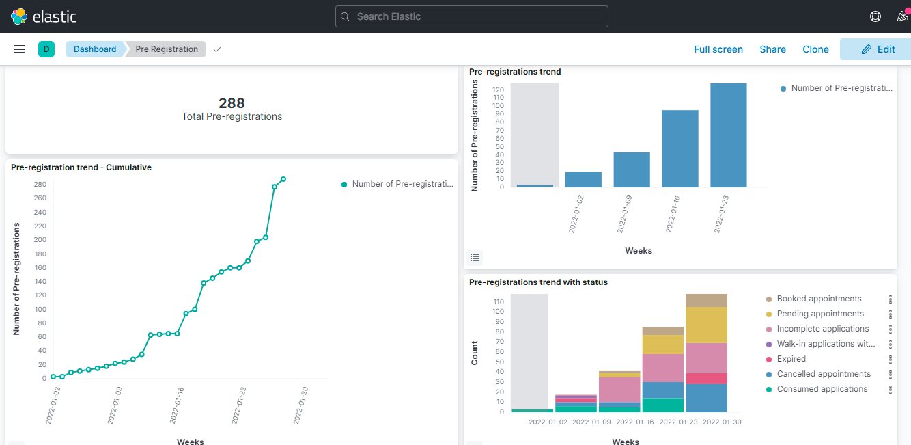
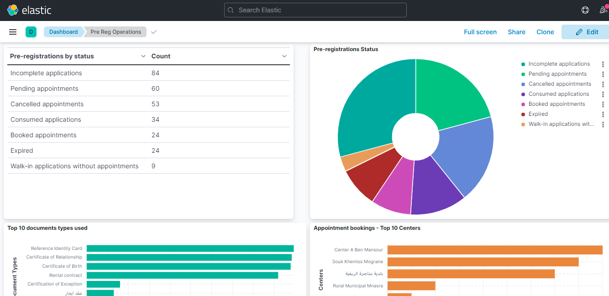
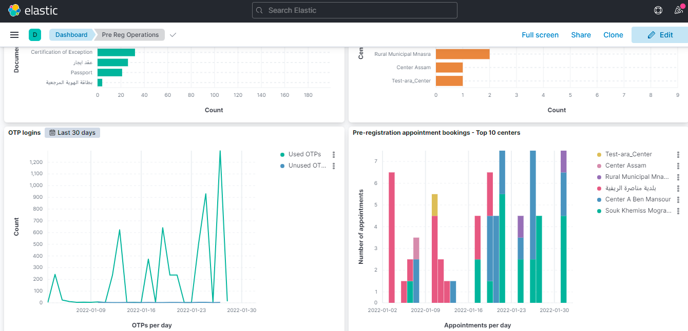
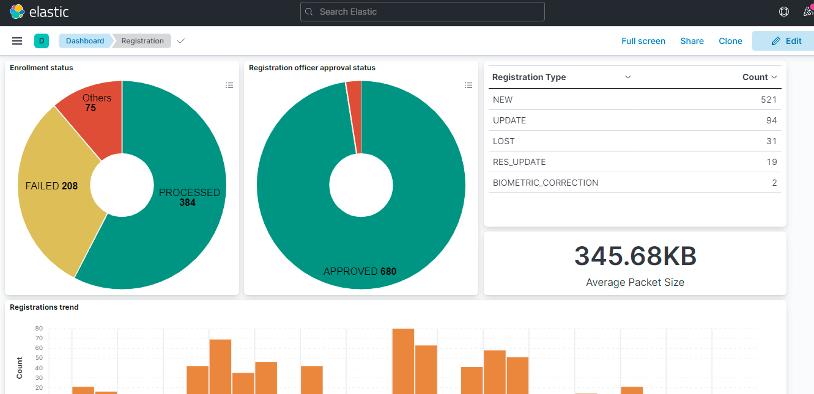
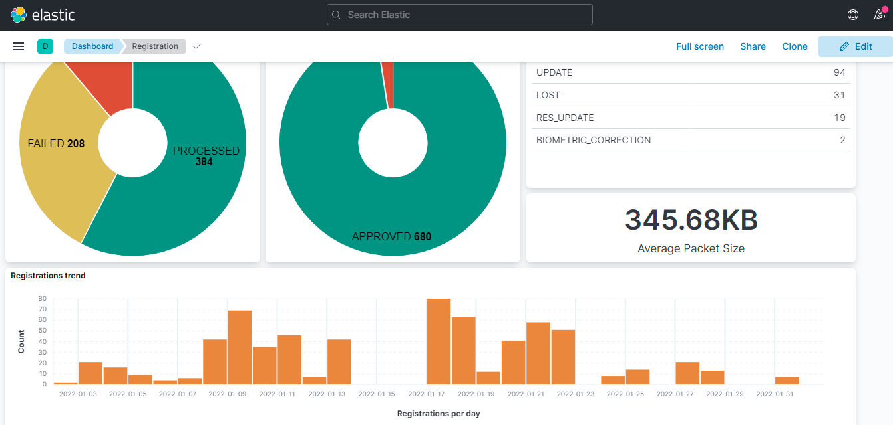
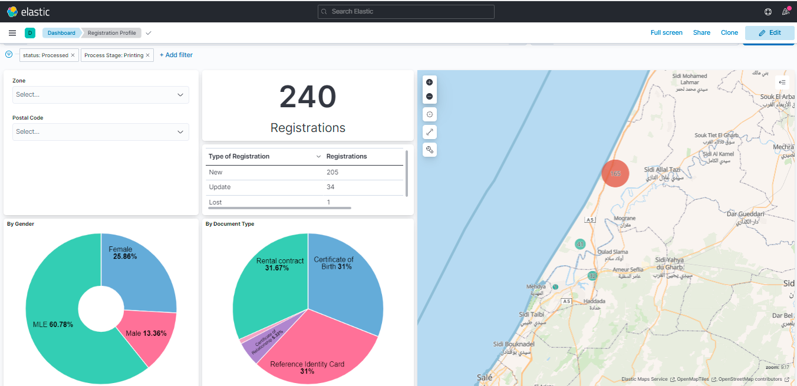
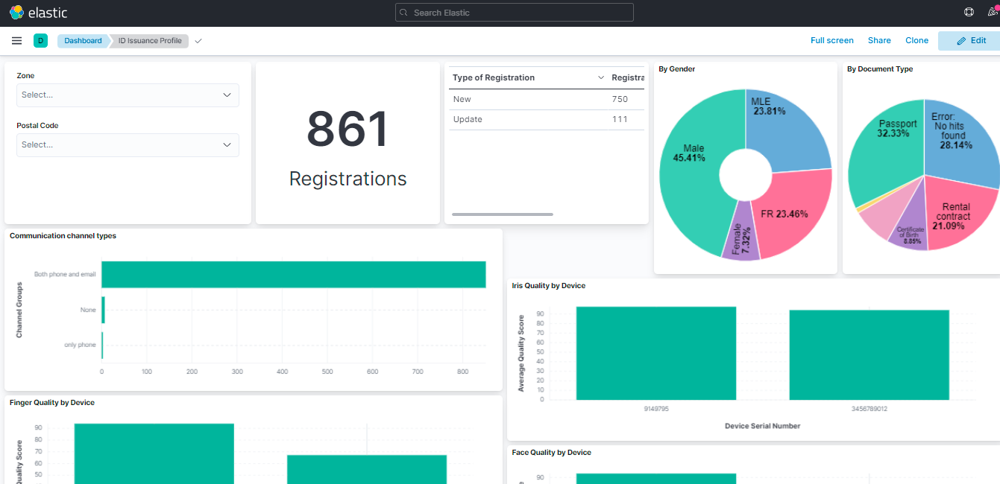

# Reporting

## Overview

Details of reporting framework can be found here <TODO add link>

The framework has been used to create a set of default dashboards using Kibana. Dashboards give a visual display of metrics and important data to track the status of various pre and post-enrollment processes. This data helps ID issuers with improving efficiency, forecasting, and better decision-making.

## Default dashboards
The following dashboards are configured on Kibana as the default implementation

* Combined dashboard
  
  
* Pre Registration dashboard
  
  
  
* Pre Reg Operations dashboard
  
  
  
* Registration dashboard
  
  
  
* Authentication dashboard
  
  
* Registration Profile dashboard
  
  
  
* ID Issuance Profile dashboard
  
  

The source files of the default dashboards are available here <TODO add link>

## How to customize?
* Setup a data pipeline for populating data from database to elastic search. Details are given here <TODO add link>
* After data is populated in elastic search, one can create custom dashboards in Kibana. Details are given here <TODO add link>
