# Resident Portal User Guide

The Resident Portal is a user-friendly web-based platform designed to assist residents in accessing various services associated with their Unique Identification Number (UIN). This portal offers a range of essential services such as:

1. **UIN services** using UIN/VID (through [e-Signet](https://docs.esignet.io)):
   * View My History
   * Manage My VID
   * Secure My ID
   * Track My Requests
   * Get Personalised Card
   * Share My Data
   * Logout
2. Get Information
   * About Registration Centers
   * List of supporting documents
3. Get My UIN (using UIN/ VID/ AID)
4. Verify email ID and/ or phone number
5. Responsive UI support- Support for the application to work seamlessly on various resolutions.
6. Book an appointment for new enrolment (via the pre-registration portal)
7. Ancillary features
   * Font size
   * Get Notifications (email and bell notifications)
   * View profile details of the logged in user (name, photo, and last login details)

Below is the detailed explanation of each of the features mentioned above.

## UIN Services

Residents can use these services to view, update, change, manage or share their data. They can also report an issue in case of a grievance.

#### Login

**Pre-requisites**: To login into the Resident Portal, the resident should have their unique virtual ID (VID) or Unique Identification Number (UIN) and also have access to the registered email ID/ phone number to be able to receive the OTP.

1.  Resident accesses the Resident Portal dashboard page.

    
2.  Resident clicks on `UIN Services`.

    

    The login screen appears and the resident can choose one of the options to log in.
3.  To login with OTP authentication, the resident clicks on `Log in here> More ways to login > Login with OTP`.

    
4.  Resident needs to enter valid VID in the `Enter Your VID` text field and check the box `I'm not a robot`.

    
5.  Next, the resident clicks on the `Get OTP` button.

    * The resident receives the OTP on the registered phone number and email ID.
    * The resident needs to enter the valid OTP received within stipulated time and click the `Verify` button.

    
6. The resident is then navigated to the Consent page. On this page, the **Essential** and **Voluntary** claims are displayed. Additionally, they will also have to allow access to their data in **Authorize Scope** section to avail various services. Based on the consent provided by the resident, the services will be made available for modification.

7. The resident has the choice to select from the list of Voluntary claims while the Essential claims are mandatory.

8.  The resident should now click the `Continue` button. The system navigates the resident to the UIN Services menu page from where they can avail various services.

    _**Note**_: **Consent page will be available only for first time login.**

    

### View My History

The residents can view the history of all the transactions associated with their logged-in UIN/ VID. They can also view their details and if any unaccounted entry is found, a report can be raised against the same.

The residents can perform the following:

1. **Search**: The residents can enter an Event ID to search a particular event.
2. **Filter based on date** (**From date** and **To date**): The Residents can put a “from” and “to” date in order to get the list of all the events performed in the chosen date range.
3. **Filter based on status (Success/ In Progress/ Failure)**: The Residents can filter based on the status of the event. E.g.: If they want to view all “In Progress” events, they can choose the status as “In Progress”. Additionally, they can also select any combination of the above three options.
4. **Filter based on History Type (Authentication, ID Management, Data Update, Data Share, Service Requests)**: The Residents can filter based on the type of event. Additionally, they can also choose any combination of the above five options.
   * **Authentication Request**: This includes all the authentication and e-KYC requests.
   * **ID Management Request**: This includes the below services:
     * Manage My VID (Generate/Revoke VID)
     * Verify phone number/email ID
     * Secure My ID (Lock/unlock various authentication types)
   * **Data Update Request**: This includes the below services:
     * Update my UIN (demographic data and contact data)
   * **Data Share Request**: This includes the below services:
     * Share with a partner
   * **Service Request**: This includes the below services:
     * Download configured card
     * Physical card
     * Get my UIN
     * Book an appointment (lost UIN, Update UIN, Pre-registration, other)
5. **Go button**: Residents can click on the `Go` button once they are done selecting all the required filters.
6. **Download the PDF of the results**: The residents can download the PDF version of the search result populated.
7.  Clicking on the accordion/ the caret of a particular event, the following options will appear:

    a. **View Details**: The residents can view the details about an event by clicking on `View Details`. They will be redirected to `Track My Request` page with pre-filled EID where they can see further details about the event.

    b. **Pin Event to the top**: The residents can pin the events to the top of the list based on their preference. Currently, this is configured for up to 3 events but it can be customized as per country’s requirements. Also, the resident can unpin the pinned events by clicking `Unpin from Top`.

    c. **Report a grievance**: The residents can report a grievance in case of fraud or for any event not initiated by them. On clicking `Report an Issue`, the resident will be redirected to the `Grievance Redressal Form` page where they will see a set of pre-filled data as well as a set of data to be filled.

    * Pre-filled data:
      * Name
      * Event ID (EID)
      * Registered Email ID
      * Registered Mobile Number
    * Data to be filled:
      * Alternate Email ID
      * Alternate Mobile Number
      * Comments

Once the event is completed, a message is displayed containing the grievance tracking ID.

Below are the images with different filters on this page.

### Manage My VID

On clicking `Manage My VID`, the resident will be taken to a page where they can view details of the existing VIDs, generate new VID, revoke existing VID or download a VID card.

The following types of VIDs can be seen based on the VID policy:

* Perpetual VID
* Temporary VID
* One-time VID

_**Note**_: The resident can get to know about the features of a particular VID by hovering over the “i” symbol.

The residents can perform the following:

1. **Create a new VID** : The residents can click on the `Create` button against any of the VID type selected. They can click on `Yes` to proceed. Once the event is completed, a message is displayed containing the Event ID along with a link to track the service.

2. **Revoke an existing VID**: The residents can click on the **Delete icon** to revoke an existing VID. They can click on `Yes` to proceed. Once the event is completed, a message is displayed containing the Event ID along with a link to track the service.

3.  **Download a VID card**:

    a. The residents can click on the **Download icon** to initiate the download process. They can click on `Download` to proceed. Once the event is completed, a message is displayed containing the Event ID, a link to track the service and the password combination.

    b. Once the card is ready to download, they will receive a notification for the same under the **bell icon** displayed on the top right corner of the screen and as an Email notification.

    c. On clicking on the notification, the resident will be taken to `Track My Request` page with pre-filled EID.

    d. On this screen, the resident will be able to download the card by clicking on `Download My VID card` button on the bottom left corner of the screen.

    e. The downloaded card will be a password protected PDF. The residents can view the downloaded VID card by entering the password combination displayed on the screen.

4. **View VID number**: All the VID numbers will be masked by default. The residents can view the unmasked version of VID by clicking on eye icon next to the VID number.

### Secure My ID

On clicking `Secure My ID`, the residents can view the status of all the authentication types. They can choose to lock or unlock authentication types like the following:

1. Email authentication
2. Mobile authentication
3. Demographic authentication
4. Fingerprint authentication
5. Iris authentication
6. Face authentication

The residents can perform the following,

**View the current status of authentication types**: The **lock icon** on each card indicates the current status of the authentication type. E.g.: If the lock is open, the authentication type is unlocked which means the residents can authenticate themselves using that particular authentication type and vice versa.

**Lock/ unlock the authentication types**: To lock/ unlock a particular authentication type, the residents can click on lock/ unlock button. Once the preferences of each authentication type is selected, the residents can click on `Submit` to save the changes and click `Yes` to proceed. Once the event is completed, a message is displayed containing the Event ID along with a link to track the service.

### Track My Requests

On clicking `Track My Requests`, the residents can track the status of an EID associated with the logged-in UIN/ VID. They can also view and download the detailed information about the entered EID like:

1. Event ID- This is the unique ID provided against each event
2. Event Type- This is the feature that is being availed. E.g.: Lock/unlock authentication types
3. Event Status- This is the status of the event which can hold values like Success, Failure or In-Progress
4. Individual ID- This is the type of individual ID that was used to login. E.g.: VID or UIN
5. Summary- This the the detailed description of the event.
6. Timestamp- This the time when the event occurred.
7. Authentication Mode- This is the authentication mode used to login. E.g.: OTP or Biometric or QR code
8. Partner Logo- This is the logo of the registered partner.
9. Partner Name- This is the name of the registered partner.
10. Attribute List- This is the list of attributes shared with the registered partner.
11. Purpose- This is the purpose of sharing data with the registered partner as input by the resident.

The resident can reach `Track My Requests` page by the following ways:

1. `UIN services > View history > Click on the event tile > View details`
2. By clicking the bell icon
3. `UIN services > Track My Requests`

_**Note**_:

* Residents can download their updated UIN /VID card.
* **Report a grievance**: The residents can report a grievance in case of fraud or for any event not initiated by them. On clicking `Report an Issue`, the resident will be redirected to the `Grievance Redressal Form` page where they will see a set of pre-filled data as well as a set of data to be filled.

### Get Personalised Card

On clicking `Get Personalised Card`, the residents can select the data to be added to their credential. They can preview the chosen data and download it. To be able to download the card, residents should select at least 3 attributes from the list mentioned below:

* Name- Name of the resident. They can choose the format in which they want the name to be displayed.
* Date of Birth- Date of birth of the resident. They can choose the format in which they want the date of birth to be displayed.
* UIN- Unique Identification Number. They can choose to mask or unmask the UIN.
* Perpetual VID- Perpetual Virtual ID. They can choose to mask or unmask the VID.
* Phone number- Registered phone number of the resident. They can choose to mask or unmask the phone number.
* Email ID- Registered email ID of the resident. They can choose to mask or unmask the email ID.
* Address- Address of the resident. They can choose the format in which they want the address to be displayed.
* Gender
* Photo

These details can be previewed as and when the attributes are chosen.

Once the event is completed, a message is displayed containing the Event ID along with a link to track the service.

### Share My Data

On clicking `Share My Data`, the residents can choose the data to be shared with any of the registered partners to avail various third party services.

To share the data, residents should select at least 3 attributes from the list mentioned below:

* Name- Name of the resident. They can choose the format in which they want the name to be displayed.
* Date of Birth- Date of birth of the resident. They can choose the format in which they want the date of birth to be displayed.
* UIN- Unique Identification Number. They can choose to mask or unmask the UIN.
* Perpetual VID- Perpetual Virtual ID. They can choose to mask or unmask the VID.
* Phone number- Registered phone number of the resident. They can choose to mask or unmask the phone number.
* Email ID- Registered email ID of the resident. They can choose to mask or unmask the email ID.
* Address- Address of the resident. They can choose the format in which they want the address to be displayed.
* Gender
* Photo

These details can be previewed as and when the attributes are chosen.

Additionally, the residents have to:

1. Select the partner with whom they want to share their data from a dropdown list of registered partners.
2. Enter the purpose of sharing the data with the registered partner.
3. On clicking the `Share` button, the resident will have to provide consent to share their data with the external partner.
4. Once the event is completed, a message is displayed containing the Event ID along with a link to track the service.

### Menu Bar

The Resident Portal menu bar contains the following:

1. Font Size- Residents can alter the size of the font based on their preferences.
2. Language- Residents can select the language of preference.
3. Bell icon Notification- Residents can view the notifications of all the asynchronous events in chronological order.
4. Profile Icon- Residents can view the following:
   * Name of the logged in user
   * Photo of the logged in user
   * Last login details
   * Logout option

## Book an Appointment

The residents can book an appointment for registration using the pre-registration portal. To do so, they can click on `Book an appointment` tile which will redirect them to the pre-registration portal. To know more about pre-registration portal, refer to this link [Pre-registration](https://docs.mosip.io/1.2.0/modules/pre-registration).

## Verify email ID/ phone number

The residents can use this feature to verify their registered email ID or phone number.

**Steps to verify email ID/ phone number**:

1. Resident clicks either on Verify email ID or Verify phone number option
2. Enter the UIN/VID.
3. Select `I’m not a robot` against the captcha and click on `Send OTP`.
4.  Resident enters the OTP received on the requested channel and clicks on `Submit`.

    Based on the scenario, any of the below three messages will be displayed:

    a. **Email ID/ phone number successfully verified**: On successful verification, a message is displayed on the screen saying that the phone number/ email ID has been successfully verified.

    b. **Email ID/ phone number was already verified**: If the verification has been previously completed, a message is displayed saying the email ID/ phone number was already verified.

    c. **Email ID/ phone number does not exist**: If there is no email ID/ phone number linked to the UIN/VID, a message is displayed saying no email ID/ phone number was found associated to this UIN/VID.

    

    

    

    

    

### Get My UIN

The residents can use this feature for one of the following:

1. Download their UIN card
2. Check the status of their Application ID (AID)

**Steps to download the UIN**:

1. Resident clicks on Get My UIN
2. Enter the AID/UIN/VID.
3. Select `I’m not a robot` against the captcha and click on `Send OTP`.
4. Resident enters the OTP received on the registered email ID/ phone number and clicks on `Submit`.
5.  The default PDF of UIN card will be downloaded and a success message is seen stating that the UIN has been successfully downloaded.

    

    

**Steps to check the status of the AID**:

**Note**: If the UIN is not ready, then the AID is used to get status else UIN card will be downloaded using AID too.

1. Resident clicks on`Get My UIN`.
2. Enter the AID.
3. Select `I’m not a robot` against the captcha and click on `Send OTP`.
4. Resident enters the OTP received on the registered email ID/ phone number and clicks on `Submit`.
5.  The status of the AID will be shown.

    

## Get Information

#### List of supporting documents

Residents can view the list of supported documents in the PDF format and download the same. Also, some sample documents are available for reference.

#### List of Registration Centers

Residents can search for Registration Centres on the basis of below two mechanisms:

**Nearby centers**: The resident will be asked to allow permission for location access in order to enable the system to suggest the nearest Registration Centres.

**Manually look for centers**: If the Resident wants to manually look for a center, they can do so by choosing a level in location hierarchy from the drop-down (e.g.: Region, Province, Postal Code) and entering the value against the same.

They can also download the PDF version of the result displayed on the screen for reference.

**Update My Data**

1. Identity data
   * Name
   * DOB
   * Gender
   * POI document
2. Address
   * Full address
   * POA document
3. Contact Information
   * Phone number
   * Email ID
4. Preferred Language
5.  **Identity Data:** Residents can update their identity data like Name, Date of Birth, Gender certain number of times (number of times the identity data can be updated is configurable). **To update the Identity Data, the residents will have to do the following:**

    a. Go to “Update My Data”

<figure><figcaption></figcaption></figure>

b. Click on “Identity” tab

<figure>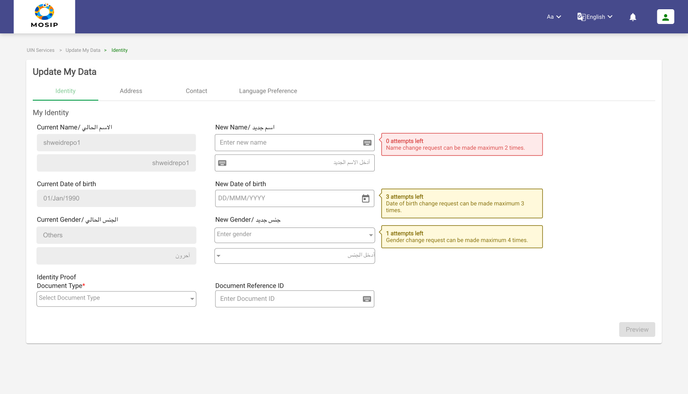<figcaption></figcaption></figure>

c. Enter the new Name/ new Date of Birth/ new Gender in preferred language.

<figure><figcaption></figcaption></figure>

d. The resident will then have to choose the type of document from drop-down.

<figure>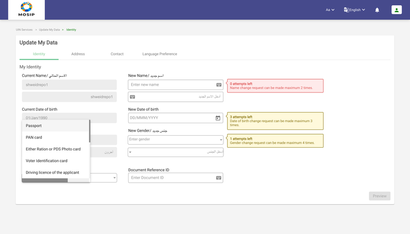<figcaption></figcaption></figure>

e. Upload a valid supporting document as Proof of Identity to back their change in identity request.

<figure>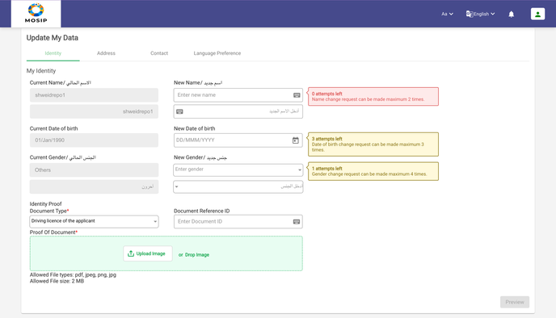<figcaption></figcaption></figure>

f. Once the document is uploaded, the “Preview” button will be made clickable

<figure>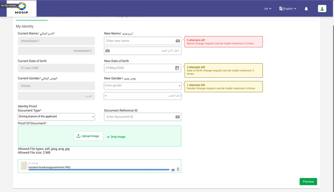<figcaption></figcaption></figure>

g. The Residents will then be taken to the preview screen where they can view the updated data and the uploaded supporting document which they can modify if required. When the resident is satisfied with all the data entered, he can go ahead and submit the data update request by clicking on “Update” button.

<figure>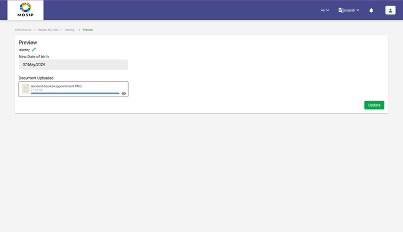<figcaption></figcaption></figure>

h. The Resident will then have to accept the terms and conditions and click on “Submit” button to submit the data update request.

<figure>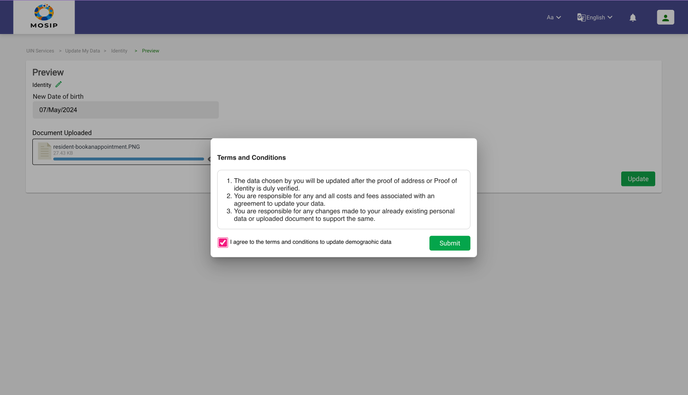<figcaption></figcaption></figure>

i. Once the event is completed, a message will be displayed containing the Event ID along with a link to track the service.

<figure><figcaption></figcaption></figure>

j. A bell icon and an email notification will be triggered using which the residents can view the status of the application.

<figure>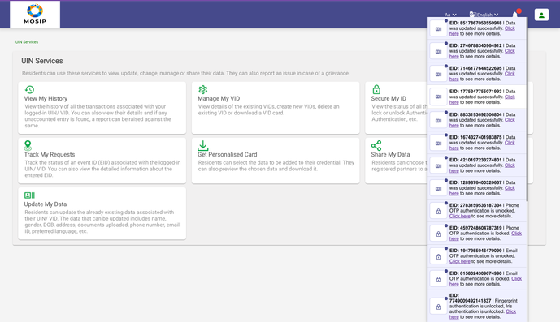<figcaption></figcaption></figure>

k. Once the update is successful, the card can be downloaded with new data by clicking on the particular notification.

<figure>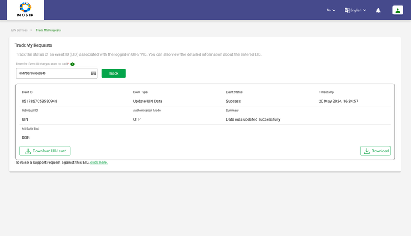<figcaption></figcaption></figure>


Note: The Resident can update the Proof of Identity document itself with no change in data.


6. **Address:** Residents can update their partial address or full address on the basis of their requirement any number of times. **To update the Address, the residents will have to do the following:**

a. Go to “Update My Data”

<figure>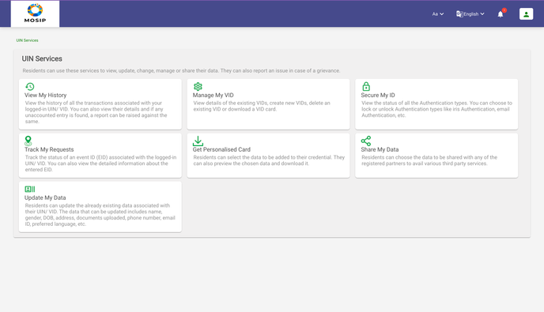<figcaption></figcaption></figure>

b. Click on “Address” tab

<figure>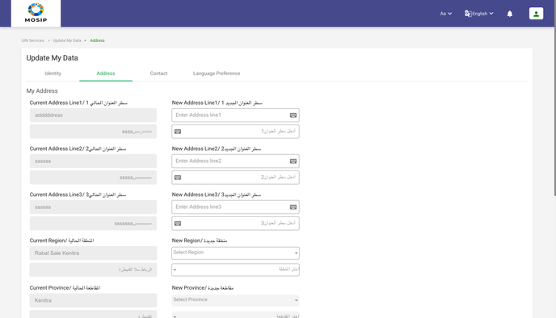<figcaption></figcaption></figure>

c. Enter the new address.

<figure>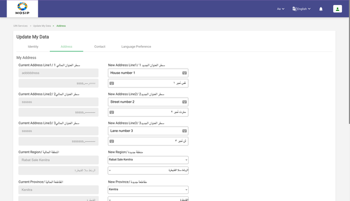<figcaption></figcaption></figure>

d. The resident will then have to choose the type of document from drop-down.

<figure>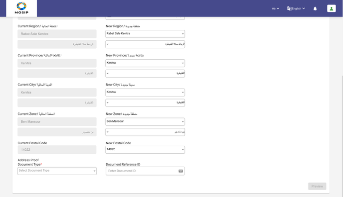<figcaption></figcaption></figure>

<figure>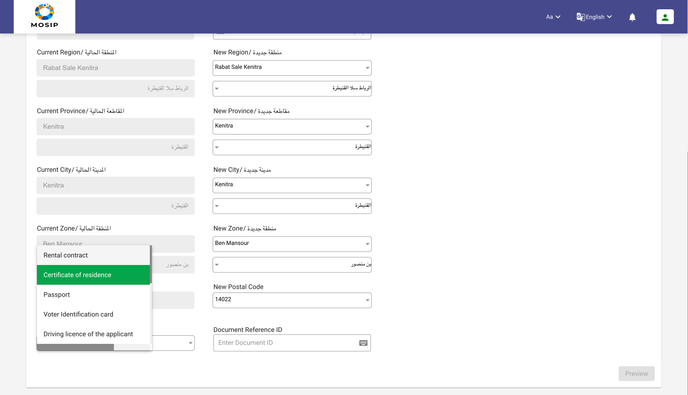<figcaption></figcaption></figure>

e. Upload a valid supporting document as Proof of Address to support their change in address request.

<figure>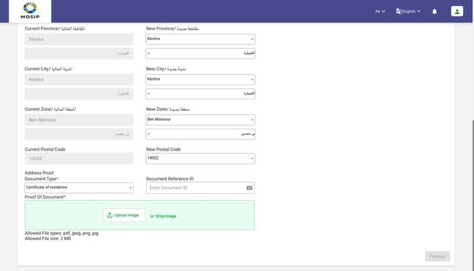<figcaption></figcaption></figure>

f. Once the document is uploaded, the preview button will be enabled.

<figure>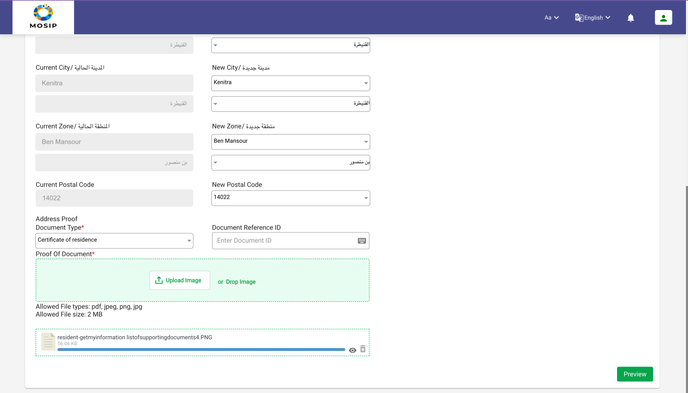<figcaption></figcaption></figure>

g. The Residents will be taken to the preview screen where they can view the updated data and the uploaded supporting document which they can modify if required by clicking on the pencil icon.

<figure>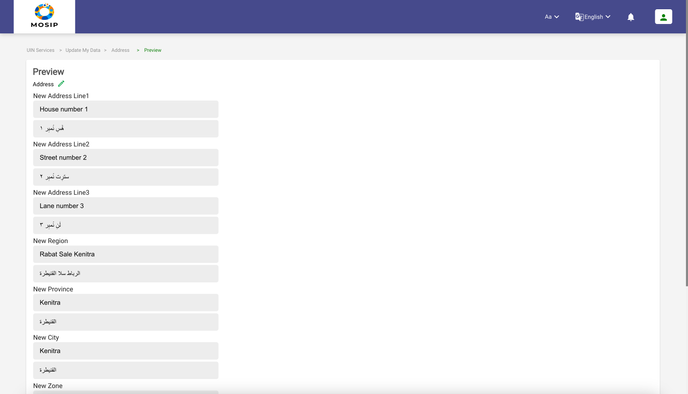<figcaption></figcaption></figure>

h. When the resident is satisfied with all the data entered, they can go ahead and submit the data update request by clicking on “update”.

<figure>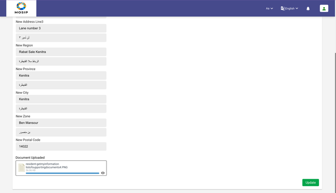<figcaption></figcaption></figure>

i. The Resident will also have to accept the terms and conditions in order to proceed and click on “Submit” button to proceed.

<figure>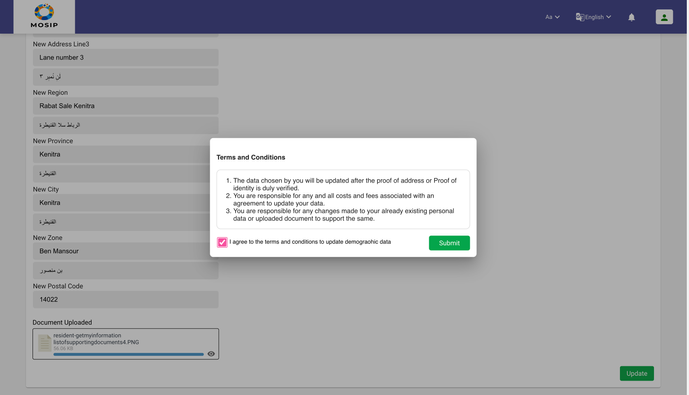<figcaption></figcaption></figure>

j. Once the event is successful, a message will be displayed consisting of the Event ID along with a link to track the service.

<figure><figcaption></figcaption></figure>

k. A bell icon and an email notification will be triggered using which the residents can view the status of the application.

<figure><figcaption></figcaption></figure>

l. Once the update is successful, the card can be downloaded with new data by clicking on the particular notification.

<figure>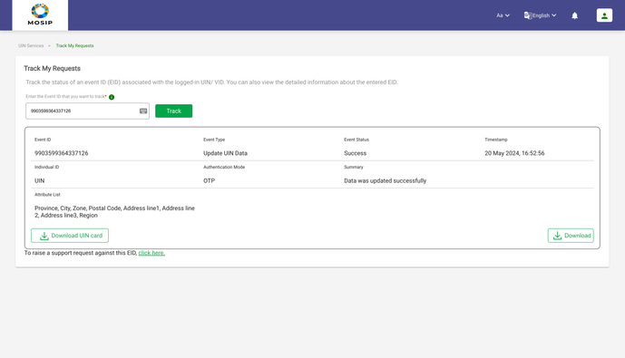<figcaption></figcaption></figure>


Note: Additionally, the Resident can also update the Proof of Address document itself with no change in data.


7. **Contact Data:** Residents can update their existing email ID and phone number. **To update the Contact Data, the residents will have to do the following:**

a . Go to “Update My Data”.

<figure><figcaption></figcaption></figure>

b. Click on “Contact Data” tab.

<figure>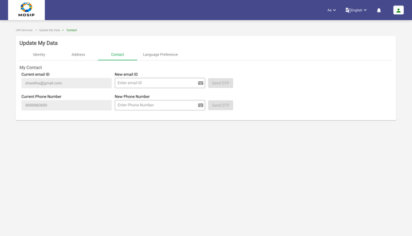<figcaption></figcaption></figure>

c. Enter the new email ID or Phone number (whichever needs to be updated).

<figure>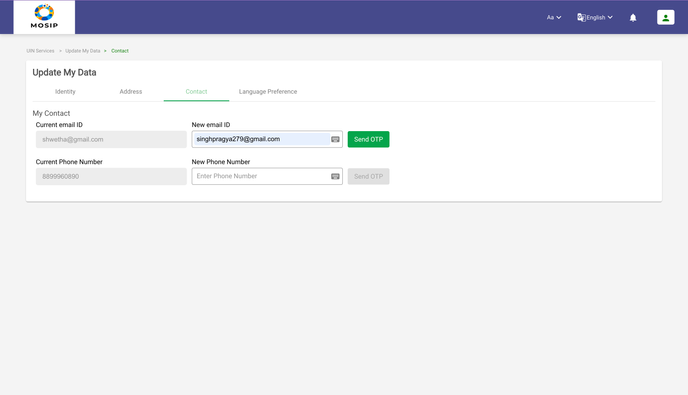<figcaption></figcaption></figure>

d. The Resident will receive an OTP over their new email ID/ Phone number and thereby entering the OTP received on the new email ID/ phone number.

<figure>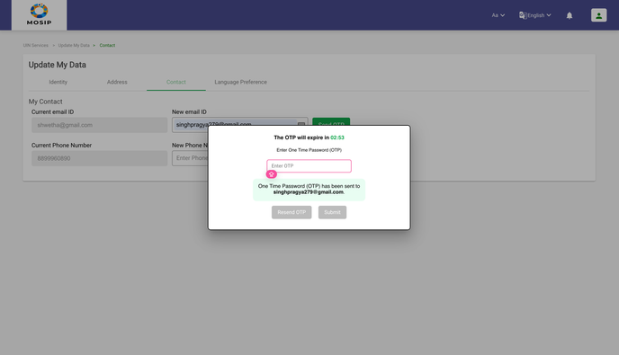<figcaption></figcaption></figure>

e. Once the event is completed, a message will be displayed consisting of the Event ID along with a link to track the service.

<figure><figcaption></figcaption></figure>

f. A bell icon and an email notification will be triggered using which the residents can view the status of the application.

<figure><figcaption></figcaption></figure>

g. Once the update is successful, the card can be downloaded with new data by clicking on the particular notification.

<figure>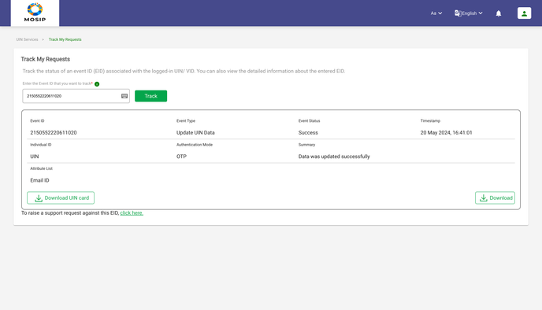<figcaption></figcaption></figure>

8. **Notification Language Preference:** Residents can update the language in which all the notifications are being sent to them. The residents can change the notification language as many times as they want to. **To update the Notification Language, the residents will have to do the following:**

a. Go to “Update My Data”

<figure><figcaption></figcaption></figure>

b. Go to “Language Preference” tab

<figure>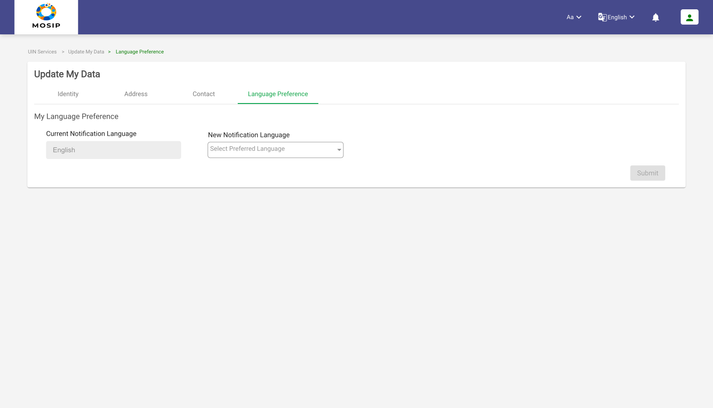<figcaption></figcaption></figure>

c.  Click on the “New Notification Language” drop-down.

<figure>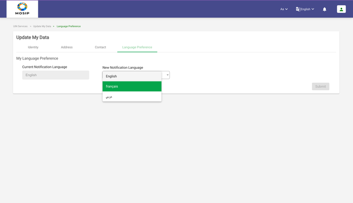<figcaption></figcaption></figure>

d. Choose the new Notification Language and click in “Submit” button.

<figure>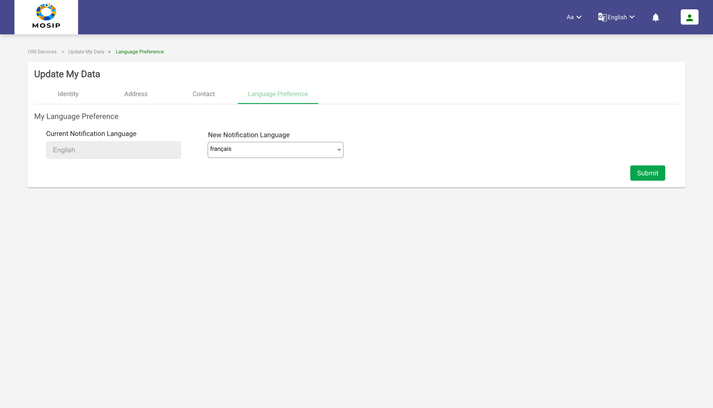<figcaption></figcaption></figure>

e. On clicking on “Submit”, a message will be displayed consisting of the Event ID along with a link to track the service.

<figure>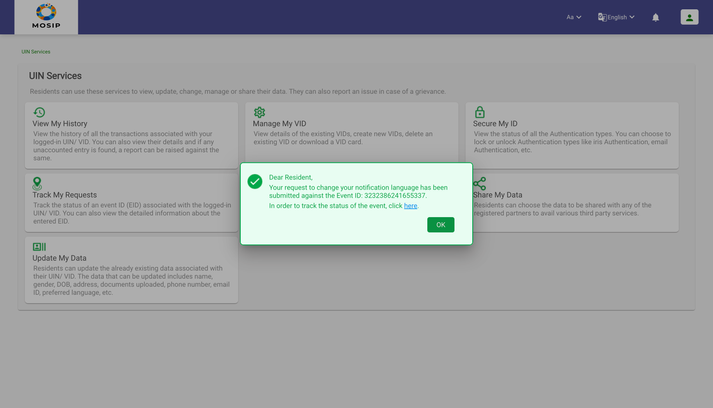<figcaption></figcaption></figure>

**Multi-Lingual Support:**

The Residents can view the entire portal in the language that they prefer using the language change option on the top right corner of the screen. On choosing any language, all the labels/ texts/ success or error messages, PDF downloads will be displayed in the chosen language.

**To change the language, the residents will have to do the following:**

1. Click on the language option from the header menu.
2. On clicking the language option, a drop-down will open that will have the list of languages in which the Resident Portal can be rendered in.
3. On choosing any language, the screen will be refreshed and the entire portal will be rendered in the chosen language.
4. Menu option in English.

<figure>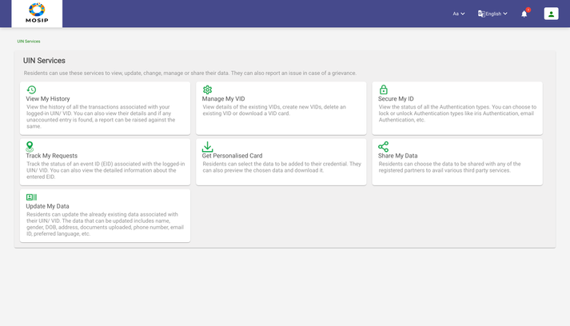<figcaption></figcaption></figure>

5. Menu option in French

<figure><figcaption></figcaption></figure>

6. Menu option in Arabic

<figure>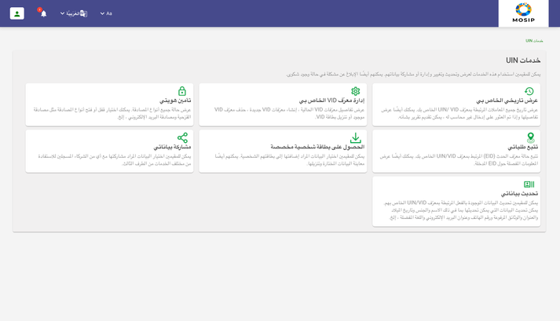<figcaption></figcaption></figure>


**Note:** Only one update request can be raised at a time. A second update request can only be initiated when there are no existing requests in progress. If the user still wants to request another data update, they can discard the request in progress and then raise a new data update request.

