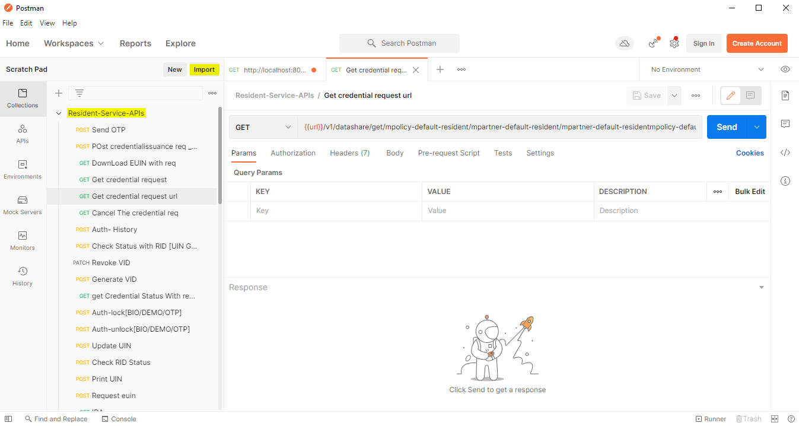
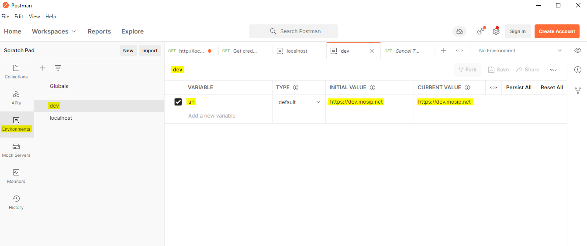
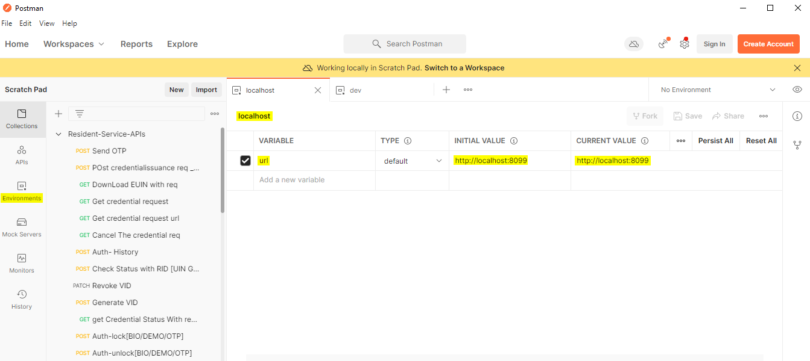

# Resident Services Developer Setup Documentation

## Overview
Resident services are the self-services which are used by the residents themselves via a portal. Resident Portal is a web based UI application that provides residents of a country the services related to their Unique Identification Number (UIN). To know more, read [here](https://docs.mosip.io/1.2.0/modules/resident-services).

This documentation will guide you with the various types of setups.

## Software setup

Below are a list of tools required in Resident services:
1. JDK 11
2. Any IDE (like eclipse, intellij idea)
3. Apache Maven (zip folder)
4. pgAdmin
5. Postman
6. Git
7. Notepad++ (optional)
8. lombok.jar (file)
9. settings.xml (document)

You can download `lombok.jar` and `settings.xml` from [here](https://github.com/mosip/documentation/tree/1.2.0/docs/_files/resident-services-config-files).

After unzipping Apache Maven, a user needs to move the unzipped folder in ```C:\Program Files``` and `settings.xml` inside this 'conf' folder ```C:\Program Files\apache-maven-3.8.4\conf```.

After installing Eclipse, a user needs to open the `lombok.jar` file and wait for some time until it completes the scan for Eclipse IDE then click on 'Install/Update'.


Now you can check inside the eclipse installation folder ```C:\Users\userName\eclipse\jee-2021-12\eclipse```, the `lombok.jar` is added there. Now you don't have to add the dependency of 'lombok' in your `pom.xml` file separately because it will be auto-configured by the Eclipse.

You also need to configure the JDK (Standard VM) with your eclipse by going inside Preferences → Java → Installed JREs.


## Code setup
First you need to make a clone of a repository. Follow setps of setup from [here](https://docs.mosip.io/1.2.0/community/code-contributions).

### Importing and building of a project
1. Open the project folder where `pom.xml` is present.
2. Open command prompt from the same folder.
3. Now run this command to build the project ```mvn clean install -Dgpg.skip=true -DskipTests=true``` and wait for build to complete successfully.
4. After building of a project, open Eclipse and select import projects → Maven → Existing maven projects → Next → Browse to project directory → Finish.


5.After successful importing of project, you need to update the project by right-click on project → maven → update project.

## Environment setup
1. For environment setup, a user needs one external JAR which is provided [here](https://oss.sonatype.org/#nexus-search;gav~~kernel-auth-adapter~1.2.0-SNAPSHOT~~) with different versions as per their need they can download any (eg., kernel-auth-adapter needs to download and add to project Libraries → Classpath → Add External JARs → Select Downloaded JAR → Add → Apply and close).


2. Now a user need to take a clone of 'mosip-config' repository from [here](https://github.com/mosip/mosip-config).
3. Follow all the steps of cloning a repository & adding a remote repository and constraints.
4. Create an empty folder inside the 'mosip-config' with 'sandbox-local' name and then copy and paste all config files inside 'sandbox-local' folder except .gitignore, README and LICENSE.
5. As resident-services is using two properties file: `resident-default` and `application-default`. You have to configure it according to your environment on which you will work. The same files are available [here](https://github.com/mosip/documentation/tree/1.2.0/docs/_files/resident-services-config-files) for your reference.
6. There are two files: [kernel-config-server.jar](https://oss.sonatype.org/#nexus-search;gav~~kernel-config-server~1.2.0-SNAPSHOT~~) and [config-server-start.bat](https://github.com/mosip/documentation/tree/1.2.0/docs/_files/resident-services-config-files) which will help to run the server. Put both of the files in the same folder and change the location attribute to 'sandbox-local' folder in `config-server-start.bat` file and also check the version of `kernel-config-server.jar` in the end of command. (eg., ```java -jar -Dspring.profiles.active=native  -Dspring.cloud.config.server.native.search-locations=file:C:\Users\myDell\mosipProject\mosip-config\sandbox-local -Dspring.cloud.config.server.accept-empty=true  -Dspring.cloud.config.server.git.force-pull=false -Dspring.cloud.config.server.git.cloneOnStart=false -Dspring.cloud.config.server.git.refreshRate=0 kernel-config-server-1.2.0-20201016.134941-57.jar```).

As I mentioned in step 5, you have to make some changes in these two properties files.

eg., ```mosip.mosip.resident.client.secret=xyz789``` you need to add this property because you need to use a decrypted passcode to run it in your local machine and if you are running it on a server then you have to use an encrypted passcode like this ```mosip.mosip.resident.client.secret={cipher}1bdd7e59ca3a9dbe66b47db3ecb7025e66a6746911de2bd841c804f```. You need to comment out this ```auth.server.admin.issuer.internal.uri``` in `application-default` file because you already have this ```auth.server.admin.issuer.uri``` so there is no need of ```auth.server.admin.issuer.internal.uri```.

If you check the urls present in these files are set on default with port no. 80 or something but you need to use external url to access. In the beginning of `resident-default` file, you need to add ```mosipbox.public.url=https://${domain.url}``` and change all other urls with ```${mosipbox.public.url}```. It’s because you will pass this domain url in Eclipse VM arguments like this ```-Ddomain.url=dev.mosip.net``` which will result in this ```mosipbox.public.url=https://dev.mosip.net``` and it will connect with the Dev environment.

Now run the server by open the `config-server-start.bat` file and it will open the command prompt and start running.


As you can see that the server is up. Now we have to do some configurations in Eclipse also.

Open eclipse and run the project for one time as 'java application', so that it will create a java application which you can see in debug configurations and then change its name to like what I have given (project name with environment - "Resident-dev").


Now open the arguments and pass this ```-Ddomain.url=dev.mosip.net -Dapplication.base.url=http://localhost:8090 -Dspring.profiles.active=default -Dspring.cloud.config.uri=http://localhost:51000/config -Dspring.cloud.config.label=master``` in VM arguments. Here domain url represents the environment on which you are working (eg., it can be ```dev2.mosip.net``` or ```qa3.mosip.net```).


Now simply click on apply and then debug it and it will start running. In console, you can see a message like ```"Started ResidentBootApplication in 34.078 seconds (JVM running for 38.361)"```.

## Resident services API documentation
You can find all the APIs used in resident-services 1.2.0 [here](https://mosip.github.io/documentation/1.2.0/resident-services.html).

You can test the APIs with the help of Swagger-UI and postman. Swagger is an interface description language for describing restful APIs expressed using JSON. You can access Swagger-UI of resident-services for dev-environment from ```https://dev.mosip.net/resident/v1/swagger-ui/index.html?configUrl=/resident/v1/v3/api-docs/swagger-config``` and localhost from ```http://localhost:8099/resident/v1/swagger-ui/index.html?configUrl=/resident/v1/v3/api-docs/swagger-config```.

Postman is an API platform for building and using APIs. Postman simplifies each step of the API lifecycle and streamlines collaboration so you can create better APIs—faster. It is widely used tool for API testing. Below you will find the APIs postman collection of resident-services.

You just need to download the JSON collection from [here](https://github.com/mosip/documentation/tree/1.2.0/docs/_files/resident-services-config-files) and then import it in your 'postman'.



Now you need to create an environment like below is the environment created for dev and give variable name as ```url``` and set both of the values as ```https://dev.mosip.net```.



The same way you need to create more environment here like below is the environment created for localhost and give variable name as ```url``` and set both of the values as ```http://localhost:8099```.



If you will check, you will find five types of APIs: Get, Post, Put, Patch & Delete and when you will send a request from any of those APIs, you will get a particular response from those APIs.
