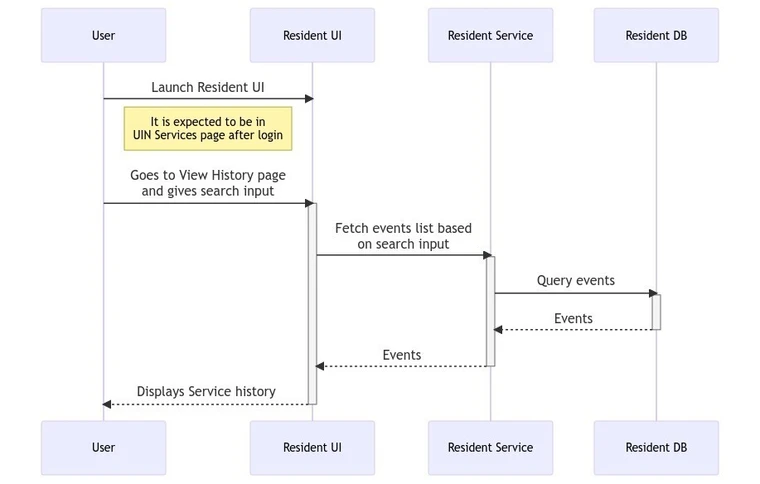
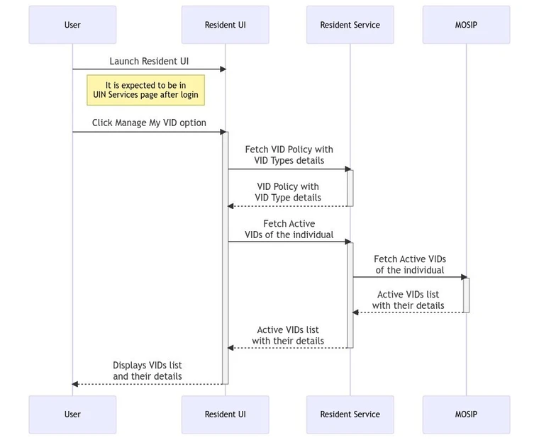

# Functional Design Document

Resident Portal is a self-help web portal that can be used by the residents of a country to avail the services related to their Unique Identification Number (UIN). The key services provided are:

* UIN services
    * View My History
    * Secure My ID
    * Manage My VID
    * Track My Request
    * Download My Personalized Card
    * Update My Data
    * Share My Credential
* Get Information
    * Supporting Documents
    * Registration Center
* Verify Email ID/Phone number
* Get My UIN
* Booking an Appointment

Below is the detailed explanation of each of the features mentioned above.

<<< >>>

### View My History

The residents can view the history of all the transactions associated with their logged-in UIN/ AID/ VID. They can also view their details and if any unaccounted entry is found, a report can be raised against the same.

Below is the list of APIs:

**GET /service-history/{lang-code}**: This API is to get the service history of one or more service types. These entries can be fetched for a certain period (start date and end date). The result will be paginated. This is an authenticated API. For more details, refer [API documentation](https://mosip.stoplight.io/docs/resident/0b88c7fac6a1c-get-service-history-of-the-resident).

**GET /download/service-history**: This API is to download the View History Tables as a PDF. To know more, refer [here](https://mosip.stoplight.io/docs/resident/f3ca383640b73-download-service-history).

### Manage My VID

On clicking `Manage My VID`, the resident is taken to a page where they can view details of the existing VIDs, generate new VID, revoke existing VID or download a VID card.

The following types of VIDs can be seen based on the VID policy:

* Perpetual VID
* Temporary VID
* One-time VID

Below is the list of APIs:

**GET​/vid​/policy**: This API is to get the VID policy. This is an authenticated API. To know more, refer [here](https://mosip.stoplight.io/docs/resident/76c0bbbec07ef-vid-policy).

**POST​/generate-vid**: This API generates the VID for the given VID type for the logged in user.
To know more, refer [here](https://mosip.stoplight.io/docs/resident/b61a4bf8f3117-generate-vid).

**PATCH​/revoke-vid​/{vid}**: VID Revoke API that is authenticated used to revoke a VID of the logged in user. It also needs to verify the individual ID in the request belongs to the same user who has logged in.
To know more, refer [here](https://mosip.stoplight.io/docs/resident/e7c01df57c4d3-revoke-vid-vid).

**GET /vids**: This is an authenticated API that will retrieve the list of active VIDs of the UIN/ VID of the logged in session. Refer [here](https://mosip.stoplight.io/docs/resident/7c8694c3fa4ba-get-vi-ds-of-the-resident).

**GET/request-card/vid/{VID}**: This API is to request the PDF card generation for a specific VID of the logged in user. This will give back a event ID for tracking purpose and to use it to download the VID card from the notifications.

**GET /download-card/event/{event-id}**: This API is to download the UIN card using the URL sent over email/SMS/track event/notification section. Refer the links below:

a. 

b. 

### Secure My ID

On clicking `Secure My ID`, the residents can view the status of all the authentication types. They can choose to lock or unlock authentication types like the following:

1. Email OTP authentication

2. Phone OTP authentication

3. Demographic authentication

4. Fingerprint authentication

5. Iris authentication

6. Face authentication

Below is the list of APIs:

**GET​/auth-lock-status**: This API returns the lock/unlock status of Auth Types for a given UIN/VID. The individual ID is obtained from the logged-in session. Refer [API documentation](https://mosip.stoplight.io/docs/resident/2229d1317ece0-auth-lock-status).

  <<< check with Pragya>>>

**POST​/auth-lock-unlock**: Resident service to store the Auth type lock/unlock status with status_comment containing summary of what is locked /unlocked. For details, refer [here](https://mosip.stoplight.io/docs/resident/0c178333f2164-auth-lock-unlock).

 <<< check with Pragya>>>

**POST​/callback​/authTypeCallback**: This is a Websub callback for Auth Type Lock/Unlock acknowledgement from IDA. Resident Service subscribes to the websub topic `AUTH_TYPE_STATUS_UPDATE_ACK` and updates the Auth type lock/unlock status into `resident_transaction` Table for the request ID (AID) as COMPLETED/FAILED. The table will have multiple entries for each online verification Partner and the status will be updated for the online verification specific partner id mentioned in the websub notification. For more, click [here](https://mosip.stoplight.io/docs/resident/bd55a60bedd28-websub-callback-for-auth-type-lock-unlock-acknowledgement).

### Track My Requests

On clicking `Track My Requests`, the residents can track the status of an Event ID (EID) associated with the logged-in UIN/ VID. They can also view and download the detailed information about the entered EID.

Below is the list of APIs:

**GET /events/{event-id}?langCode={language-Code}**: This authenticated API is to get the details of status for a given EID and including its status. To know more, refer [here](https://mosip.stoplight.io/docs/resident/d7394b9e82775-events-event-id-lang-code-language-code).

**GET /ack/download/pdf/event/{eventId}/language/{languageCode}**: This API is to convert the acknowledgement of any service request Event ID as a downloadable PDF. This is an authenticated endpoint.
To learn more, refer [here](https://mosip.stoplight.io/docs/resident/752a9090b564e-ack-download-pdf-event-event-id-language-language-code).

### Get Personalized Card

On clicking `Get Personalized Car`, the residents can select the data to be added to their credential. They can preview the chosen data and download it. Residents should select at least 3 attributes.

Below is the list of APIs:

**GET ​/identity/info/type/{schema-type}**: API to get the list of ID Attributes of the logged-in user to pre-populate in the UI. https://mosip.stoplight.io/docs/resident/24c36650d44e0-identity-info-type-schema-type 

**GET​/proxy​/config​/identity-mapping**: This API is to get the identity mapping Json. For more, refer [here](https://mosip.stoplight.io/docs/resident/ea2336c94f85f-proxy-config-identity-mapping).

**GET​/proxy​/config​/ui-schema**: API to return the UI Spec (UI Schema) for the given schemaType which is one of share-credential/update-demographics/personalized-card. For details, click [here](https://mosip.stoplight.io/docs/resident/0f2b7295f1e29-proxy-config-ui-schema).

**POST /download/personalized-card**: This API is to download the personalized PDF card. This is a synchronous call where the personalized card is downloaded immediately. The input for this is the HTML content used in the preview card in the Resident UI. This is an authenticated API. Refer [here](https://mosip.stoplight.io/docs/resident/ff21b71c08730-download-personalized-card).

   << check with Pragyaa)))

### Share My Data

On clicking `Share My Data`, the residents can choose the data to be shared with any of the registered partners to avail various third party services.

Below is the list of APIs:

**GET​/auth-proxy/partners**: This API is to get the list of partner types from PMS. The details of this API are available [here](https://mosip.stoplight.io/docs/resident/bd8ca93768659-auth-proxy-partners). 

**GET​/proxy​/config​/ui-schema**: API to return the UI Spec (UI Schema) for the given `schemaType` which is one of share-credential/update-demographics/personalized-card. Refer [here](https://mosip.stoplight.io/docs/resident/0f2b7295f1e29-proxy-config-ui-schema).

**GET​/proxy​/config​/identity-mapping**: This API is to get the identity mapping Json. Refer [here](https://mosip.stoplight.io/docs/resident/ea2336c94f85f-proxy-config-identity-mapping).

**GET​/auth-proxy​/masterdata​/templates/{langcode}/{templatetypecode}**: This API is to return terms and conditions for different use cases for different languages such as eng, fra, and ara. This will be invoked by UI for the specific language. This is a Proxy API of master data service for getting templates for template type code and language code. This should be an authenticated proxy API. refer [here](https://mosip.stoplight.io/docs/resident/94f785201e613-auth-proxy-masterdata-templates-langcode-templatetypecode) for more details.

**POST /share-credential**: This API is to share the user specified attributes to selected partner in the selected formats along with a purpose. Refer [here](https://mosip.stoplight.io/docs/resident/5f8ac1903d659-share-credential) for more. 

### Menu Bar

The Resident Portal menu bar contains the following:

**Font Size**- Residents can alter the size of the font based on their preferences.

**Language**- Residents can select the language of preference.

**Bell icon Notification**- Residents can view the notifications of all the asynchronous events in chronological order.

Below is the list of APIs:

**unread/service-list**   : This API is to get any updates to the service requests after the users have viewed the last service updates in the notification in a paginated way (page start and page fetch query params). The API should return the URL of the UIN card if it is ready, the entry of these needs to be added to the resident-transaction table as `NEW` status. Fore more, refer [here](https://mosip.stoplight.io/studio/resident?source=jvrylvdq&symbol=%252Fp%252Freference%252FAPI-Unread-Service-List.yaml%252Fpaths%252F%7E1unread%7E1service-list%252Fget). 

**GET /unread/notification-count**: API to return the number of unread service notification list. This is an authenticated API. This will return the count of `resident_transaction` table entries with `read_status=false`.
Refer [here](https://mosip.stoplight.io/docs/resident/36f7e14e6ece0-unread-notification-count).

**GET /notifications/{langCode}**: API to return the all service notification list along with status summary message and status update time in a paginated way. This is an authenticated API. For mroe, refer [here](https://mosip.stoplight.io/studio/resident?source=jvrylvdq&symbol=%252Fp%252Freference%252FAPI-Unread-Service-List.yaml%252Fpaths%252F%7E1unread%7E1service-list%252Fget).

**GET /bell/notification-click**: API to get last date-time of user click event on the bell notification.
This is an authenticated API. This returns the last date time of user click event on the bell notification icon.
For more, refer [here](https://mosip.stoplight.io/docs/resident/5f86168d8037a-bell-notification-click).

**PUT/bell/updatedttime**: API to update last date-time when user clicked on the bell notification.
This is an authenticated API. This will update the last date time with current UTC time. For more, refer [here](https://mosip.stoplight.io/docs/resident/3698b2ddd36ce-bell-updatedttime).

### Profile Icon

**Profile Icon**- Residents can view the following:

  * Name of the logged in user
  * Photo of the logged in user
  * Last login details
  * Logout option

Below is the list of APIs:

**GET /profile**: This API is to get User details for the current session. For more, refer [here](https://mosip.stoplight.io/docs/resident/41d27b4cdfff9-profile).

**GET​/login​/{redirectURI}**: API that obtains Access token and ID token for the given authorization code, validates them and then redirects to the given redirect URL with the tokens in the response cookie. For details, refer [here]
(https://mosip.stoplight.io/docs/resident/d63e06fd24774-login-redirect-uri).

### Book an appointment

The residents can book an appointment for registration using the pre-registration portal. To do so, they can click on  `Book an appointment` tile which will redirect them to the pre-registration portal. To know more about pre-registration portal, refer [Pre-registration overview](https://docs.mosip.io/1.2.0/modules/pre-registration).

API details present [here](https://github.com/mosip/documentation/blob/1.1.5/docs/Pre-Registration-APIs.md#login-service-public).

### Verify Email ID/ Phone number

The residents can use this feature to verify their registered email ID or phone number.

Below is the list of APIs:

**POST /validate-otp**: This API will be used to validate OTP when the resident is trying to verify his phone number or email Id. For more, refer [here](https://mosip.stoplight.io/docs/resident/ffb06d52ba4e7-validate-otp-for-given-uin-vid-using-ida-to-verify-phone-email). 

**GET/channel/verification-status/**: This API is to check if OTP is verified for a channel for an individual (UIN/VID). For more, read [here](https://mosip.stoplight.io/docs/resident/dae10ad85c0a9-get-channel-verified-status).

### Get My UIN

The residents can use this feature for one of the following:

1. Download their UIN card

2. Check the status of their Application ID (AID)

Below is the list of APIs:

**POST /individualId/otp**: This API is used to send the OTP prior to download the UIN card for the given AID/VID/UIN. If the UIN is card is not ready it will return the current status of the AID.

**POST /download-card**: This API is to download the default UIN card using AID/VID/UIN.

**GET /rid/{individual-id}**:  This is ID-repo API is to get the RID for a given UIN/VID. This is used internally in resident service.

### Get Information

**List of supporting documents**

Residents can view the list of supported documents in the PDF format. Also, they can view some samples for reference.

Below is the list of APIs:

**GET /download/supporting-documents?langcode={language-code}**: This API is to convert the List of supporting documents request as a downloadable PDF.

Refer [here](https://mosip.stoplight.io/docs/resident/32c31a9b693aa-download-supporting-documents-langcode-language-code) for more details.

**GET​/proxy​/masterdata​/getcoordinatespecificregistrationcenters​/{langcode}​/{longitude}​/{latitude}​/{proximitydistance}**

**GET​/proxy​/masterdata​/locationHierarchyLevels​/{langcode}**

**GET​/proxy​/masterdata​/locations​/immediatechildren​/{locationcode}​/{langcode}**

**GET​/proxy​/masterdata​/locations​/info​/{locationcode}​/{langcode}**

**GET​/proxy​/masterdata​/registrationcenters​/{langcode}​/{hierarchylevel}​/names**

**GET​/proxy​/masterdata​/registrationcenters​/page​/{langcode}​/{hierarchylevel}​/{name}**

**GET​/proxy​/masterdata​/validdocuments​/{langCode}**

**GET​/proxy​/masterdata​/applicanttype​/{applicantId}​/languages**

