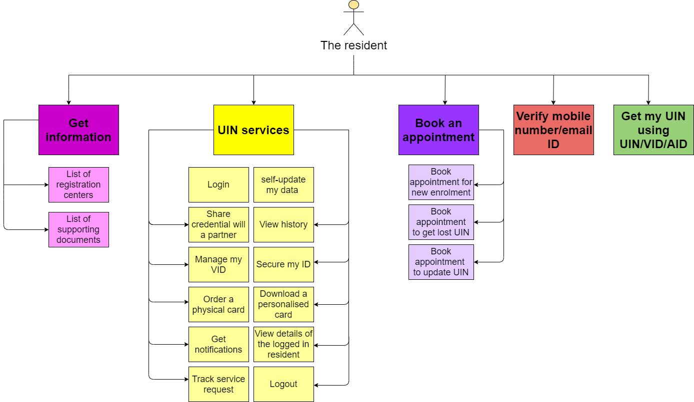
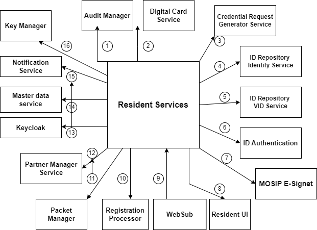

# Resident Services

## Overview

Resident services are the self-services which are used by the residents themselves via a portal. Resident Portal is a web-based UI application that provides residents of a country the services related to their Unique Identification Number (UIN). The residents can perform various operations related to their UIN/ VID and can also raise concerns if any through the portal.

The key features provided on Resident portal are:

1. Get Information 
    * About Registration Centers
    * List of supporting documents
2. Get My UIN (using UIN/ VID/ AID)
3. Verify email ID and/ or phone number 
4. Avail **UIN services** using UIN/VID (through [e-Signet](https://docs.esignet.io)):
     * View My History
     * Manage My VID
     * Secure My ID
     * Track My Requests
     * Get Personalised Card
     * Share My Data
     * Get Notifications (email and bell notifications)
     * View profile details of the logged in user (name, photo, and last login details)
     * Logout
5. Responsive UI support- Support for the application to work seamlessly on various resolutions.
6. Book an appointment for new enrolment (via the pre-registration portal)

Below is an image summarizing the features provided in Resident portal.

The relationship of Resident services with other services is listed below. 

_Note: The numbers do not signify sequence of operations or the control flow._

1.	__Audit Manager__: Resident services sends all the audit logs to the Audit Manager.
2.	__Digital card service__: Resident services uses this service to download the PDF of the UIN card or VID card.
3.	__Credential Request Generator Service__: This service is used to share the credential with various partners like print partners, authentication partners, and digital card partners.
4.	__ID Repository Identity Service__: Resident services uses this service to retrieve the identity information of a credential and to lock/unlock authentication types.
6.	__ID Repository VID service__: This service is used to generate/revoke various types of VIDs.
7.	__ID Authentication__: This service is used by Resident services to authenticate users.
8.	__MOSIP e-Signet__: This is used to authenticate and authorize the users in an event of login using UIN/ VID.
9.	__Resident UI__: This is the interface through which users can interact with the Resident services.
10.	__WebSub__: This is used to get asynchronous notification from IDA for acknowledgment purposes.
11.	__Registration Processor__: This is used to sync and upload packets for features pertaining to changes in identity data.
12.	__Packet Manager__: Resident services uses this service to create packets.
13.	__Partner Management Service__: Resident services uses this service to get information about various partners and policies.
14.	__Keycloak__: Resident services uses this to authenticate in order to access the MOSIP internal APIs. The Resident services communicates with endpoints of other MOSIP modules via a token obtained from Keycloak.
15.	__Master data service__: Resident services invokes the Master Data services to get various templates and machine details.
16.	__Notification service__: Resident services uses this service to send various notifications through email or SMS.
17.	__Key Manager__: Resident services uses Key Manager to encrypt or decrypt the data used across features.

## Design principles

The design of the Resident portal embodies the following principles:

* __One-stop solution__: The Resident portal is designed to have components that aims to solve all the queries, issues, or discrepancies of the residents and acts as a one-stop solution for all the requirements.
* __Self-Sovereign__: Once the ID is issued by an authority, the user/resident/citizen chooses to control and manage their data in their choice of devices.
* __Inclusive__: The Resident portal aims to be available in all the browsers while also catering to the needs of visually impaired, dyslexic and colour-blind folks.
* __Presence assurance__: This web-based UI application would put in all its efforts to ensure easy access to all the residents with high availability.
* __Works Remote__: The Resident portal should be able to share credentials when data needs to be shared remotely without physical presence.
* __Trusted__: The identity verification process on the device should be trusted so that it can be used in service delivery without any concerns.
* __Grievance redressal__: The Resident portal ensures that in case of any concerns or grievance, the issue is raised and resolved through the portal itself.

## Services

For detailed description of Resident services, the code and design, refer to [resident services repo]().

## Resident portal

MOSIP provides a reference implementation of the Resident portal that can be customized as per the country’s needs. The sample implementation is available at *insert reference implementation repository link*. 

For getting started with the resident portal, refer to the *Resident services user guide link*

## Build and deploy

To access the build and read through the deployment instructions, refer to insert resident services repo link

## Configurations

For details related to resident portal configurations, refer to *insert Resident services configuration link*

## Developers Guide

For a detailed description of Resident Services, code, and design, refer to *insert resident services developer’s guide link*

## API

Refer [API Documentation](https://mosip.stoplight.io/docs/resident/9a5192571fc51-document).

## Source code 

[Github repo](https://github.com/mosip/resident-services/tree/release-1.2.0).

