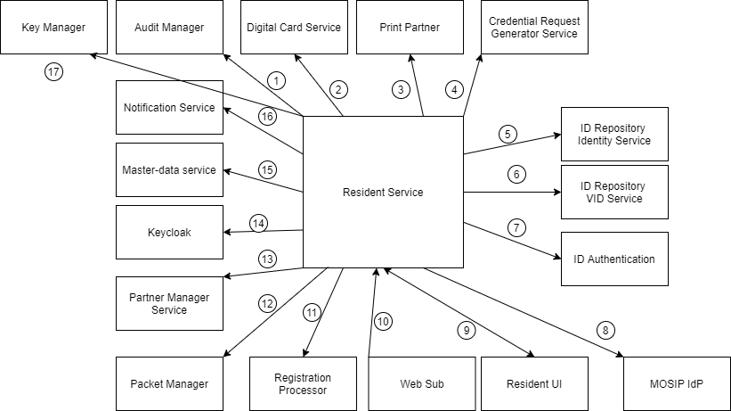

	# Resident Services

## Overview
Resident services are the self-services which are used by the residents themselves via a portal. Resident Portal is a web based UI application that provides residents of a country the services related to their Unique Identification Number (UIN). The residents can perform various operations related to UIN/VID and can raise concerns if any through the portal.

The key services provided by Resident services are:
1.	Get information about:
    * Get the list of the registration center
    *	Get the list of supporting documents
2.	Get my UIN using UIN/ VID/ AID 
3.	Verify email ID and/or phone number 
4.	Avail UIN services using UIN/ AID/ VID and OTP/ biometrics/ QR code to:
	  * View My History
	  * Manage My VID
	  Secure My ID
		Track My Requests
		Get Personalised Card
		Share My Data
Update My Data
    
    *	Get Notifications (email and bell notifications)
    *	View profile details of the logged in user (name, photo, and last login details)
    *	Logout
  
5. Responsive UI support

6.    Book an appointment for new enrolment (via the pre-registration portal)

Below is an image summarizing the features provided in Resident portal.

The relationship of Resident services with other services is listed below. 

_Note: The numbers do not signify sequence of operations or the control flow._

1.	__Audit Manager__: Resident services sends all the audit logs to the Audit Manager.
2.	__Digital card service__: Resident services use this service to download the PDF of the UIN card or VID card.
3.	__Print partner__: Resident services use this service to perform activities related to the printing of the credential.
4.	__Credential Request Generator Service__: Resident services use this service to share the credential with various partners like print partners, authentication partners, and digital card partners.
5.	__ID Repository Identity Service__: Resident services use this service to retrieve the identity information of a credential and to lock/unlock authentication types.
6.	__ID Repository VID service__: Resident services use this service to generate/revoke various types of VIDs.
7.	__ID Authentication__: This service is used by Resident services to authenticate users.
8.	__MOSIP IdP__: This is used to authenticate and authorize the users in an event of logging in using UIN/ VID.
9.	__Resident UI__: This is the interface through which users can interact with the Resident services.
10.	__WebSub__: This is used to get asynchronous notification from IDA for acknowledgment purposes.
11.	__Registration Processor__: This is used to sync and upload packets for features pertaining to changes in identity data.
12.	__Packet Manager__: Resident services use this service to create packets.
13.	__Partner Management Service__: Resident services uses this service to get information about various partners and policies.
14.	__Keycloak__: Resident services uses this to authenticate in order to access the MOSIP internal APIs.
15.	__Master data service__: Resident services invoke the Master Data services to get various templates and machine details.
16.	__Notification service__: Resident services uses this service to send various notifications through email or SMS.
17.	__Key Manager__: Resident services uses this manager to encrypt or decrypt the data used across features.

## Design principles

The design of the Resident portal has to embody the following principles:

* __One-stop solution__: The resident portal is designed to have components that aim to solve all the queries, issues, or discrepancies of the residents and will act as a one-stop solution for all the requirements.
* __Self-Sovereign__:- Once the ID is issued by an authority the user/resident/citizen chooses to control this in their choice of devices with no central authority.
* __Inclusive__: The Resident portal aims to be available in all browsers while also catering to the needs of visually impaired, dyslexic and colour-blind folks.
* __Presence assurance__: The Resident portal would put in all its efforts to assure presence.
* __Works Remote__: The resident portal should be able to share credentials when data needs to be shared through remote mode.
* __Trusted__: The identity verification process on the device should be trusted so that it can be used in service delivery without any concern.
* __Grievance redressal__: The Resident portal will ensure that in case of any concerns or grievance, the issue is raised and resolved through the portal itself.

## Services
For detailed description of Resident services, the code and design, refer to [resident services repo](https://github.com/mosip/resident-services/tree/release-1.2.0).

## Resident portal
MOSIP provides a reference implementation of the Resident portal that can be customized as per the country’s needs. The sample implementation is available at *insert reference implementation repository link*. 
For getting started with the resident portal, refer to the *Resident services user guide link*

## Build and deploy
To access the build and read through the deployment instructions, refer to insert resident services repo link

## Configurations
For details related to resident portal configurations, refer to *insert Resident services configuration link*

## Developers Guide
For a detailed description of Resident Services, code, and design, refer to *insert resident services developer’s guide link*

## API
Refer [API Documentation](https://mosip.github.io/documentation/release-1.2.0/release-1.2.0.html).

## Source code 
[Github repo](https://github.com/mosip/resident-services/tree/release-1.2.0).

