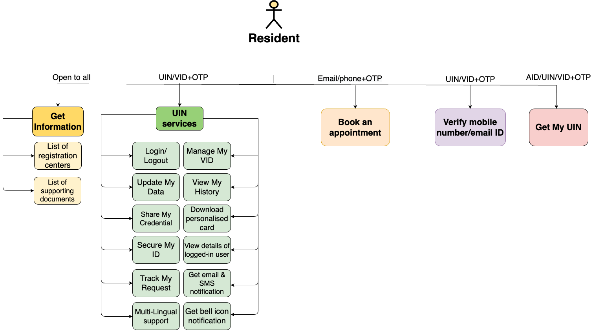
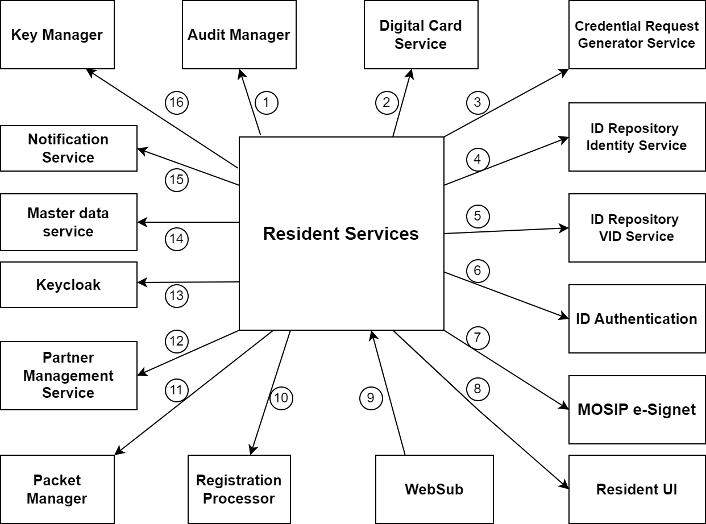

# Resident Portal

### Overview

Resident services are the self-services which are used by the residents themselves via a portal. [Resident Portal](https://docs.mosip.io/1.2.0/modules/resident-services/resident-portal-user-guide) is a web-based UI application that provides residents of a country the services related to their Unique Identification Number (UIN). The residents can perform various operations related to their UIN/ VID and can also raise concerns if any through the portal.

The key features provided on the Resident portal are:

1. Avail **UIN services** using UIN/ VID (through [e-Signet](https://docs.esignet.io/)):
   * **View My History**: This feature enables the Resident to view the history of transactions associated to their UIN.
   * **Manage My VID**: Residents can create, delete and download VID card based on requirement.
   * **Secure My ID**: Residents can lock or unlock their authentication modalities such as fingerprint authentication, iris authentication, email OTP authentication, SMS OTP authentication, thumb print authentication, face authentication.
   * **Track My Requests**: This feature enables the Residents to enter an Event ID associated to the logged in user’s UIN in order to track the status of the event.
   * **Get Personalized Card**: The residents can download a personalized card which essentially means that they can choose the attributes that they would want to be added to their cards.
   * **Share My Data**: This feature enables Resident to choose the data that they want to share with a MOSIP registered partner.
   * **Update My Data**: This feature enables the Resident to update their identity data, address, email ID, phone number, and notification language preference.
   * **Logout**: Once the Resident is done with the activities that he wanted to perform, he can end the active session by logging out from the portal.
2. **Get Information**
   * About Registration Centers: Residents can get the list of Registration Centers near them or Registration Centers based on the location heirarchy.
   * List of supporting documents: Residents can get the list of all the supporting document as a Proof of Identity, Proof of Address, Proof of Relationship etc.
3. **Get My UIN (using UIN/ VID/ AID)**: Using this feature, the Resident can download their password protected UIN card if the UIN card is ready or they can view the status of their Application ID (AID) if the UIN card is still under progress.
4. **Verify email ID and/ or phone number:** Using this feature, the Resident can verify if the email ID/ Phone number given during registration is correct or not. This will be done by veryfing the OTP sent over registered email ID/ Phone number.
5. **Book an appointment for new enrolment (via the pre-registration portal)**: Using this feature, the Resident can book an appointment to visit the Registration center.
6. **Ancillary features**
   * **Multi-lingual support**: Residents can view and use the Resident Portal in multiple languages including RTL languages.
   * **Get Notifications (email and bell notifications):** Residents will be getting bell-icon notifications for the asynchronous events if they have an active session i.e. they have logged into Resident Portal.
   * **View profile details of the logged in user (name, photo, and last login details)**: The Resident will be able to view the name, photo of the logged in user. They will also be able to see the last login details of the Resident.
   * **Responsive UI support**: Support for the application to work seamlessly on various resolutions.

Below is an image summarizing the features provided in Resident portal.

<figure><figcaption></figcaption></figure>

The relationship of Resident services with other services is listed below.


**Note**: The numbers do not signify sequence of operations or the control flow.


<figure><figcaption></figcaption></figure>

1. **Audit Manager**: Resident services sends all the audit logs to the Audit Manager.
2. **Digital card service**: Resident services uses this service to download the PDF of the UIN card or VID card.
3. **Credential Request Generator Service**: This service is used to share the credential with various partners like print partners, authentication partners, and digital card partners.
4. **ID Repository Identity Service**: Resident services uses this service to retrieve the identity information of a credential and to lock/unlock authentication types.
5. **ID Repository VID service**: This service is used to generate/revoke various types of VIDs.
6. **ID Authentication**: This service is used by Resident services to authenticate users.
7. **MOSIP e-Signet**: This is used to authenticate and authorize the users in an event of login using UIN/ VID.
8. **Resident UI**: This is the interface through which users can interact with the Resident services.
9. **WebSub**: This is used to get asynchronous notification from IDA for acknowledgment purposes.
10. **Registration Processor**: This is used to sync and upload packets for features pertaining to changes in identity data.
11. **Packet Manager**: Resident services uses this service to create packets.
12. **Partner Management Service**: Resident services uses this service to get information about various partners and policies.
13. **Keycloak**: Resident services uses this to authenticate in order to access the MOSIP internal APIs. The Resident services communicates with endpoints of other MOSIP modules via a token obtained from Keycloak.
14. **Master data service**: Resident services invokes the Master Data services to get various templates and machine details.
15. **Notification service**: Resident services uses this service to send various notifications through email or SMS.
16. **Key Manager**: Resident services uses Key Manager to encrypt or decrypt the data used across features.

### Design Principles

The design of the Resident portal embodies the following principles:

* **One-stop solution**: The Resident portal is designed to have components that aims to solve all the queries, issues, or discrepancies of the residents and acts as a one-stop solution for all the requirements.
* **Self-Sovereign**: Once the ID is issued by an authority, the user/resident/citizen chooses to control and manage their data in their choice of devices.
* **Inclusive**: The Resident portal aims to be available in all the browsers while also catering to the needs of visually impaired, dyslexic and colour-blind folks.
* **Presence assurance**: This web-based UI application would put in all its efforts to ensure easy access to all the residents with high availability.
* **Works Remote**: The Resident portal should be able to share credentials when data needs to be shared remotely without physical presence.
* **Trusted**: The identity verification process on the device should be trusted so that it can be used in service delivery without any concerns.
* **Grievance redressal**: The Resident portal ensures that in case of any concerns or grievance, the issue is raised and resolved through the portal itself.

### Documentation

1. [Release Notes](https://docs.mosip.io/1.2.0/releases/resident-services-0.9.0)
2. [Resident Services Developers Guide](https://docs.mosip.io/1.2.0/modules/resident-services/resident-services-developer-guide)
3. [Resident Services UI Developers Guide](https://docs.mosip.io/1.2.0/modules/resident-services/resident-services-ui-developer-guide)
4. [Resident Portal Configuration Guide](https://docs.mosip.io/1.2.0/modules/resident-services/resident-portal-configuration-guide)
5. [Resident Services Deployment Guide](https://docs.mosip.io/1.2.0/modules/resident-services/resident-services-deployment-guide)
6. [Configuring Resident OIDC Client](https://docs.mosip.io/1.2.0/modules/resident-services/resident-services-configure-resident-oidc-client)
7. [Resident Portal User Guide](https://docs.mosip.io/1.2.0/modules/resident-services/resident-portal-user-guide)
