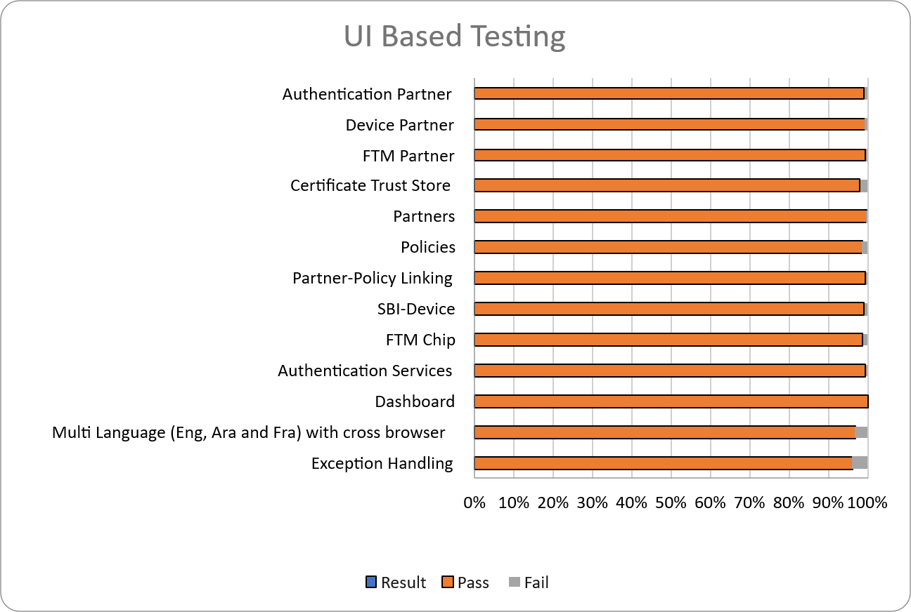
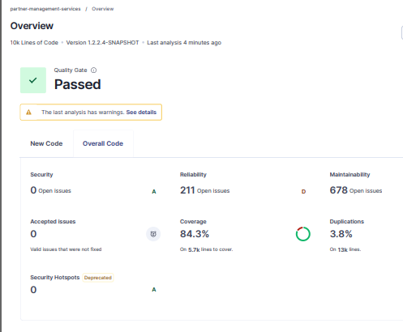

# Test Report

### Introduction

The Partner Management System Revamp testing scope includes the following: Features: MISP Partner, ABIS Partner, Authentication Partner, Device Partner, FTM Partner, Credential Partner, Manual Adjudication Partner, Online Verification Partner, MISP Partner, ABIS Partner, Partner Admin, Certificate Trust Store, Partners, Policies, Partner-Policy Linking, SBI-Device, FTM Chip, Authentication Services, User Profile, User Dashboard, Root CA Certificate expiry notifications, Intermediate Certificate expiry notifications, Partner Certificate expiry notifications, API Key expiry notifications, FTM Chip expiry notifications, SBI ID expiry notifications, and Weekly Summary notifications for Partner Certificate, API Key, FTM Chip, and SBI ID expiry.

### Overview and Scope

The scope of testing defines the boundaries, functionalities, and features that will be tested for the Partner Management System (PMS) Revamp. This ensures comprehensive validation of critical workflows while clearly identifying what is included and excluded from testing.

Functional Features: MISP Partner, ABIS Partner, Authentication Partner, Device Partner, FTM Partner, Credential Partner, Manual Adjudication Partner, Online Verification Partner, Partner Admin, Certificate Trust Store, Partners, Policies, Partner–Policy Linking, SBI–Device Mapping, FTM Chip, Authentication Services, User Profile, User Dashboard.

Cross-Platform Support:

* Multilingual: English, Arabic, French
* Multi-Browser: Edge, Firefox, Chrome
* Devices: Windows
* Testing Types: Sanity, Regression
* Cross-browser testing

### Test Approach

The scope of testing is to verify fitment to the specification from the perspective of:

* Functionality
* Combination
* UI Automation
* API automation
* Library verification

### Test Planning

This Test Plan outlines the testing approach, scope, resources, and schedule for the Partner Management System (PMS) Revamp. The objective is to ensure that all functional, integration, and non-functional requirements are met with high quality before release.

* Validate end-to-end functionality of the Partner Management System Revamp.
* Ensure system stability across supported browsers, devices, and languages.

### Sanity Scenarios Verified

Sanity testing will be performed to ensure basic application stability before detailed test execution. The following high-level sanity scenarios will be verified:

* Application accessibility and successful login for different partner roles
* Core partner creation and management flows (Device Partner, Authentication Partner, FTM Partner)
* Partner Admin work flow
* Authentication services basic validation
* Certificate upload and validation
* User profile and dashboard accessibility
* **Device Partner:** Created and managed device partners, including device creation and configuration
* **Auth Partner:** Created and managed Auth partners and their authentication configurations by creating auth policies, OIDC client ID and API Key
* **FTM Partner:** Created and managed FTM partners, including FTM chip creation and configuration.

Only upon successful completion of sanity testing the build will be accepted for full regression and integration testing.

### Docker Versions

| **Component**                                         |
| ----------------------------------------------------- |
| docker.io/mosipdev/alpine:latest                      |
| docker.io/mosipdev/apitest-auth:release-1.2.2.x       |
| docker.io/mosipdev/apitest-idrepo:release-1.2.4.x     |
| docker.io/mosipdev/dsl-orchestrator:release-1.5.x     |
| docker.io/mosipdev/dsl-packetcreator:release-1.5.x    |
| docker.io/mosipid/admin-service:1.2.1.4               |
| docker.io/mosipid/admin-ui:1.2.0.1                    |
| docker.io/mosipid/admintest:1.2.0.1                   |
| docker.io/mosipid/apitest-idrepo:1.2.3.0              |
| docker.io/mosipid/apitest-masterdata:1.2.1.3          |
| docker.io/mosipid/apitest-prereg:1.2.0.3              |
| docker.io/mosipid/apitest-resident:1.2.1.3            |
| docker.io/mosipid/artifactory-server:1.2.0.2          |
| docker.io/mosipid/artifactory-server:1.2.0.4          |
| docker.io/mosipid/artifactory-server:1.4.1-ES         |
| docker.io/mosipid/biosdk-server:1.2.0.1               |
| docker.io/mosipid/captcha-validation-service:0.1.0    |
| docker.io/mosipid/clamav:1.3.0\_base                  |
| docker.io/mosipid/commons-packet-service:1.2.0.4      |
| docker.io/mosipid/config-server:1.1.2                 |
| docker.io/mosipid/consolidator-websub-service:1.2.0.1 |
| docker.io/mosipid/data-share-service:1.2.0.2          |
| docker.io/mosipid/data-share-service:1.3.0-beta.2     |
| docker.io/mosipid/digital-card-service:1.2.0.1        |
| docker.io/mosipid/dsl-orchestrator:1.2.2.0            |
| docker.io/mosipid/dsl-orchestrator:1.3.0              |
| docker.io/mosipid/dsl-orchestrator:1.4.0              |
| docker.io/mosipid/dsl-packetcreator:1.2.2.0           |
| docker.io/mosipid/dsl-packetcreator:1.3.0             |
| docker.io/mosipid/esignet:1.4.1                       |

## Test Execution Report

Below are the test metrics by performing functional testing. The process followed was black box testing which based its test cases on the specifications of the software component under test. The functional test was performed in combination with individual module testing as well as integration testing. Test data were prepared in line with the user stories. Expected results were monitored by examining the user interface. The coverage includes GUI testing, System testing, End-To-End flows across multiple languages and configurations.

### Test Case Execution Summary

The Test Case Execution Summary section provides a detailed overview of the total test cases executed across platforms, including pass, fail, and skip counts. It includes a table summarizing results and observations on execution pass rates.

#### Test Case - Manual Verification (UI)

Verified from the API Test rigs, hence marking it as NA.

| **Total** | **Passed** | **Failed** | **Skipped (N/A)** |
| --------- | ---------- | ---------- | ----------------- |
| NA        | NA         | NA         | NA                |

#### Test Case - Manual Verification (API)

| **Total**                           | **Passed** | **Failed** | **Skipped (N/A)** |
| ----------------------------------- | ---------- | ---------- | ----------------- |
| 511                                 | 497        | 0          | 12                |
| Test Rate: 99% with Pass Rate: 100% |            |            |                   |

### Automation Results

This section provides a summary of the automated test execution. It shows the pass, fail, and known issues from the automated test suite.

#### Automation Execution Result - API Testrig

| **Total**                            | **Passed** | **Failed** | **Skipped (N/A)** | **Ignored** | **Known issues** |
| ------------------------------------ | ---------- | ---------- | ----------------- | ----------- | ---------------- |
| 511                                  | 497        | 0          | 0                 | 2           | 12               |
| Test Rate: 100% with Pass Rate: 100% |            |            |                   |             |                  |


API flow is tested through automation for both positive and negative scenarios, while test cases that are not automated are tested manually.


### Detailed Test Metrics

Below are the detailed test metrics by performing Manual/automation testing. The project metrics are derived from Defect density, Test coverage, Test execution coverage, test tracking and efficiency.

The various metrics that assist in test tracking and efficiency are as follows:

* Passed Test Cases Coverage: It measures the percentage of passed test cases. (Number of passed tests / Total number of tests executed) x 100
* Failed Test Case Coverage: It measures the percentage of all failed test cases. (Number of failed tests / Total number of test cases executed) x 100

## Test Execution Report (Cross-Platform)

Verification is performed on various configurations with verified configuration for 3 languages (English/Arabic/French).

### Browser Compatibility Evaluations

#### Browser Versions Tested on Desktop/Laptop

| **Sl.No** | **Browser** | **Versions** |
| --------- | ----------- | ------------ |
| 1         | Chrome      | NA           |
| 2         | Firefox     | NA           |
| 3         | Edge        | NA           |

#### Browser Versions Tested on Tablet Device

| **Sl.No** | **Browser** | **Versions** |
| --------- | ----------- | ------------ |
| 1         | Chrome      | NA           |
| 2         | Firefox     | NA           |
| 3         | Edge        | NA           |

#### Browser Versions Tested on Extra-Large Screens

| **Sl.No** | **Browser** | **Versions** |
| --------- | ----------- | ------------ |
| 1         | Chrome      | NA           |
| 2         | Firefox     | NA           |
| 3         | Edge        | NA           |
| 4         | Safari      | NA           |

### Screen Sizes Used for UI Responsiveness Validation

* Laptop/Desktop: 1920x1080
* Tablet: NA
* Extra-large screens: NA

## Feature Health

### Sonar Report

**Partner-Management-Service:**

## Conclusion

The Partner Management System 1.2.2.4 Release has been successfully validated in the qa11new environment, with all critical functionalities performing as expected.

Sanity and regression testing were completed within the defined scope.

* No critical or high-severity defects remain open.
* Based on the successful test execution and results, QA approves the build for release.

