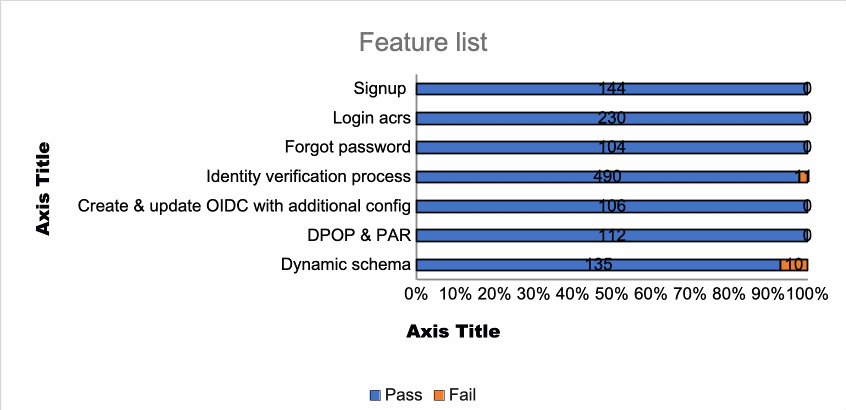
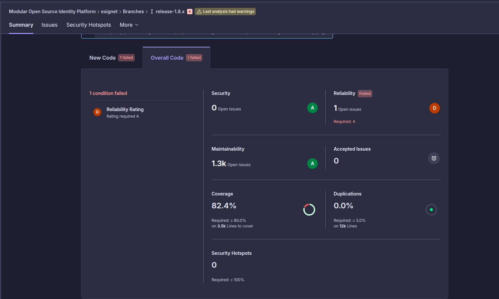
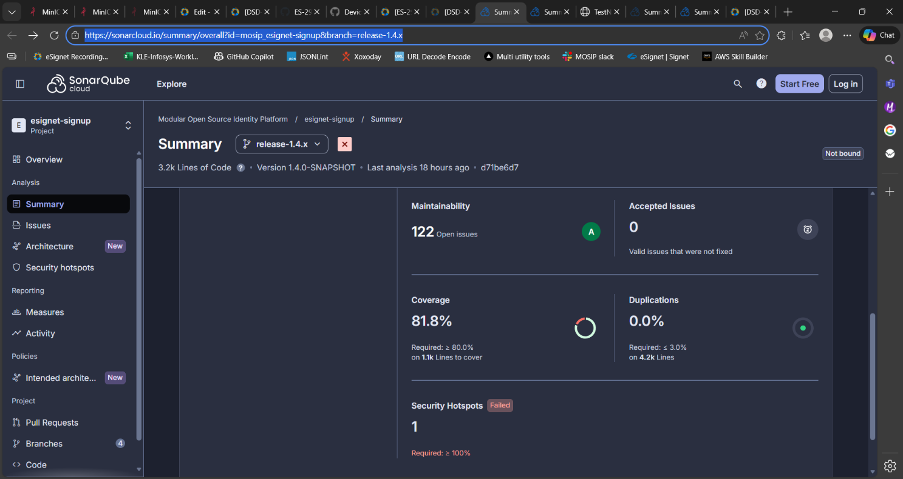
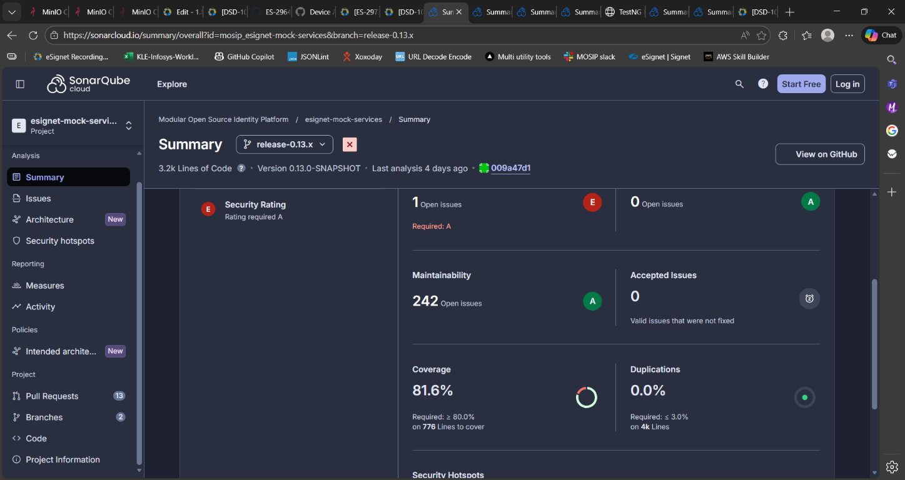
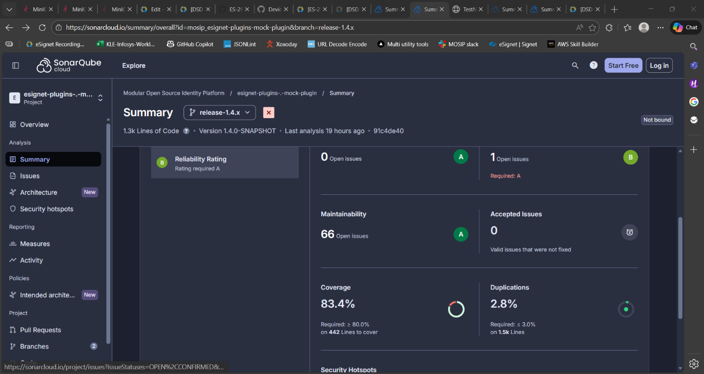
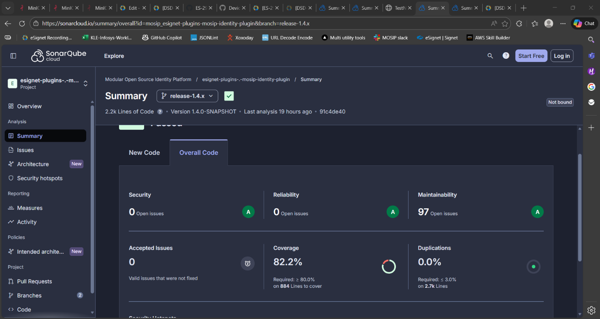
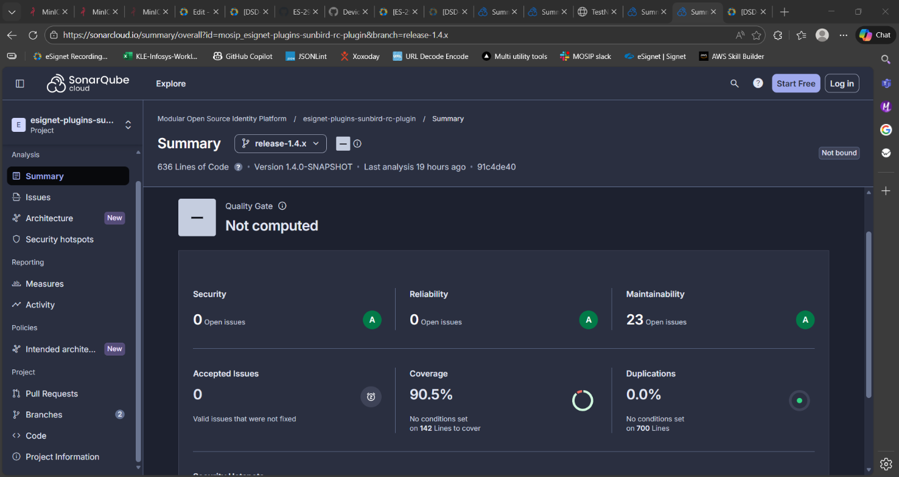

# Test Report

## Introduction 

The eSignet testing scope includes the validation of authentication, authorization, identity verification, consent management, token generation, OpenID Connect (OIDC) flows, partner integration, and user onboarding workflows across supported authentication methods and external identity systems. eSignet is a modular and standards-based digital identity authentication solution that supports secure and configurable login journeys using OTP, biometrics, wallet-based authentication, and trusted identity providers.

### Overview and Scope 

The scope of testing defines the boundaries, functionalities, and features that will be tested for the eSignet platform. This ensures comprehensive validation of critical authentication, authorization, consent, and identity verification workflows while clearly identifying what is included and excluded from testing.

Functional Features: Signup Portal with Mock Plugin, MOSIP ID – QABASE, and MOSIP ID – CRE, Login with OTP using Phone Number, UIN/VID, and Email, Login with Password Authentication, Forgot Password Functionality, Login with Biometrics Authentication, Login with KBI (Knowledge-Based Identification), Identity Verification Process for L1 and L2 Flows, Sunbird Plugin Integration, DPoP (Demonstration of Proof-of-Possession) Validation, PAR (Pushed Authorization Request) Validation, Dynamic Signup Schema Validation, Deployment Testing for eSignet and Signup Modules, FAPI 2.0 Compliance Validation, Docker Compose Compatibility Testing across Windows, macOS, and Linux Operating Systems, OIDC Authorization Flow with PKCE, Token Generation & Validation, Consent Management, Claims Management, User info API Validation, Session Management, API Security Validation, Logout Flow, Audit Logging, Verified Claims Support, and Multi-factor Authentication workflows.

### Cross-Platform Support

* Multilingual: eSignet with 6 languages (English/Khmer/Hindi/Kannada/Arabic/Tamil)
* Multilingual: Signup with 2 languages (English/Khmer)
* Multi-Browser: Edge, Firefox, Chrome
* Devices: Windows, Mac, Tablet, Mobile
* Testing Types: Sanity, Regression Testing and Integration Testing
* Cross-browser and cross-device compatibility testing

### Test Approach

The scope of testing is to verify fitment to the specification from the perspective of&#x20;

* Functionality
* Combination
* UI Automation
* API Automation
* Library verification

## Test Organization 

**Table**: Test Organization

<table><thead><tr><th width="161.0859375">Name</th><th width="142.81640625">Functional Role</th><th>Responsibilities</th></tr></thead><tbody><tr><td>Ragini Krishnamurthy</td><td>Manager</td><td>Defining test strategy, managing QA activities, and ensuring overall product quality.</td></tr><tr><td>Chandra Sekhar</td><td>Lead</td><td>Leading the test team, planning and executing tests, and ensuring timely delivery of quality results.</td></tr><tr><td>Prathmesh Jadhav Rohith Goud</td><td>Test engineers</td><td>
Designing and executing test cases, performing functional and regression testing, validating eSignet authentication and signup workflows, verifying login and identity verification functionalities, logging and tracking defects, validating fixes, and ensuring overall application quality, security, and compliance standards.

 
</td></tr></tbody></table>

### Test Planning 

This Test Plan outlines the testing approach, scope, resources, and schedule for the eSignet platform and Signup modules. The objective is to ensure that all functional, integration, security, and non-functional requirements are validated with high quality before release.

* Validate end-to-end functionality of eSignet authentication, authorization, and signup workflows.
* Ensure system stability across supported browsers, operating systems, plugins, and environments.
* Verify integrations with dependent systems, identity providers, and authentication services.
* Validate OIDC, DPoP, PAR, and FAPI 2.0 compliance workflows.
* Identify and mitigate risks early through functional, regression, integration, and deployment testing.
* Ensure compatibility of Docker Compose setup across Windows, macOS, and Linux operating systems.
* Validate identity verification workflows for L1 and L2 authentication flows.
* Verify secure login mechanisms including OTP, Password, Biometrics, and KBI authentication methods.

### Sanity Scenarios Verified 

Sanity testing will be performed to ensure basic application stability before detailed test execution. The following high-level sanity scenarios will be verified:

* Application accessibility and successful login across supported authentication methods and environments.
* Signup portal accessibility and successful user registration using Mock plugin and MOSIP ID integrations.
* Login validation using OTP (Phone Number, UIN/VID, and Email).
* Login validation using Password authentication.
* Forgot Password workflow validation.
* Basic biometric authentication validation using Mock ID and MOSIP ID.
* KBI (Knowledge-Based Identification) login validation.
* Identity verification workflow validation for L1 and L2 flows.

Only upon successful completion of sanity testing will the build be accepted for full regression and integration testing.

### Test Environment 

* [https://healthservices.esqa2.mosip.net](https://healthservices.esqa2.mosip.net/) – mock environment
* [https://healthservices-qabase.esqa2.mosip.net/](https://healthservices-qabase.esqa2.mosip.net/) (qa11new)- mosipid-qabase environment.
* [https://healthservices-cre.esqa2.mosip.net/](https://healthservices-cre.esqa2.mosip.net/) - mosipid-CRE environment.
* [https://healthservices-sunbird.esqa2.mosip.net/](https://healthservices-sunbird.esqa2.mosip.net/) - Sunbird environment.

**Table**: Test Environment -images

<table data-header-hidden><thead><tr><th valign="bottom"></th></tr></thead><tbody><tr><td valign="bottom">Tested with Components on esqa2 env</td></tr><tr><td valign="bottom">docker.io/mosipqa/apitest-esignet-signup:1.4.x</td></tr><tr><td valign="bottom">docker.io/mosipqa/apitest-esignet:1.8.x</td></tr><tr><td valign="bottom">docker.io/mosipqa/esignet-with-plugins:1.8.x</td></tr><tr><td valign="bottom">docker.io/mosipqa/mock-identity-system:0.13.x</td></tr><tr><td valign="bottom">docker.io/mosipqa/mock-relying-party-service:0.13.x</td></tr><tr><td valign="bottom">docker.io/mosipid/captcha-validation-service:0.1.0-beta.1</td></tr><tr><td valign="bottom">docker.io/mosipid/config-server:1.1.2</td></tr><tr><td valign="bottom">docker.io/mosipid/kafka:3.2.1-debian-11-r9</td></tr><tr><td valign="bottom">docker.io/mosipid/keycloak-init:1.2.0.2</td></tr><tr><td valign="bottom">docker.io/mosipid/kibana:7.17.2-debian-10-r0</td></tr><tr><td valign="bottom">docker.io/mosipid/minio-client-util</td></tr><tr><td valign="bottom">docker.io/mosipid/minio-client-util:latest</td></tr><tr><td valign="bottom">docker.io/mosipid/minio:2022.2.7-debian-10-r0</td></tr><tr><td valign="bottom">docker.io/mosipid/mock-smtp:1.0.0</td></tr><tr><td valign="bottom">docker.io/mosipid/mosip-artemis-keycloak:1.2.0.1</td></tr><tr><td valign="bottom">docker.io/mosipid/os-shell:12-debian-12-r46</td></tr><tr><td valign="bottom">docker.io/mosipid/partner-management-service:1.2.2.3</td></tr><tr><td valign="bottom">docker.io/mosipid/policy-management-service:1.2.2.3</td></tr><tr><td valign="bottom">docker.io/mosipid/postgres-init:1.2.0.1</td></tr><tr><td valign="bottom">docker.io/mosipid/postgresql:14.2.0-debian-10-r70</td></tr><tr><td valign="bottom">docker.io/mosipid/redis:7.0.5-debian-11-r25</td></tr><tr><td valign="bottom">docker.io/mosipid/softhsm:v2</td></tr><tr><td valign="bottom">docker.io/mosipid/zookeeper:3.8.0-debian-11-r30</td></tr><tr><td valign="bottom">docker.io/mosipint/elasticsearch:7.17.2-debian-10-r4</td></tr><tr><td valign="bottom">docker.io/mosipqa/mock-relying-party-ui:0.13.x</td></tr><tr><td valign="bottom">docker.io/mosipqa/oidc-ui:1.8.x</td></tr><tr><td valign="bottom">docker.io/mosipqa/partner-onboarder:1.3.x-beta.2</td></tr><tr><td valign="bottom">docker.io/mosipqa/postgres-init:develop</td></tr><tr><td valign="bottom">docker.io/mosipqa/signup-ui:1.4.x</td></tr><tr><td valign="bottom">docker.io/mosipqa/signup-with-plugins:1.4.x</td></tr><tr><td valign="bottom">docker.io/mosipqa/uitest-signup:1.4.x</td></tr><tr><td valign="bottom">docker.io/mosipqa/uitest-signup:release-1.4.x</td></tr><tr><td valign="bottom">mosipid/config-server:1.1.2</td></tr><tr><td valign="bottom">mosipid/keycloak-init:1.2.0.2</td></tr><tr><td valign="bottom">mosipid/postgres-init:1.2.0.1</td></tr><tr><td valign="bottom">mosipid/softhsm:v2</td></tr><tr><td valign="bottom">mosipqa/apitest-esignet-signup:1.4.x</td></tr><tr><td valign="bottom">mosipqa/apitest-esignet:1.8.x</td></tr><tr><td valign="bottom">mosipqa/postgres-init:develop</td></tr></tbody></table>

### Test Execution Report 

Below are the test metrics by performing functional testing. The process followed was black box testing which based its test cases on the specifications of the software component under test. The functional test was performed in combination with individual module testing as well as integration testing. Test data were prepared in line with the user stories. Expected results were monitored by examining the user interface. The coverage includes GUI testing, System testing, End-To-End flows across multiple languages and configurations.

### Test case execution summary

The Test Case Execution Summary section provides a detailed overview of the total test cases executed across platforms, including pass, fail, and skip counts. It includes a table summarizing results and observations on execution pass rates.

**Table**: Test Case - UI based verification

<table><thead><tr><th width="319.203125">Total</th><th>Passed</th><th>Failed</th><th>Skipped (N/A)</th></tr></thead><tbody><tr><td>1341</td><td>1320</td><td>21</td><td>0</td></tr><tr><td>Test Rate: 100% with Pass Rate: 98.43%</td><td></td><td></td><td></td></tr></tbody></table>

**Table**: Test Case – API based verification (API):

<table><thead><tr><th width="329.90234375">Total</th><th>Passed</th><th>Failed</th><th>Skipped (N/A)</th></tr></thead><tbody><tr><td>2215</td><td>2140</td><td>18</td><td>57</td></tr><tr><td>Test Rate: 97.43% with Pass Rate: 99.17%</td><td></td><td></td><td></td></tr></tbody></table>


Note: NA - 57 Test Cases which are descoped scenarios/not developed feature


### Automation Results 

This section provides a summary of the automated test execution. It shows the pass, fail, and known issues from the automated test suite.

**Table**: Automation Execution Result -API Testrig – mockid environment

<table><thead><tr><th width="161.72265625" valign="top">Module</th><th>Total</th><th>Passed</th><th>Failed</th><th>Skipped (N/A)</th><th>Ignored</th><th></th></tr></thead><tbody><tr><td valign="top">eSignet</td><td>1339</td><td>791</td><td>0</td><td>0</td><td>548</td><td>0</td></tr><tr><td valign="top">Signup</td><td>670</td><td>640</td><td>0</td><td>0</td><td>30</td><td>0</td></tr><tr><td valign="top">Test Rate: 100% with Pass Rate: 100%</td><td></td><td></td><td></td><td></td><td></td><td></td></tr></tbody></table>


Note: 548 test cases in esignet and 30 test cases in signup related to the MOSIP ID plug-in are currently being ignored.


**Table**: Automation Execution Result -API Testrig – mosipid-qabase environment

<table><thead><tr><th width="156.265625" valign="top">Module</th><th>Total</th><th>Passed</th><th>Failed</th><th>Skipped (N/A)</th><th>Ignored</th><th></th></tr></thead><tbody><tr><td valign="top">eSignet</td><td>1339</td><td>1098</td><td>0</td><td>0</td><td>171</td><td>21</td></tr><tr><td valign="top">Signup</td><td>670</td><td>653</td><td>0</td><td>0</td><td>17</td><td>0</td></tr><tr><td valign="top">Test Rate: 100% with Pass Rate: 100%</td><td></td><td></td><td></td><td></td><td></td><td></td></tr></tbody></table>


Note: 171 test cases in esignet and 17 test cases in signup related to the mock plug-in are currently being ignored.


**Table**: Automation Execution Result -API Testrig – mosipid-CRE environment

<table><thead><tr><th width="162.1953125" valign="top">Module</th><th>Total</th><th>Passed</th><th>Failed</th><th>Skipped (N/A)</th><th>Ignored</th><th></th></tr></thead><tbody><tr><td valign="top">eSignet</td><td>1339</td><td>1098</td><td>32</td><td>10</td><td>171</td><td>21</td></tr><tr><td valign="top">Signup</td><td>670</td><td>398</td><td>60</td><td>195</td><td>17</td><td>0</td></tr><tr><td valign="top">Test Rate: 89.80% with Pass Rate: 94.2%</td><td></td><td></td><td></td><td></td><td></td><td></td></tr></tbody></table>


Note: Failures in esignet and signup are due to L2 flow is not supported in esignet and signup and some test cases are failing due to credential movement is taking longer time.



Note- API flow is tested through automation for both positive and negative scenarios, while test cases that are not automated are tested manually.


**Table**: Automation Execution Result - UI Automation

<table><thead><tr><th width="159.50390625">Total</th><th>Passed</th><th>Failed</th><th>Skipped (N/A)</th><th>Ignored</th><th>Known issues</th></tr></thead><tbody><tr><td>17</td><td>9</td><td>0</td><td>0</td><td>0</td><td>8</td></tr><tr><td>Test Rate: 100% with Pass Rate: 100%</td><td></td><td></td><td></td><td></td><td></td></tr></tbody></table>

### Detailed Test metrics 

Below are the detailed test metrics by performing Manual/automation testing. The project metrics are derived from Defect density, Test coverage, Test execution coverage, test tracking and efficiency.

The various metrics that assist in test tracking and efficiency are as follows:

* Passed Test Cases Coverage: It measures the percentage of passed test cases. (Number of passed tests / Total number of tests executed) x 100
* Failed Test Case Coverage: It measures the percentage of all failed test cases. (Number of failed tests / Total number of test cases executed) x 100

## Test Execution Report 

Verification is performed on various configurations as mentioned below

* Default configuration with verified configuration for 3 Lang (English/Arabic/French)

## Browser compatibility evaluations 

**Table**: Browser versions tested on desktop/laptop

<table><thead><tr><th width="154.23046875">Sl.No</th><th>Browser</th><th>Versions</th></tr></thead><tbody><tr><td>1</td><td>Chrome</td><td>Version 147.0.7727.138</td></tr><tr><td>2</td><td>Firefox</td><td>Version 150.0.2 (64-bit)</td></tr><tr><td>3</td><td>Edge</td><td>Version 147.0.3912.72</td></tr><tr><td>4</td><td>Safari</td><td>Version 18.6 (20621.3.11.11.3</td></tr></tbody></table>

## Feature Health 

<figure><figcaption></figcaption></figure>

### Known Issues Metrics 

This section focuses on a separate category of issues that are known but not addressed in the current release. It provides a count and severity distribution for these defects across releases.

**Table**: Defect Metrics for the known issues 

Blocker: 2 deployment bugs to be tested in v1.8.1 deployment (v1.8.0 testing is already completed).

Critical: 1 critical bug will be coming up as story in 1.8.1 release.

## Sonar Report 

* **esignet**:

<figure><figcaption></figcaption></figure>

* &#x20;**esignet-signup**:

<figure><figcaption></figcaption></figure>

* **esignet-mock-service**:

<figure><figcaption></figcaption></figure>

* **esignet-plugins(mock)**:

<figure><figcaption></figcaption></figure>

* **esignet-plugins(mosipid)**:

<figure><figcaption></figcaption></figure>

* **esignet-plugins(sunbird)**:

<figure><figcaption></figcaption></figure>

### Conclusion 

The eSignet application has been successfully validated in the esqa2 environment, with all critical functionalities performing as expected.

Sanity, regression, and integration testing were completed within the defined scope.

* Based on the successful test execution and results, QA approves the build for release.

### QA Approval 

The build has met all the defined exit criteria and is recommended for release based on the following:

* Test Case Execution: All planned test cases have been executed successfully.
* Story and Defect Closure: All user stories are completed, and no critical or high-severity defects remain open.
* Automation Reports: API-Testrig and UI automation execution reports have been reviewed and approved.
* Documentation Sign-off: All required test and release documentation has been reviewed and signed off.
* Test Environment Stability: The test environment remained stable throughout the testing cycle.

**Table**: Report is signed off details

| Name             | Functional Role | Responsibilities                                                                                      |
| ---------------- | --------------- | ----------------------------------------------------------------------------------------------------- |
| Ragini Krishna   | Manager         | Defining test strategy, managing QA activities, and ensuring overall product quality.                 |
| Chandra Sekhar N | Lead            | Leading the test team, planning and executing tests, and ensuring timely delivery of quality results. |

### Appendix 

This includes additional reference information for the report. It contains a history of document versions.

**Appendix A**: Versions

<table><thead><tr><th>Version</th><th>Date</th><th>Author</th><th valign="top">Reviewers</th></tr></thead><tbody><tr><td>V1.0</td><td>07/05/2026</td><td>Prathmesh Jadhav</td><td valign="top">Ragini Krishna</td></tr></tbody></table>

### Document History

It outlines the strategy used to ensure a comprehensive evaluation.

<table><thead><tr><th width="110.4140625">Version</th><th>Author</th><th>Date</th><th valign="top">Review</th><th valign="top">Affected Sections</th></tr></thead><tbody><tr><td>V1.0</td><td>Prathmesh Jadhav</td><td>07/05/2026</td><td valign="top">Ragini Krishnamurthy</td><td valign="top"> </td></tr></tbody></table>

Refer [**here**](https://github.com/mosip/test-management/tree/master/e-signet/1.8.0) to get more details on reports. 
