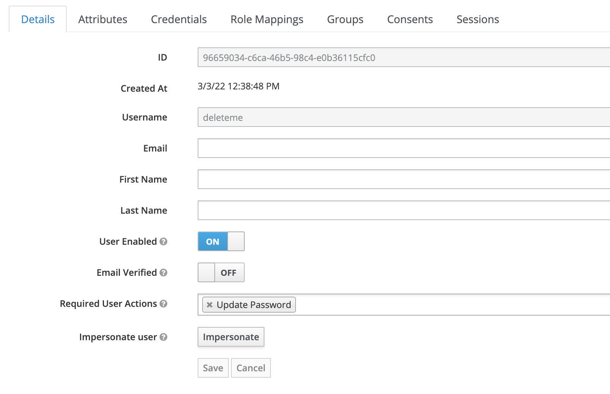

# Sandbox Deployment

## Overview
MOSIP components are available as Dockers on [Docker Hub](). We provide deployment guide and scripts to install the same on [Kubernetes](https://kubernetes.io).

## Single click installer (V2)
The [single click installer](https://github.com/mosip/mosip-infra/tree/release-1.2.0/deployment/sandbox-v2), also called V2 is an installer based on Ansible scripts. The sandbox may be used for development and testing.

The configuration properties used in this installer are available [here](https://github.com/mosip/mosip-config/tree/release-1.2.0).

## Production grade deployment (V3) 
Currently available as _Beta_, [V3](https://github.com/mosip/mosip-infra/tree/release-1.2.0/deployment/v3) is a reference implementation of a Kubernetes based production grade deployment of MOSIP. The same may be deployed both as a sandbox or full-scale production deployment. Several security features and enhancements have been added over the single click installer.

The configuration properties used in this installer are available [here](https://github.com/mosip/mosip-config/tree/develop3-v3).

### Cluster administration 
In V3 installation cluster can be administered by logging into organisation wide [Rancher setup](https://github.com/mosip/mosip-infra/tree/develop/deployment/v3/rancher). Rancher is integrated with Keycloak for authentication. To provide cluster access to a user perform the following steps as administrator:
1. Login into organisation wide Keycloak e.g `https://iam.xyz.net`.  It is assumed that you have `admin` role in Keycloak.
1. Create a new user. 
1. Make sure a strong password is set for the same under _Credentials_ tab.
1. On _Details_ tab you should see _Update Password_ flag under _Required User Actions_. This will prompt a user to change the password during first login.  Disable the same only if you are sure you don't want user to change password.

    

1. Login to Rancher as administrator, e.g. `https://rancher.xyz.net`.
1. Select a cluster for which you would like to enable access to the user.
1. Add the user as member of the cluster.
1. Assign a role, e.g Cluster Owner, Cluster Viewer.

### Wireguard 
V3 installation uses Wireguard for secure access. Refer to the following documents for further details:
* [Wireguard Bastion Host](https://github.com/mosip/mosip-infra/blob/develop/deployment/v3/docs/wireguard-bastion.md)
* [Wireguard Administrator's Guide](https://github.com/mosip/mosip-infra/blob/develop/deployment/v3/docs/wireguard-administrators-guide.md)
* [Wireguard Client Installation Guide](wireguard-client-installation-guide.md)

## Active branches
Branches of `mosip-infra` chart that are being updated now are listed below. Previous versions are frozen. Make sure any c
hanges are reflected in these branches (if applicable).
* `1.1.5_v3`
* `1.2.0.1`
* `develop`

