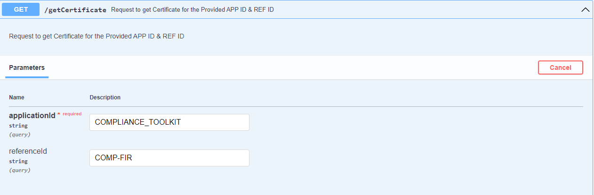
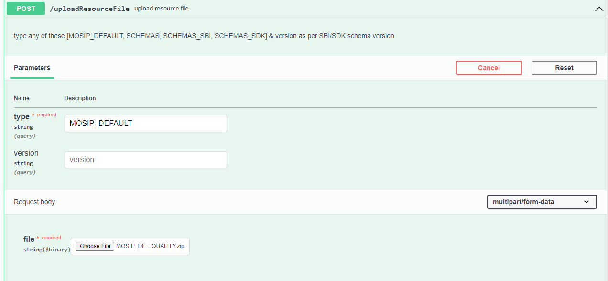
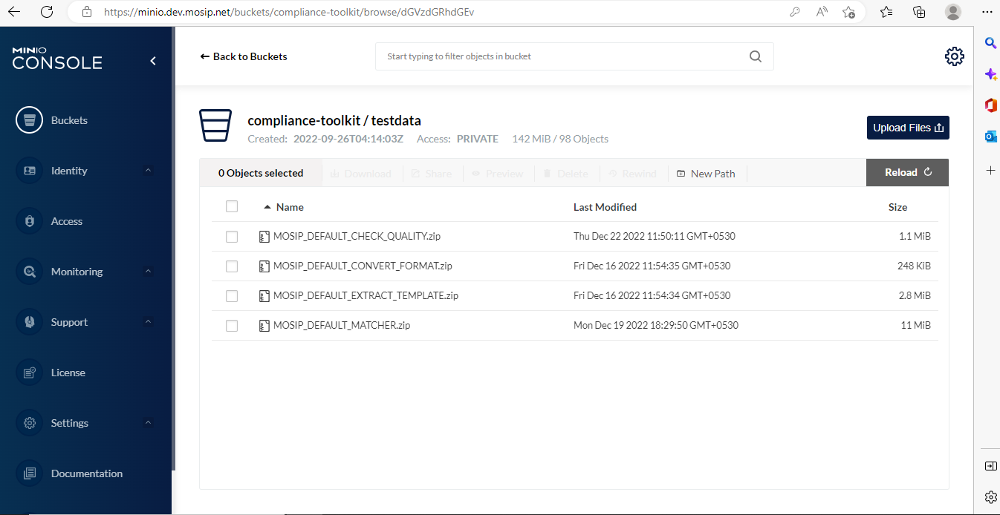
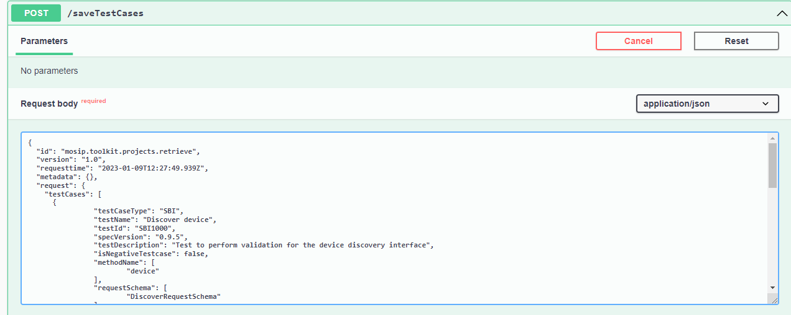

# Setting up Compliance Tool Kit (CTK)

## Pre-requisites

CTK should be deployed with the required dockers.

* compliance-toolkit-service: 0.0.9-B1
* compliance-toolkit-ui: 0.0.9-B1

Dependent Service (dockers)
* Artifactory: mosipid/artifactory-ref-impl: 1.2.0.1-B2
* Audit manager: mosipid/kernel-auditmanager-service: 1.2.0.1-B1
* Auth Manager: mosipid/kernel-authmanager: 1.2.0.1-B1
* Key Manager: modipid/kernel-keymanager-service: 1.2.0.1-B1
* Partner Management: mosipid/partner-management-service: 1.2.0.1-B1
* KeyCloak: mosipid/keycloak-init: 1.2.0.1-B1
* Postgres: mosipid/postgres-init: 1.2.0.1-B1
* Config Server: config-server: mosipid/config-server: 1.1.2
* Notification Service: mosipid/kernel-notification-service: 1.2.0.1-B1
* ClamAV: clamav/clamav: latest
* MinIO

_**Note**_: 
* Ensure that in the `kernel-default.properties`, the value of `mosip-toolkit-client` is set as `auth.server.admin.allowed.audience`. 
* If this was not set by default, then set it and restart `kernel-auth-service` and `compliance-toolkit-service`.
* From 0.0.9-B2 version onwards, need to generate an encryption key for CTK.
    * Create a new app id by directly inserting below row.
	    
		```INSERT INTO keymgr.key_policy_def(app_id, key_validity_duration, is_active,pre_expire_days, 
		   access_allowed, cr_by, cr_dtimes, upd_by, upd_dtimes, is_deleted, del_dtimes)
		   VALUES ('COMPLIANCE_TOOLKIT', 1095, true, 60, 'NA', 'mosipadmin', '2022-11-28 09:00:40.822625', 
		   null, null, false, null);
		
		```
	* Get the client token using auth manager swagger by calling endpoint.
	    `https://api-internal.dev.mosip.net/v1/authmanager/authenticate/clientidsecretkey`
		
		```jsonc
		{
			"id": "string",
			"version": "string",
			"requesttime": "2022-12-22T07:13:35.010Z",
			"metadata": {},
			"request": {
				"clientId": " mosip-pms-client ",
				"secretKey": " XXXXXX ",
				"appId": " regproc "
			}
		}
		```
	
	* Use `generateMasterKey` endpoint to generate module level certificate.
	
	
	
	* Directly download certificate via keymanager swagger `getCertificate` with App Id as `COMPLIANCE_TOOLKIT` and Ref Id as `COMP-FIR`.
	
	
	
	* This certificate is to be used by **SBI** devices as encryption key.
	* For Mock **MDS**, when running in **Auth** mode, update below values in application.properties file.
	    
		```	mosip.auth.appid=regproc
			mosip.auth.clientid=mosip-pms-client
			mosip.auth.secretkey=XXXXXXXXXXXXXXXX
			mosip.auth.server.url=https://api-internal.dev.mosip.net/v1/authmanager/authenticate/clientidsecretkey 
			mosip.ida.server.url=https://api-internal.dev.mosip.net/v1/keymanager/getCertificate?applicationId=COMPLIANCE_TOOLKIT&referenceId=COMP-FIR
		```

*For REAL MDS/SBI.
    * You must communicate to the vendors to download the new encryption key from UI and give us updated **SBI** which uses this encryption key. 
	* It can be downloaded for **Auth SBI** projects from UI.
	
	

## Steps tO load TESTDATA, SCHEMAS in MINIO

1\.	Browse to [mosip-compliance-toolkit](https://github.com/mosip-compliance-toolkit.git).
       
2\. The resources folder would contain schemas, test data and test cases that need to be added to MinIO and DB.
  

   
## Steps to upload resources to MinIO
   
1\. Login to MinIO from the browser.
    
2\. Create a `compliance-toolkit` bucket.
    
3\. Create a new folder named `testdata` in the above bucket and upload all test data zip files from resources folder to this folder.
    
4\. Create a new folder named `schemas` in the above bucket and upload all **sbi** and **sdk** schemas, **testcase** schema from the resources folder to this folder.

_Note_: _There is no need to upload `compliance_test_definitions_sbi.json` and `compliance_test_definitions_sdk.json`._

5\. Restart the pods after adding new files in MinIO.
   
## Steps to upload resources to MinIO using Swagger

1\. Using Keycloak, create a new user for the compliance toolkit.


 
2\. Make sure to add the email ID. Also, give the user `GLOBAL_ADMIN`.

3\. Login to the compliance toolkit in your environment with above the Keycloak user.

4\. Open the [swagger](https://{api-internal-env-url}/v1/toolkit/swagger-ui/index.html?configUrl=/v1/toolkit/v3/api-docs/swagger-config).

5\. Go to `uploadResourceFile` endpoint in `ResourceManagementController`.

6\. Select any one of the types which is mentioned in swagger and version (SBI or SDK).

7\. Upload the **schema** and **testdata** files from resources folder in project.


         
8\. You can see the uploaded **schema** and **testdata** files in MinIO dev environment.


     
 ## Steps to upload test cases to the Database
        
1\.	Open [swagger](https://{api-internal-env-url}/v1/toolkit/swagger-ui/index.html?configUrl=/v1/toolkit/v3/api-docs/swagger-config) and go to `saveTestCases` in `test-cases-controller`.
        
2\.	Open the resources folder in the project.
        
3\.	`compliance_test_definitions_sbi.json` file has all the test cases in it.
        
4\.	Copy the test cases array from this file and prepare a request as shown below.
        
5\.	Request body for `saveTestCases` request.
        
```jsonc  
{
    "version": "1.0",
    "requesttime": "2022-10-29T06:06:51.174Z",
    "metadata": null,
    "request": {
        "testCases": [
<Paste the testcases here>
                     ]
               }
}
```


9\. The same should be done for `compliance_test_definitions_sdk.json`.
