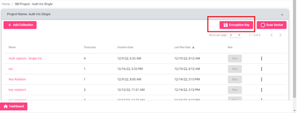

# 1.1.0

## Pre-requisites

CTK should be deployed with the required dockers.

* compliance-toolkit-service: 1.1.0
* compliance-toolkit-ui: 1.1.0

## Dependent Service (dockers)

* Artifactory: mosipid/artifactory-ref-impl: 1.2.0.1-B2
* Audit manager: mosipid/kernel-auditmanager-service: 1.2.0.1-B1
* Auth Manager: mosipid/kernel-authmanager: 1.2.0.1-B1
* Key Manager: modipid/kernel-keymanager-service: 1.2.0.1-B1
* Partner Management: mosipid/partner-management-service: 1.2.0.1-B1
* KeyCloak: mosipid/keycloak-init: 1.2.0.1-B1
* Postgres: mosipid/postgres-init: 1.2.0.1-B1
* Config Server: config-server: mosipid/config-server: 1.1.2
* Notification Service: mosipid/kernel-notification-service: 1.2.0.1-B1
* ClamAV: clamav/clamav: latest
* MinIO

**The Setup guide is a checklist for the three categories below:**

1. Configuration Checks
2. Steps to load testdata, schemas and testcases
3. Steps to generate Android APK

### Configuartion checks

1. Ensure that in the `kernel-default.properties`, the value of `mosip-toolkit-client` and `mosip-toolkit-android-client` is set in `auth.server.admin.allowed.audience`. If this was not set by default, then set it and restart `kernel-auth-service` and `compliance-toolkit-service`.

2. Ensure that in `compliance-toolkit-default.properties`, CORS is enabled to allow access to `mosip-toolkit-android-client`:

   ```
    mosip.security.cors-enable=true
    mosip.security.origins=http://localhost
    auth.server.admin.allowed.audience=mosip-toolkit-client,mosip-toolkit-android-client
   ```

3. Check if the roles given to `mosip-pms-client` match with any of the roles for the following config property: 
       ` mosip.role.keymanager.postverifycertificatetrust=XXX`
       
   This config property is available [here](https://github.com/mosip/mosip-config/blob/${ENV_NAME}/kernel-default.properties).

   _For Example_:
    
    mosip.role.keymanager.postverifycertificatetrust=`ZONAL_ADMIN`, `GLOBAL_ADMIN`, `PMS_ADMIN`, `PMS_USER`

    Then `mosip-pms-client` should have any of the above roles.
    
4. Check that `mosip-pms-client` has the role `REGISTRATION_PROCESSOR`, `PARTNER_ADMIN`, `PMS_ADMIN` in Key Cloak. If this was not set by default, then set it and restart `keymanager` and `compliance-toolkit-service`.

5. From the 1.0.0 version onwards, we need to generate an encryption key for CTK.
Create a new app id by directly inserting the below row.

   `INSERT INTO keymgr.key_policy_def(app_id, key_validity_duration, is_active,pre_expire_days, access_allowed, cr_by, cr_dtimes, upd_by, upd_dtimes, is_deleted, del_dtimes) VALUES ('COMPLIANCE_TOOLKIT', 1095, true, 60, 'NA', 'mosipadmin', '2022-11-28 09:00:40.822625', null, null, false, null);`

   Get the client token using auth manager swagger by calling the endpoint.     
   `https://api-internal.dev.mosip.net/v1/authmanager/authenticate/clientidsecretkey`

   ```
   {
       "id": "string",
      "version": "string",
      "requesttime": "2022-12-22T07:13:35.010Z",
      "metadata": {},
       "request": {
          "clientId": " mosip-pms-client ",
         "secretKey": " XXXXXX ",
         "appId": " regproc "
      }
    }
   ```

   Use `generateMasterKey` endpoint to generate module-level certificate.

   

6. Directly download the certificate via key manager swagger `getCertificate` with App Id as `COMPLIANCE_TOOLKIT` and Ref Id as `COMP-FIR`.

   

7. This certificate is to be used by **SBI** devices as the encryption key.

   For Mock **MDS**, when running in **Auth** mode, update the below values in the `application.properties` file.

    ```
    mosip.auth.appid=regproc
    mosip.auth.clientid=mosip-pms-client
    mosip.auth.secretkey=XXXXXXXXXXXXXXXX
    mosip.auth.server.url=https://api-internal.${env}.mosip.net/v1/authmanager/authenticate/clientidsecretkey 
    mosip.ida.server.url=https://api-internal.${env}.mosip.net/v1/keymanager/getCertificate?applicationId=COMPLIANCE_TOOLKIT&referenceId=COMP-FIR
    ```

8. For real MDS/SBI, the vendors can download the new encryption key from the UI and test with the updated **SBI** which uses this encryption key.
   It can be downloaded for **Auth SBI** projects from UI.

   

### Steps to load testdata, schemas and testcases

1\. Browse to [mosip-compliance-toolkit](https://github.com/mosip-compliance-toolkit.git) repository in github. Select 1.1.0 branch.

2\. The resources folder would contain schemas, test data and test cases that need to be added to MinIO and DB. Download this folder.


#### Steps to load testdata and schemas in MinIO directly

1\. Log in to MinIO from the browser.

2\. Create a `compliance-toolkit` bucket.

3\. Create a new folder named `testdata` in the above bucket and upload all test data zip files from the resources folder to this folder.

4\. Create a new folder named `schemas` in the above bucket and folders for the spec versions. Upload all **sbi** and **sdk** schemas under the spec version folders, upload **test case** schema from the resources folder to the `schemas` folder.

_Note_: _There is no need to upload `compliance_test_definitions_sbi.json` and `compliance_test_definitions_sdk.json`._

5\. Restart the CTK service after adding new files in MinIO.

**Alernately swagger endpoint can also be used to upload data in Minio. In this case there is no need to restart CTK services.**


#### Steps to load testdata and schemas in MinIO directly using Swagger

1\. Using Keycloak, create a new user for the compliance toolkit.

2\. Make sure to add the email ID. Also, give the user `GLOBAL_ADMIN`.

3\. Log in to the compliance toolkit in your environment with above the Keycloak user.

4\. Open the [swagger](https://{api-internal-env-url}/v1/toolkit/swagger-ui/index.html?configUrl=/v1/toolkit/v3/api-docs/swagger-config).

5\. Go to `uploadResourceFile` the endpoint in `ResourceManagementController`.

6\. Select any one of the types which are mentioned in swagger and version (SBI or SDK).

7\. Upload the **schema** and **test data** files from the resources folder in the project.


8\. You can see the uploaded **schema** and **test data** files in the MinIO dev environment.


#### Steps to upload test cases to the Database

1\. Open [swagger](https://{api-internal-env-url}/v1/toolkit/swagger-ui/index.html?configUrl=/v1/toolkit/v3/api-docs/swagger-config) and go to `saveTestCases` in `test-cases-controller`.

2\. Open the resources folder in the project.

3\. `compliance_test_definitions_sbi.json` file has all the test cases in it.

4\. Copy the test cases array from this file and prepare a request as shown below.

5\. Request body for `saveTestCases` request.

```
{
    "version": "1.0",
    "requesttime": "2022-10-29T06:06:51.174Z",
    "metadata": null,
    "request": {
        "testCases": [
                        <Paste the testcases here>
                     ]
    }
}
```


9\. The same should be done for `compliance_test_definitions_sdk.json`.

### Steps to generate Android APK

* Once all above steps are done, you can trigger the Android APK build for your env
https://github.com/mosip/mosip-compliance-toolkit-ui/actions/workflows/android.yml

* You may need GitHub repository write access.

* Add values for the URL’s according to your deployment env.


