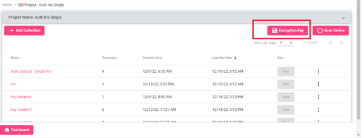

# 1.2.0

## Pre-requisites

CTK should be deployed with the required dockers.

* compliance-toolkit-service: 1.1.0
* compliance-toolkit-ui: 1.1.0

To deploy Compliance Toolkit, we require the below mandatory services:

## Dependent Service (dockers)

* Artifactory: mosipid/artifactory-ref-impl: 1.2.0.1-B2
* Audit manager: mosipid/kernel-auditmanager-service: 1.2.0.1-B1
* Auth Manager: mosipid/kernel-authmanager: 1.2.0.1-B1
* Key Manager: modipid/kernel-keymanager-service: 1.2.0.1-B1
* Partner Management: mosipid/partner-management-service: 1.2.0.1-B1
* KeyCloak: mosipid/keycloak-init: 1.2.0.1-B1
* Postgres: mosipid/postgres-init: 1.2.0.1-B1
* Config Server: config-server: mosipid/config-server: 1.1.2
* Notification Service: mosipid/kernel-notification-service: 1.2.0.1-B1
* ClamAV: clamav/clamav: latest
* MinIO

**The Setup guide is a checklist for the three categories below:**

1. Configuration Checks
2. Steps to load testdata, schemas and testcases
3. Steps to generate Android APK

### Configuration checks

1. Ensure that in the `kernel-default.properties`, the value of `mosip-toolkit-client` and `mosip-toolkit-android-client` is set in `auth.server.admin.allowed.audience`. If this was not set by default, then set it and restart `kernel-auth-service` and `compliance-toolkit-service`.

2. Ensure that in `compliance-toolkit-default.properties`, CORS is enabled to allow access to `mosip-toolkit-android-client`:

   ```
    mosip.security.cors-enable=true
    mosip.security.origins=http://localhost
    auth.server.admin.allowed.audience=mosip-toolkit-client,mosip-toolkit-android-client
   ```

   If this was not set by default, then set it and restart `compliance-toolkit-service`.

3. Check if the roles given to `mosip-pms-client` match with any of the roles for the following config property: 
       ` mosip.role.keymanager.postverifycertificatetrust=XXX`
       
   This config property is available [here](https://github.com/mosip/mosip-config/blob/${ENV_NAME}/kernel-default.properties).

   _For Example_:
    
    mosip.role.keymanager.postverifycertificatetrust=`ZONAL_ADMIN`, `GLOBAL_ADMIN`, `PMS_ADMIN`, `PMS_USER`

    Then `mosip-pms-client` should have any of the above roles.
    
4. Check that `mosip-pms-client` has the role `REGISTRATION_PROCESSOR`, `PARTNER_ADMIN`, `PMS_ADMIN` in Key Cloak. If this was not set by default, then set it and restart `keymanager` and `compliance-toolkit-service`.

5. From the CTK v 1.0.0 version onwards, we need to generate an encryption key for CTK.
   * Create a new app id by directly inserting the below row.

      `INSERT INTO keymgr.key_policy_def(app_id, key_validity_duration, is_active,pre_expire_days, access_allowed, cr_by, cr_dtimes, upd_by, upd_dtimes, is_deleted, del_dtimes) VALUES ('COMPLIANCE_TOOLKIT', 1095, true, 60, 'NA', 'mosipadmin', '2022-11-28 09:00:40.822625', null, null, false, null);`

   * Using the auth manager swagger URL, get the client token.
   
      Swagger URL:

         `https://api-internal.${env}.mosip.net/v1/authmanager/swagger-ui/index.html?configUrl=/v1/authmanager/v3/api-docs/swagger-config`

      Endpoint:

         `/authenticate/clientidsecretkey`

      Request:

      ```
      {
         "id": "string",
         "version": "string",
         "requesttime": "2022-12-22T07:13:35.010Z",
         "metadata": {},
         "request": {
            "clientId": " mosip-pms-client ",
            "secretKey": " XXXXXX ",
            "appId": " partner "
         }
      }
      ```

   * Now using the key manager swagger URL, generate module level certificate.
   
      Swagger URL:

         `https://api-internal.${env}.mosip.net/v1/keymanager/swagger-ui/index.html?configUrl=/v1/keymanager/v3/api-docs/swagger-config`

      Endpoint:

         `/generateMasterKey/Certificate`

      Request:

      

   * Directly download the certificate via key manager swagger URL and `getCertificate` endpoint, with App Id as `COMPLIANCE_TOOLKIT` and Ref Id as `COMP-FIR`.

      

   * This certificate is to be used by **SBI** devices as the encryption key.

      For Mock **MDS**, when running in **Auth** mode: update the below values in the `application.properties` file.

      ```
      mosip.auth.appid=regproc
      mosip.auth.clientid=mosip-pms-client
      mosip.auth.secretkey=XXXXXXXXXXXXXXXX
      mosip.auth.server.url=https://api-internal.${env}.mosip.net/v1/authmanager/authenticate/clientidsecretkey 
      mosip.ida.server.url=https://api-internal.${env}.mosip.net/v1/keymanager/getCertificate?applicationId=COMPLIANCE_TOOLKIT&referenceId=COMP-FIR
      ```

      For real MDS/SBI, the vendors can download the new encryption key from the UI and test with the updated **SBI** which uses this encryption key.It can be downloaded for **Auth SBI** projects from UI.

      

### Steps to load testdata, schemas in MINIO

1\. Browse [mosip-compliance-toolkit](https://github.com/mosip-compliance-toolkit.git)

2\. Project structure will be as shown below.


3\. The resources folder has schemas, test data and testcases that need to be added to MinIO and DB.


#### Steps to load testdata and schemas directly in MinIO 

1\. Log in to MinIO from the browser.

2\. Create a `compliance-toolkit` bucket.

3\. Create a new folder named `testdata` in the above bucket.Upload MOSIP_DEFAULT_XXX.zip files from resources to it.

4\. Create a new folder named `schemas` in the above bucket.  Upload all **SBI** and **SDK** schemas along with subfolders in it.

5\. Upload `testcase_schema.json` from resources folder to `schemas folder.

6\. There is no need to upload `compliance_test_definitions_sbi.json` & `compliance_test_definitions_sdk.json`

7\. Please restart the compliance pods after adding new files in minio to refresh the cache.

   **Alernately swagger endpoint can also be used to upload data in Minio. In this case there is no need to restart CTK services.**


#### Steps to upload resources to MinIO using Swagger

1\. The swagger url is: 

`https://{api-internal-env-url}/v1/toolkit/swagger-ui/index.html?configUrl=/v1/toolkit/v3/api-docs/swagger-config`

2\. Using keycloak/ register option in CTK UI, create a new user for compliance toolkit.

3\. Make sure to add the email ID. Also, give the role `GLOBAL_ADMIN`.

4\. Login to compliance toolkit in your environment from browser with the above Keycloak user.

5\. Go to `ResourceManagementController` in swagger and upload the schema alongwith testdata files.

6\. Then, select any one of type mentioned above and also mention the version (SBI/SDK Version).

7\. Select the type of required file which you want to upload from `resources` folder in project.


8\. After execution you can see the response. 

9\. Check inside the MinIo in dev environment whether the files have been uploaded into it.


#### Steps to upload test cases to the Database

1\. Open [swagger](https://{api-internal-env-url}/v1/toolkit/swagger-ui/index.html?configUrl=/v1/toolkit/v3/api-docs/swagger-config) and go to `saveTestCases` in `test-cases-controller`.

2\. Open `resources` folder in project.

3\. `compliance_test_definitions_sbi.json` file have all the test cases in it.

4\. Copy test cases array from this file and prepare a request as shown below.

5\. Request body for `saveTestCases` request.

```
{
   "id": "mosip.toolkit.projects.retrieve",
   "version": "1.0",
   "requesttime": "2022-10-29T06:06:51.174Z",
   "metadata": null,
   "request": {
      "testCases": [
         <Paste the testcases here>
      ]
   }
}
```

6\. Then, execute it.


7\. The same should be done for `compliance_test_definitions_sdk.json`.

### Steps to generate Android APK

* Once all the steps mentioned above are completed, you can trigger the Android APK build for your environment.
https://github.com/mosip/mosip-compliance-toolkit-ui/actions/workflows/android.yml

* You may need GitHub repository write access.

* Add values for the URL’s according to your deployment env.


