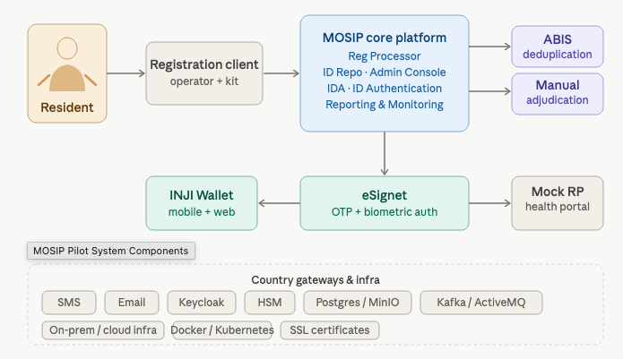

# Infrastructure and Requirements

## Hardware Specifications and Requirements

MOSIP supplies the full hardware specification for the pilot so that the country team can provision exactly what is needed. The list below is the minimum footprint to run the pilot end to end.

### Server and infrastructure footprint

The MOSIP pilot can be deployed on a public cloud or on the country's on-prem environment. Either way, the following virtual machine footprint is recommended.

| Virtual Machine | vCPU | RAM (GB) | SSD (GB) | Operating System |
|---|---|---|---|---|
| svr-mosip-01 | 16 | 64 | 128 | Ubuntu 20.04 LTS |
| svr-mosip-02 | 16 | 64 | 128 | Ubuntu 20.04 LTS |
| svr-mosip-03 | 16 | 64 | 128 | Ubuntu 20.04 LTS |
| svr-mosip-04 | 16 | 64 | 128 | Ubuntu 20.04 LTS |
| svr-mosip-05 | 16 | 64 | 128 | Ubuntu 20.04 LTS |
| svr-mosip-06 | 16 | 64 | 128 | Ubuntu 20.04 LTS |
| svr-mosip-07 | 16 | 64 | 128 | Ubuntu 20.04 LTS |
| srv-iam-01 | 8 | 16 | 64 | Ubuntu 20.04 LTS |
| srv-abis-01 | 20 | 64 | 256 | As recommended by ABIS vendor |
| srv-nginx-01 | 4 | 16 | 64 | Ubuntu 20.04 LTS |
| srv-nginx-02 | 4 | 16 | 64 | Ubuntu 20.04 LTS |
| srv-postgres | 16 | 32 | 256 | Ubuntu 20.04 LTS |
| srv-minio | 16 | 32 | 256 | Ubuntu 20.04 LTS |
| srv-bastion | 4 | 16 | 64 | Ubuntu 20.04 LTS |

#### Aggregate footprint

* Total RAM: ~600 GB
* Total SSD storage: ~2 TB
* vCPU sizing on physical servers can be calculated as (threads × cores) × processors per host. As a reference, an Intel Xeon E-2288G with 8 cores / 16 threads on one socket exposes 128 vCPUs.


**Cloud or on-prem?** If the country plans to run the future production system on-prem, exercise the on-prem footprint here so that operations, networking and security teams rehearse the real run-book. If the production target is cloud, run the pilot on the same cloud provider.


### Registration kit -- laptop specification

| Specification | Recommended value |
|---|---|
| Processor | Multi-core, latest generation (e.g., Intel 12th-gen Core i7, 1.7 GHz up to 4.7 GHz, 12 MB L3 cache) |
| RAM | 16 GB minimum |
| Operating System | Windows 10 or 11, 64-bit |
| Storage | 512 GB SSD |
| Display | 14 inches or larger, full HD |
| Networking | Ethernet RJ45 and Wi-Fi (IEEE 802.11 b/g/n) |
| Ports | 2 × USB 3.0 (1.5 A each), 1 × USB 2.0 (≥1 A), HDMI for external monitor; include a powered USB hub with 4 × USB 3.0 ports |
| Security chip | TPM 2.0 or higher |
| Antivirus | Enterprise-grade antivirus pre-installed and patched |

**Citizen-facing monitor:** 18 to 22 inch external display per kit.

### Biometric devices and authentication devices

| Device | Source | Quantity |
|---|---|---|
| Fingerprint slap scanner (Registration) | Provided by MOSIP biometric partner ecosystem. Shipped to the country. | 1 per registration kit |
| Dual iris scanner (Registration) | Provided by MOSIP biometric partner ecosystem. | 1 per registration kit |
| Face camera (Registration) | Country-provided. Must meet MOSIP photo capture guidance. | 1 per registration kit |
| Single fingerprint device (Authentication) | Provided by MOSIP biometric partner ecosystem. | Approximately 5-10 across the pilot |


**Plan for shipping lead time** Procurement and international shipping of biometric devices typically takes 6 to 8 weeks. Start this on day one. The country team should pre-clear the customs process to avoid delays.


### Document scanners, printers and photo booths

#### Printer with scanner (per registration station)

| Specification | Value |
|---|---|
| Type | Color |
| Print resolution | 600 dpi |
| Scan resolution | 300 dpi |
| Paper size | A4 |
| Connectivity | USB 2.0+ or wireless |
| OS support | Windows 10/11 |
| Driver support | TWAIN / WIA compatible |
| Quantity | Approximately 4 units across the pilot (scale with number of Centers) |

These are regular printers available off the shelf such as HP, Epson, Canon etc.

#### Photo booth (per registration station)

| Specification | Value |
|---|---|
| Backdrop | 3 ft (W) × 4 ft (H), white, with stand and wall mount |
| Lighting | 2 × 30 W clear white lights (or LED equivalent), with stands and operator-controlled long cabling |
| Quantity | Approximately 4 stations across the pilot |

### Mobile phones for INJI Wallet

Residents and operators need a small fleet of phones to exercise INJI Wallet on both ecosystems. Country team typically provisions:

* Approximately 10 Android phones (Android 12 and above).
* Approximately 10 iPhones (iPhone 12 or above)

### Helpdesk, administration and adjudication terminals

| Terminal | Purpose / configuration | Source |
|---|---|---|
| Manual adjudication terminal | 1 Windows laptop or desktop (minimal configuration) to handle exceptions and deduplication adjudications. | Country-provided |
| Mock health portal terminal | A few Windows laptops or desktops (minimal configuration) for the mock relying-party portal used to demonstrate authentication. | Country-provided |
| Helpdesk / supervisor terminal | 1 Windows laptop or desktop per registration Center to handle citizen queries. | Country-provided |
| Administration console terminal | 1 Windows desktop or laptop with privileged access for the country admin to manage configuration, users and master data. | Country-provided |

## Software and Platform Requirements

MOSIP supplies the platform and integrates the third-party components. The country team is responsible for the operating environment, gateways and identity-related accounts.

_Figure 2 --- Pilot system components and how the resident, registration client, MOSIP core, ABIS, eSignet, INJI Wallet and the mock relying party portal connect._

| Component | Purpose | Owner |
|---|---|---|
| Operating system and VMs | A secure on-prem or cloud sandbox onto which MOSIP will be deployed. | Country |
| Databases and object store | Provisioned and managed as part of the MOSIP deployment. | MOSIP |
| Hardware Security Module (HSM) | Stores cryptographic keys used for encryption and decryption. A software HSM is used for the pilot. | MOSIP |
| Biometric SDKs and ABIS | Used for biometric quality check, authentication and deduplication. Provided through the MOSIP biometric partner ecosystem. | MOSIP |
| SMS and email gateway | Required to send notifications to residents' phones and email addresses. | Country |
| Mock relying-party portal (health) | Bundled with eSignet; used to demonstrate authentication and service delivery. | MOSIP |
| INJI Wallet (mobile and web) | Bundled in the pilot deployment for residents to download and present credentials. | MOSIP |
| GitHub and Docker accounts | Private accounts that the country team uses to access source code, container images and configuration repositories. | Country |
| SSL certificates | Provisioned for the MOSIP pilot environment. | MOSIP |
