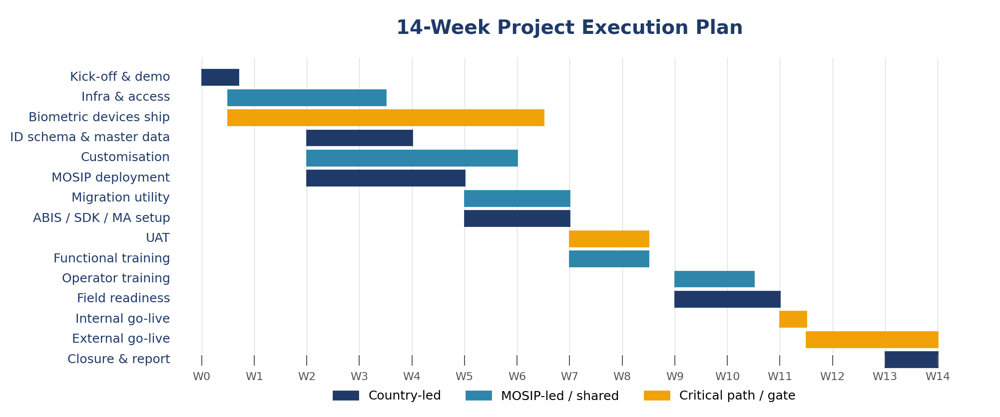

# Planning

## Project Execution Plan (Week-by-Week)

The plan below compresses the pilot into approximately 14 weeks. Pre-week 0 activities --- particularly biometric device procurement and infrastructure approvals --- should begin as soon as the pilot is approved.

| Window | Theme | Activities |
|---|---|---|
| Week 0 | Kick-off, MOSIP introduction and \*migration prep | MOSIP introduction; high-level demo of MOSIP, INJI and eSignet; _acquire source data and database structure for any legacy migration in scope._ |
| Week 1 | Infrastructure readiness | Begin procurement and shipping of biometric devices; readiness check of on-prem or cloud hardware (compute, storage, networking); \*continue acquiring legacy source data. |
| Weeks 2--3 | ID schema, master data, customisation | Define country ID schema and master data; identify customisation needs; obtain SMS / email gateway details; start customisation; deploy MOSIP onto the country environment; \*start data quality analysis for any legacy migration. |
| Week 4 | Customisation, configuration and platform readiness | Publish data quality analysis; complete customisation; finalise email and SMS configuration. |
| Weeks 5--6 | Integration and \*migration utility | Build the legacy migration utility; integrate biometric components into the country environment; deploy ABIS, SDKs and the manual adjudication system; configure SMS in the platform. |
| Weeks 7--8 | Pilot system readiness | User acceptance testing; functional training for the country technical staff; biometric functional training. |
| Weeks 9--10 | Field readiness | Operator and supervisor training; migration training; field pilot preparation; calibration of registration Centers for go-live. |
| Weeks 11--14 | Pilot go-live | Field execution: legacy migration, new registrations up to 3,000 residents, authentication exercises, INJI Wallet usage, helpdesk operation; pilot closure and report preparation. |

_This is just an indicative execution plan. The actual execution plan with dates to be prepared based understanding and agreement between the country and MOSIP team._

_*For brown-field pilots only; a brown-field pilot re-uses issued National ID from a legacy system by migrating the ID data into MOSIP._

### Critical dependencies

* On-prem or cloud infrastructure and the necessary access for installation must be ready before the start of Week 1 or 2.
* Biometric device procurement and shipping typically takes 6 to 8 weeks. The country team supports the customs clearance process.
* The country lead finalises the ID schema and provides the master data inputs.
* SMS and email gateway access is configured ahead of customisation completion in Week 4.


**If you only do one thing in week 0** Place the biometric device order and lock the infrastructure environment. Everything downstream depends on these two long-lead items.


_Figure 3 --- Indicative 14-week schedule. Country-led streams (navy), MOSIP-led / shared streams (teal) and critical-path / gate items (orange)._

## Roles and Responsibilities

Responsibilities are split between the country program and the MOSIP team. The matrix below covers technical resources, setup, rollout, management and procurement.

| Category | Activity | Responsibility |
|---|---|---|
| Technical resources | Country technical team | Country & field staff |
| Technical resources | MOSIP pilot deployment team | MOSIP |
| Technical resources | Government resource for ID schema and master data preparation | Country |
| Technical resources | Functional training; operator and supervisor training | MOSIP + Country |
| Technical resources | Field staff for registration | Country |
| Pilot setup | GitHub private account, Docker account creation and access | Country |
| Pilot setup | ID schema, master data | Country + MOSIP |
| Pilot setup | MOSIP deployment in the country environment | MOSIP with Country support |
| Pilot setup | Customisation | MOSIP |
| Rollout | Resident pre-registration | Country |
| Rollout | Resident registration at Centers, ID issuance | Country |
| Rollout | ID authentication using relying-party portal and INJI | Country |
| Rollout | Feedback, metrics collection, report generation | Country |
| Rollout | Pilot closure sign-off | Country + MOSIP |
| Management | Initial pilot plan | MOSIP |
| Management | Pilot plan finalisation | Country |
| Management | Pilot project management | Country + MOSIP |
| Management | Governance structure | Country + MOSIP |
| Procurement | On-prem / cloud environment | Country |
| Procurement | ABIS, biometric SDKs, manual adjudication system | MOSIP |
| Procurement | SMS / email gateway | Country |
| Procurement | SSL certificates | Country or MOSIP |
| Procurement | Biometric devices for registration and authentication (fingerprint slap scanner, dual iris scanner, fingerprint authentication device) | MOSIP |
| Procurement | Face camera for registration | Country |
| Procurement | PCs / laptops, printers and scanners | Country |

## Resourcing the Country Team

The country team is the Center of gravity of the pilot. They run the deployment, register residents, and inherit the system at sign-off --- so resourcing them well is the single biggest predictor of success.

| Role | Count | Responsibilities |
|---|---|---|
| Project Manager | 1 | Owns the country program. Reports to the steering committee, manages dependencies, and signs off the pilot. |
| Senior Technical Lead | 1 or more | Functional and technical owner of MOSIP within the country team. First point of contact for field issues. Becomes the in-house MOSIP expert for future scale. |
| Junior Technical Engineers | 3 or more | Hands-on engineers handling deployment support, configuration, integrations and incident response. |
| Field Operators | 5 or more | Run the registration kits at the Centers. Identified, trained and certified by the country team. |
| Field Supervisors | 1 per registration Center | Supervise operators, manage exceptions and run the day-to-day helpdesk. |
| Adjudicators | 1 or more | Handle manual adjudication for biometric duplicates and quality exceptions. |
| Communications focal point | 1 | Coordinates resident outreach, appointment scheduling and notification content for SMS and email. |


**Identify operators and supervisors early** Operators and supervisors must be identified by the country team well before the training window. Onboarding is hands-on and assumes participants are available for a continuous training block, not part-time.


## Governance and Review Cadence

A lightweight, predictable governance structure keeps decisions moving without burying the technical team in meetings.

| Forum | Membership | Cadence |
|---|---|---|
| Pilot Governance Committee | Country representatives, MOSIP, key stakeholders. Set up during kick-off. | Pilot kick-off and at major milestones. |
| Weekly technical review | Country and MOSIP technical Leads | Weekly or as discussed in the kick-off meeting, throughout the pilot |
| Steering committee | Executive members from the country and MOSIP. | Bi-weekly or at gate decisions. |
| Pilot readiness review | Members of the Steering Committee, Tech leads from the country and MOSIP | After User Acceptance Testing |
| Closure meeting | All stakeholders | After registrations are completed; final sign-off. |


**Always close with lessons learned** Block the last 30 minutes of each weekly review for 'what surprised us this week'. The compiled list becomes the lessons-learned annex of the closure report. It also helps in mid-course corrections during the pilot.

