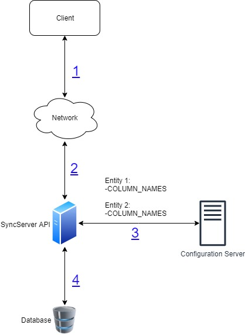

# Sync master data API - generic

#### Background

There can be new master data added to the system at any point of time. This API can be used by the Registration Client module to sync the master data in the registered machine. If there is any change in the master data, no change is required in the Service call to the master data sync API. No new logic have to be written as part of this API. 

#### Solution

**The key solution considerations are**

- Following are the key considerations for the generic master data sync functionality, 

##### List of master data

- The list of master data entities and their properties are listed down in the config server. If any new master data entitiy is added to the system, then the new entry is added to this list. 

- The entities and their properties are entered in the JSON format

	

##### Stateless 

- No state or session is maintained between the calls. 

- In the result, all the master data is returned always. This is a heavy weight operation and the response data size will be more. 

##### Adding or removing master data

- If any new master data is added or removed from the system, changes are required in the following areas, 

	1. Changes in the database and scripts.  
	2. Changes in the Configuration server.
	
- The configuration reads are not cached anywhere in the system. 

##### Specific master data for the registration center

- When a master data is requested, the response is returned always for a specific registration center. 

##### Exception handling

- Let's say, one entity is not found from the list of entities in Configuration server. 
In case of no entity is found, no error is returned. The error is logged in the log file. The result contains the existing entities. 
A mail is sent to the supported mail distribution list about the error. 

- Let's say, the properties in the entity is not found. 
In this case, only the existing entities are returned as part of the result. 
A mail is sent to the supported mail distribution list about the error. 

- If the passed Registration center is not found, specific error code and description is returned in the JSON response. 
	
