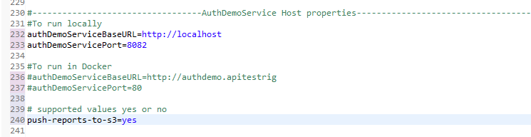
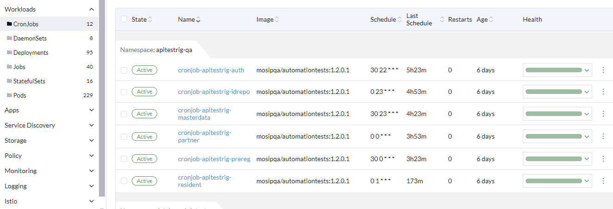
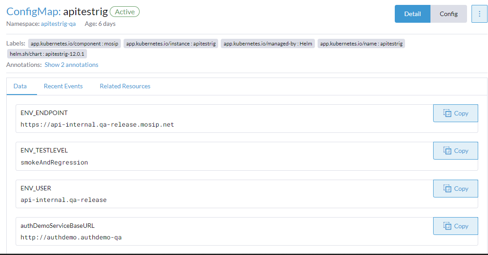
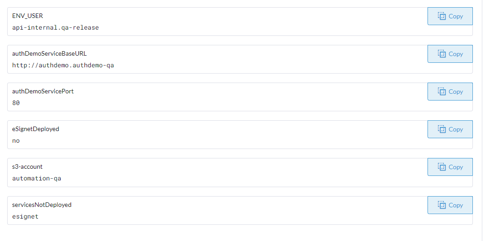

# API Test Rig Automation

## Introduction

API Test Rig is a comprehensive tool designed to rigorously test all APIs provided by MOSIP Identity. It ensures thorough testing by covering various corner cases. This Test Rig is module-specific, allowing users to execute specific APIs based on their requirements efficiently. With its optimized design, API Test Rig can complete test runs in few minutes, enhancing the testing process's speed and effectiveness.

## Execution Components and Flow

The API Test Rig consists of several key components and follows a specific execution flow.

**modules**: Indicates the name of the module being tested. Examples include auth, prereg, idrepo, resident, esignet, partner, mimoto, etc. Users can specify the module they wish to test, enabling targeted testing based on specific functionalities.

**env.user**: This parameter specifies the user of the environment where the `Testrig` file will be executed.

**env.endpoint**: Indicates the environment where the application under test is deployed. Users should replace `<base_env>` with the hostname of the desired environment.

**env.testlevel**: Determines the level of testing to be conducted. It should be set to ‘smoke’ to run only smoke test cases or ‘smokeandRegression’ to execute all tests of all modules.

## Prerequisites:

Ensure that the following software and configurations are set up on your local machine before executing the automation tests:

Java 11 and Maven (3.6.0): Install Java 11 JDK and Maven 3.6.0 on your machine. These are required to compile and execute the automation tests.

**Lombok Configuration**: Configure Lombok on your machine. Click [here](https://projectlombok.org/) to refer to the official Lombok website for installation instructions and setup details.

**Git Bash (for Windows)**: Install `Git Bash version 2.18.0.windows.1` on your Windows machine. Git Bash provides a Unix-like command-line environment on Windows, enabling seamless execution of commands.

## Maven Settings.xml Configuration:

**For Windows**: Place the `settings.xml` file in the .m2 directory.

**For Linux**: Place the settings.xml file in the regular Maven configuration folder.Additionally, copy the same settings.xml file to /usr/local/maven/conf directory.

## Steps to Execute Tests Locally

**Clone Repository**

* From a terminal (Linux) or command prompt (Windows), navigate to your preferred directory
* **Using Git Bash**: Copy the Git repository link: [https://github.com/mosip/mosip-functional-tests](https://github.com/mosip/mosip-functional-tests)
* Open Git Bash at any location
* Run the command: `git clone` [https://github.com/mosip/mosip-functional-tests](https://github.com/mosip/mosip-functional-tests)

**Configure Properties**

* Navigate to the cloned repository directory
* Update the properties file as follows:
  * Uncomment the lines beginning with authDemoServiceBaseURL and authDemoServicePort to run locally
  * Comment out the lines beginning with authDemoServiceBaseURL and authDemoServicePort intended for Docker
  * Ensure that the `push-reports-to-s3` property is set to **no** for local execution

<figure><figcaption></figcaption></figure>

* Update the kernel.properties file with the appropriate client ID and secret key Values
* Ensure that the client ID and secret key are correctly configured for the intended environment.
* Make sure globaladmin user is available in the Database.
* Pass all the VM Arguments Properly mentioned above and execute.

## Steps to Execute Tests From Docker

**Setup**

1. Authdemo pod should be up
2. All `Cronjob-apitestrig` should be up
3. Below Config Maps should be proper

<figure><figcaption></figcaption></figure>

<figure><figcaption></figcaption></figure>

<figure><figcaption></figcaption></figure>

## Tested Modules

Following are tested modules:

1.  **ID Repository (idrepo)**: ID Repository serves as a centralized database containing individual identity records. It offers API-based functionalities for storing, retrieving, and updating identity details, facilitating seamless integration with other MOSIP modules.

    Purpose: Testing the functionality and reliability of identity data management operations within the ID Repository module.
2.  **Authentication (auth)**: Authentication module provides independent services for verifying individual identities. It supports seeding with authentication data and includes services such as Authentication Services, OTP Service, and Internal Services.

    Purpose: Evaluating the effectiveness and accuracy of identity authentication processes, including authentication services and OTP generation, within the Authentication module.
3.  **Pre-registration (preregistration)**: Pre-registration module enables residents to enter demographic data, upload supporting documents, and book registration appointments. It supports appointment management, notifications, rescheduling, and cancellation functionalities, enhancing the registration process efficiency.

    Purpose: Testing the functionality and usability of pre-registration features, including data entry, appointment booking, and appointment management, to ensure a seamless registration experience for residents.
4.  **Mobile ID (MobileId)**: Mobile ID module facilitates the generation and management of mobile-based identity credentials. It offers secure and convenient identity verification solutions leveraging mobile devices.

    Purpose: Assessing the reliability and security of mobile-based identity credential generation and management processes within the Mobile ID module.
5.  **Esignet**: Esignet module provides electronic signature services, enabling digital signing of documents and transactions. It ensures the integrity and authenticity of electronic documents and transactions.

    Purpose: Verifying the functionality and effectiveness of electronic signature services, including document signing and verification processes, within the Esignet module.
6.  **Partner Management Services (Partner)**: Partner Management Services module offers services for partner onboarding and management. It includes Partner Management Service and Policy Management Service functionalities.

    Purpose: Testing the partner onboarding process and management services provided by the Partner Management Services module, ensuring smooth collaboration and integration with partner entities.

## Analyze The Report

**Identify Report Name**

* Locate the report file in the Minio automation bucket.
* The report name typically follows the format: `mosip-api-internal.<env_name>-<module_name>-<timestamp>_report_T-<Total>_P-<Passed>_S-<Skipped>_F-<Failed>.html`.
* `<env_name>`: Name of the environment where the tests were conducted
* `<module_name>`: Name of the module for which tests were executed
* `<timestamp>`: Timestamp indicating when the report was generated
* T, P, S, F: Total, Passed, Skipped, and Failed counts of test cases, respectively

## Review Overall Summary

* Open the report file and review the summary section
* Check the total number of test cases executed (T), along with the counts of passed (P), skipped (S), and failed (F) test cases

## API-wise Details

* In the beginning of the report, you'll find a section listing all API names along with their corresponding test case counts
* Click on the specific API you want to inspect further

## Inspect Test Cases

* After selecting an API, you'll be directed to a page displaying all test cases associated with that API
* Click on the individual test case to view detailed information, including request and response data
* Analyze the request payload, expected response, and actual response received during testing

## Debugging

* If a test case failed, analyze the details to identify the root cause
* Review the request parameters, headers, and body to ensure correctness
* Check the response received against the expected response, focusing on status codes, data format, and content

## Automate New API

**Create folder structure**

* Create a folder with the API name in the specific module directory
* This folder will contain the necessary files for automating the API

**Create Input and Output Templates**

* Inside the API folder, create one Handlebars (hbs) file for input and one for output
* The input hbs file should contain placeholders for parameters that will be used in the test cases
* The output hbs file should contain placeholders for expected response data

**Parameterize Data in Input Template**

* Parametrize the data in the input hbs file using Handlebars syntax
* Define variables or placeholders for the input data that will be used in the test cases

**Create YAML File**

* Create a YAML file to define the test cases for the API
* Follow the predefined structure for the YAML file, including API name, test case names, endpoint, authentication method, HTTP method, input/output templates, and input/output data
* Define each test case under the corresponding API with relevant details such as endpoint, authentication method, HTTP method, input/output templates, and input/output data

**Input and Output Data in YAML**

* In the YAML file, provide the input data for each test case under the input block, using the parameters defined in the input template
* Similarly, define the expected output data under the output block, using placeholders defined in the output template

## Example YAML Structure

```
CreateVID: # API Name IdRepository_CreateVID_ValidParameters_For_VidType_Smoke_T_sid: # Test Case Name endPoint: /idrepository/v1/vid # Endpoint of the API role: idrepo # Authentication method required restMethod: post # HTTP method inputTemplate: idRepository/CreateVID/createVid # Location of the input template outputTemplate: idRepository/CreateVID/createVidResult # Location of the output template input: '{ # Input data block "vidType": "Temporary", }' output: '{ # Output data block "vidStatus": "ACTIVE" }'
```

## Execute Test Cases

* Once the folder structure and YAML file are created, execute the test cases using the automation testing framework
* The framework will substitute the input data from the YAML file into the input template and compare the actual output with the expected output defined in the YAML file

This documentation provides comprehensive guidance for utilizing and expanding the API Test Rig functionalities effectively.
